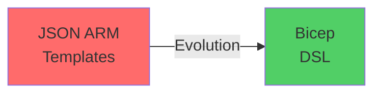
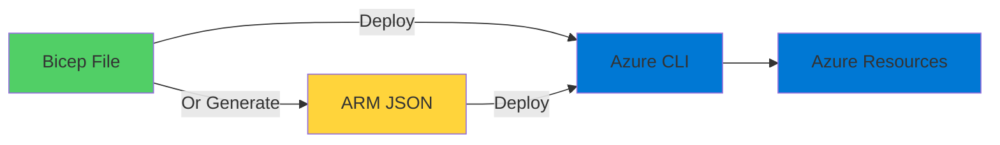
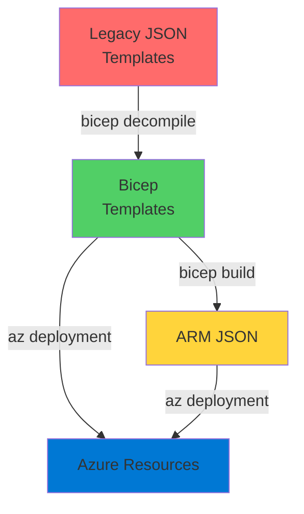

# ARM Templates with Bicep

The Evolution of Infrastructure as Code

<div class="abs-bottom-10 left-10">
  <carbon-code class="text-8xl text-blue-400 opacity-80" />
</div>

---
layout: center
---

# Welcome

<!--
METADATA:
sentence: In this session, we'll explore how Bicep simplifies infrastructure as code for Azure deployments.
search_anchor: this session, we'll explore how
-->
<v-click>

<div class="text-xl mt-8">
Explore Bicep for Azure infrastructure<br/>Simpler, cleaner, more maintainable
</div>

</v-click>

---
layout: section
---

# ARM Templates Revisited

---

# Important Concepts

<!--
METADATA:
sentence: ARM templates represent an important evolution in cloud infrastructure management.
search_anchor: ARM templates represent an important
-->
<v-click>

<div class="mt-8 text-center text-xl">
ARM templates represent an important evolution
</div>

</v-click>

<!--
METADATA:
sentence: The concepts behind them - infrastructure as code, parameterized deployments, and desired-state delivery - are fundamental to modern cloud architecture.
search_anchor: concepts behind them - infrastructure
-->
<v-click>

<div class="mt-12 grid grid-cols-3 gap-8">
  <div class="text-center">
    <carbon-document-tasks class="text-6xl text-blue-400" />
    <div class="text-sm mt-3">Infrastructure as Code</div>
  </div>
  <div class="text-center">
    <carbon-parameter class="text-6xl text-green-400" />
    <div class="text-sm mt-3">Parameterized</div>
  </div>
  <div class="text-center">
    <carbon-checkbox-checked class="text-6xl text-purple-400" />
    <div class="text-sm mt-3">Desired-State</div>
  </div>
</div>

</v-click>

<!--
METADATA:
sentence: The concepts behind them - infrastructure as code, parameterized deployments, and desired-state delivery - are fundamental to modern cloud architecture.
search_anchor: concepts behind them - infrastructure
-->
<v-click>

<div class="mt-12 text-center text-xl text-green-400">
Fundamental to modern cloud architecture
</div>

</v-click>

---

# The Challenge with JSON

<v-click>

<div class="mt-4">
  <carbon-warning class="text-6xl text-orange-400" />
</div>

</v-click>

<!--
METADATA:
sentence: The JSON format that ARM templates traditionally use can be difficult to work with, especially when you're dealing with larger applications that involve multiple resources.
search_anchor: JSON format that ARM templates
-->
<v-click>

<div class="mt-8 text-xl text-center">
JSON format can be difficult to work with
</div>

</v-click>

<!--
METADATA:
sentence: The syntax can become verbose and hard to maintain.
search_anchor: syntax can become verbose and
-->
<v-click>

<div class="mt-12 flex items-center gap-4">
  <carbon-text-color class="text-4xl text-red-400" />
  <span class="text-lg">Verbose syntax</span>
</div>

</v-click>

<!--
METADATA:
sentence: The syntax can become verbose and hard to maintain.
search_anchor: syntax can become verbose and
-->
<v-click>

<div class="mt-6 flex items-center gap-4">
  <carbon-maximize class="text-4xl text-red-400" />
  <span class="text-lg">Hard to maintain for larger applications</span>
</div>

</v-click>

<!--
METADATA:
sentence: Second, parameters and variables have simple, readable names like "location" and "storageSku" - no complex bracket notation required.
search_anchor: Second, parameters and variables have
-->
<v-click>

<div class="mt-6 flex items-center gap-4">
  <carbon-data-table class="text-4xl text-red-400" />
  <span class="text-lg">Complex bracket notation</span>
</div>

</v-click>

<!--
METADATA:
sentence: However, there's a challenge.
search_anchor: However, there's a challenge
-->
<v-click>

<div class="mt-12 text-center text-xl text-red-400">
We needed a better way
</div>

</v-click>

---
layout: section
---

# Enter Bicep

---

# The Evolution of ARM Templates

<v-click>

<div class="mt-4">
  <carbon-upgrade class="text-6xl text-green-400" />
</div>

</v-click>

<!--
METADATA:
sentence: What Are ARM Templates?
search_anchor: What Are ARM Templates
-->
<v-click>

<div class="mt-8 text-xl text-center text-green-400">
Bicep is the evolution of ARM templates
</div>

</v-click>

<!--
METADATA:
sentence: Bicep is the evolution of ARM templates - a new tool that uses a custom domain-specific language to define Azure resources in a simpler and more manageable way.
search_anchor: Bicep is the evolution of
-->
<v-click>

<div class="mt-12 text-center text-lg">
Custom domain-specific language
</div>

</v-click>

<!--
METADATA:
sentence: The syntax can become verbose and hard to maintain.
search_anchor: syntax can become verbose and
-->
<v-click>

<div class="mt-4 text-center text-lg">
Simpler and more manageable
</div>

</v-click>

<v-click>

<div class="mt-12">



</div>

</v-click>

---

# Storage Account in Bicep

<v-click>

<div class="mt-8">

```bicep
resource storageAccount 'Microsoft.Storage/storageAccounts@2021-06-01' = {
  name: storageAccountName
  location: location
  sku: {
    name: storageSku
  }
  kind: 'StorageV2'
  properties: {
    supportsHttpsTrafficOnly: httpsOnly
  }
}
```

</div>

</v-click>

<!--
METADATA:
sentence: Enter Bicep This is where Bicep comes in.
search_anchor: Enter Bicep This is where
-->
<v-click>

<div class="mt-12 text-center text-2xl text-green-400">
Notice how clean this is!
</div>

</v-click>

---
layout: section
---

# Key Advantages

---

# Why Bicep is Better

<!--
METADATA:
sentence: Field names and values don't need to be quoted, and there's less indentation noise.
search_anchor: Field names and values don't
-->
<v-click>

<div class="mt-6 flex items-start gap-4">
  <div class="text-3xl text-blue-400 mt-1">1</div>
  <div>
    <carbon-clean class="text-3xl inline-block" />
    <span class="ml-3 text-lg font-bold">Cleaner Syntax</span>
    <div class="text-sm mt-2 opacity-70">No need to quote field names and values</div>
    <div class="text-sm opacity-70">Less indentation noise</div>
  </div>
</div>

</v-click>

<!--
METADATA:
sentence: Second, parameters and variables have simple, readable names like "location" and "storageSku" - no complex bracket notation required.
search_anchor: Second, parameters and variables have
-->
<v-click>

<div class="mt-8 flex items-start gap-4">
  <div class="text-3xl text-green-400 mt-1">2</div>
  <div>
    <carbon-text-short-paragraph class="text-3xl inline-block" />
    <span class="ml-3 text-lg font-bold">Simple Names</span>
    <div class="text-sm mt-2 opacity-70">location, storageSku - readable names</div>
    <div class="text-sm opacity-70">No complex bracket notation</div>
  </div>
</div>

</v-click>

<!--
METADATA:
sentence: This makes your infrastructure code self-documenting and easier for teams to maintain.
search_anchor: This makes your infrastructure code
-->
<v-click>

<div class="mt-8 flex items-start gap-4">
  <div class="text-3xl text-purple-400 mt-1">3</div>
  <div>
    <carbon-document-add class="text-3xl inline-block" />
    <span class="ml-3 text-lg font-bold">Comments Supported</span>
    <div class="text-sm mt-2 opacity-70">Self-documenting infrastructure code</div>
    <div class="text-sm opacity-70">Easier for teams to maintain</div>
  </div>
</div>

</v-click>

---
layout: section
---

# Deployment Workflow

---

# No Additional Tools Needed

<v-click>

<div class="mt-4">
  <carbon-tools class="text-6xl text-green-400" />
</div>

</v-click>

<!--
METADATA:
sentence: The Azure CLI and PowerShell modules understand Bicep natively.
search_anchor: Azure CLI and PowerShell modules
-->
<v-click>

<div class="mt-8 text-xl text-center text-green-400">
Azure CLI and PowerShell understand Bicep natively
</div>

</v-click>

<v-click>

<div class="mt-12">



</div>

</v-click>

<!--
METADATA:
sentence: This gives you flexibility in your deployment pipeline.
search_anchor: This gives you flexibility in
-->
<v-click>

<div class="mt-12 text-center text-xl">
Flexibility in deployment pipeline
</div>

</v-click>

<!--
METADATA:
sentence: What Are ARM Templates?
search_anchor: What Are ARM Templates
-->
<v-click>

<div class="mt-4 text-center text-lg opacity-70">
Output is identical to JSON ARM templates
</div>

</v-click>

---
layout: section
---

# Bicep Tools

---

# Powerful Tooling

<!--
METADATA:
sentence: What Are ARM Templates?
search_anchor: What Are ARM Templates
-->
<v-click>

<div class="mt-8 flex items-center gap-4">
  <carbon-import class="text-4xl text-blue-400" />
  <span class="text-lg">Generate Bicep from existing JSON templates</span>
</div>

</v-click>

<!--
METADATA:
sentence: Enter Bicep This is where Bicep comes in.
search_anchor: Enter Bicep This is where
-->
<v-click>

<div class="mt-6 flex items-center gap-4">
  <carbon-export class="text-4xl text-green-400" />
  <span class="text-lg">Compile Bicep to JSON</span>
</div>

</v-click>

<!--
METADATA:
sentence: What Are ARM Templates?
search_anchor: What Are ARM Templates
-->
<v-click>

<div class="mt-6 flex items-center gap-4">
  <carbon-search class="text-4xl text-purple-400" />
  <span class="text-lg">What-if analysis to preview changes</span>
</div>

</v-click>

<!--
METADATA:
sentence: You can deploy Bicep files directly to Azure, or if you need to, you can generate ARM JSON files from your Bicep templates.
search_anchor: You can deploy Bicep files
-->
<v-click>

<div class="mt-12 text-center text-xl text-green-400">
Installed directly from Azure CLI
</div>

</v-click>

<!--
METADATA:
sentence: The tools integrate seamlessly with your existing Azure workflows.
search_anchor: tools integrate seamlessly with your
-->
<v-click>

<div class="mt-4 text-center text-lg opacity-70">
Seamless integration with existing workflows
</div>

</v-click>

---

# Bridging Old and New

<v-click>

<div class="mt-8">



</div>

</v-click>

<!--
METADATA:
sentence: In this session, we'll explore how Bicep simplifies infrastructure as code for Azure deployments.
search_anchor: this session, we'll explore how
-->
<v-click>

<div class="mt-12 text-center text-xl">
Migration path for legacy infrastructure
</div>

</v-click>

---
layout: section
---

# Why This Matters

---

# The Preferred Way

<v-click>

<div class="mt-4">
  <carbon-favorite class="text-6xl text-purple-400" />
</div>

</v-click>

<!--
METADATA:
sentence: Why This Matters Bicep is now the preferred way of using ARM.
search_anchor: Why This Matters Bicep is
-->
<v-click>

<div class="mt-8 text-xl text-center text-green-400">
Bicep is now the preferred way of using ARM
</div>

</v-click>

<!--
METADATA:
sentence: What Are ARM Templates?
search_anchor: What Are ARM Templates
-->
<v-click>

<div class="mt-12 text-center text-lg">
JSON templates still supported
</div>

</v-click>

<!--
METADATA:
sentence: While JSON templates are still supported and many existing projects use them, Microsoft is investing heavily in Bicep as the future of Azure infrastructure as code.
search_anchor: While JSON templates are still
-->
<v-click>

<div class="mt-4 text-center text-lg">
Many existing projects use JSON
</div>

</v-click>

<!--
METADATA:
sentence: While JSON templates are still supported and many existing projects use them, Microsoft is investing heavily in Bicep as the future of Azure infrastructure as code.
search_anchor: While JSON templates are still
-->
<v-click>

<div class="mt-12 text-center text-xl text-purple-400">
Microsoft investing heavily in Bicep
</div>

</v-click>

<!--
METADATA:
sentence: In this session, we'll explore how Bicep simplifies infrastructure as code for Azure deployments.
search_anchor: this session, we'll explore how
-->
<v-click>

<div class="mt-8 text-center text-lg opacity-70">
The future of Azure infrastructure as code
</div>

</v-click>

---

# Essential for Azure Work

<!--
METADATA:
sentence: ARM templates represent an important evolution in cloud infrastructure management.
search_anchor: ARM templates represent an important
-->
<v-click>

<div class="mt-12 flex justify-center gap-12">
  <div class="text-center">
    <carbon-certificate class="text-6xl text-blue-400" />
    <div class="text-sm mt-3">Certifications</div>
  </div>
  <div class="text-center">
    <carbon-industry class="text-6xl text-green-400" />
    <div class="text-sm mt-3">Production Infrastructure</div>
  </div>
  <div class="text-center">
    <carbon-cloud-services class="text-6xl text-purple-400" />
    <div class="text-sm mt-3">Cloud Architecture</div>
  </div>
</div>

</v-click>

<!--
METADATA:
sentence: Enter Bicep This is where Bicep comes in.
search_anchor: Enter Bicep This is where
-->
<v-click>

<div class="mt-12 text-center text-xl text-green-400">
Understanding Bicep is essential
</div>

</v-click>

---
layout: center
class: text-center
---

<div>

<v-click>

<carbon-play-outline class="text-8xl text-green-400 inline-block" />

</v-click>

<!--
METADATA:
sentence: Let me show you an example.
search_anchor: Let me show you an
-->
<v-click>

<div class="text-4xl mt-8 font-bold">
Let's Get Started!
</div>

</v-click>

<!--
METADATA:
sentence: In the exercises that follow, we'll get hands-on experience with Bicep - deploying resources, converting JSON to Bicep, and evolving infrastructure specifications.
search_anchor: exercises that follow, we'll get
-->
<v-click>

<div class="text-xl mt-6 opacity-70">
Deploy resources and evolve infrastructure with Bicep
</div>

</v-click>

</div>
