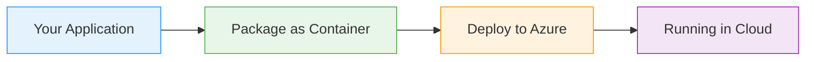

# ARM Templates with Bicep

  <iconify-icon icon="vscode-icons:file-type-azure" style="font-size: 4rem;" />

---

---
layout: center
class: text-center
---

# Welcome

Welcome to this lab on ARM Templates with Bicep

  <iconify-icon icon="carbon:rocket" style="font-size: 3rem; color: #0078d4;" />

---

---
layout: center
---

# What Are ARM Templates?

ARM templates represent an important evolution in cloud infrastructure management. The concepts behind them - infrastructure as code, parameterized de...

---

---
layout: center
---

# Enter Bicep

This is where Bicep comes in. Bicep is the evolution of ARM templates - a new tool that uses a custom domain-specific language to define Azure resources in a simpler and more manageable way.

---

---
layout: two-cols
---

# Key Advantages of Bicep

<iconify-icon icon="mdi:check-circle" class="text-green-500" /> There are several advantages to using Bicep over traditional ARM JSON templates:

<iconify-icon icon="mdi:check-circle" class="text-green-500" /> First, the syntax is cleaner

<iconify-icon icon="mdi:check-circle" class="text-green-500" /> Second, parameters and variables have simple, readable names like "location" and "storageSku" - no complex bracket notation required

<iconify-icon icon="mdi:check-circle" class="text-green-500" /> Third, and this is important, templates can include comments

::right::

  <iconify-icon icon="carbon:chart-line-smooth" style="font-size: 8rem; color: #4caf50;" />

---

---
layout: center
---

# Deployment Workflow

Here's the great news about Bicep: you don't need any additional tools to deploy Bicep files. The Azure CLI and PowerShell modules understand Bicep natively.

---

---
layout: center
---

# Bicep Tools

Bicep includes powerful tooling that bridges the gap between old and new. With the Bicep CLI, you can:

---

---
layout: center
---

# Why This Matters

Bicep is now the preferred way of using ARM. While JSON templates are still supported and many existing projects use them, Microsoft is investing heavily in Bicep as the future of Azure infrastructure

