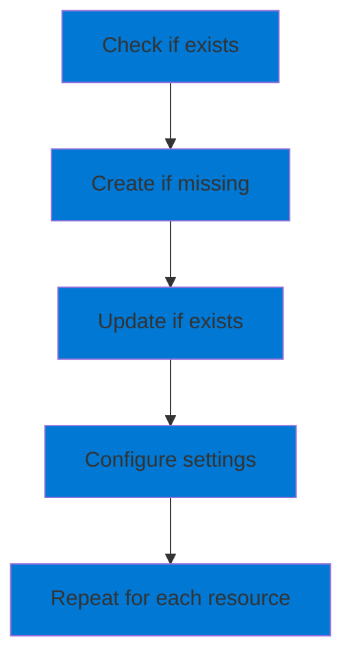
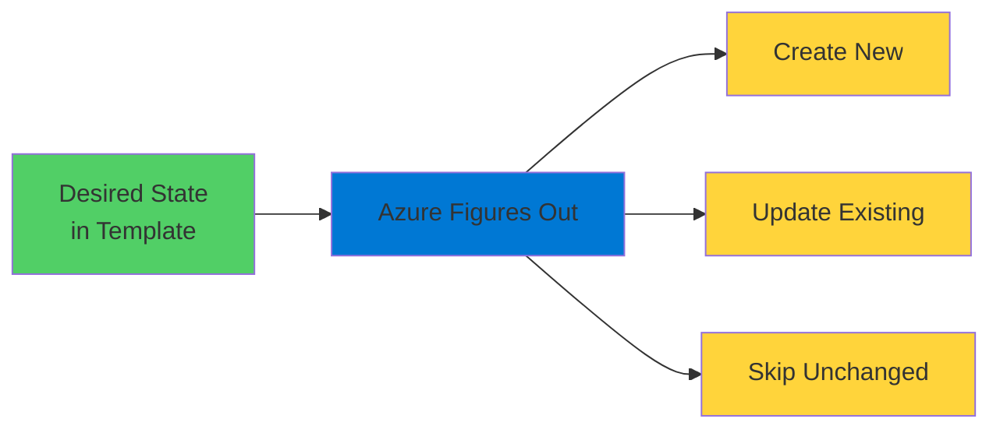
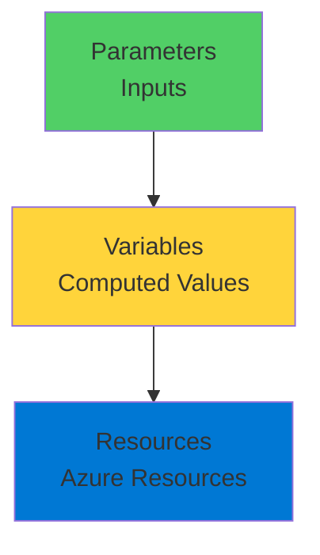
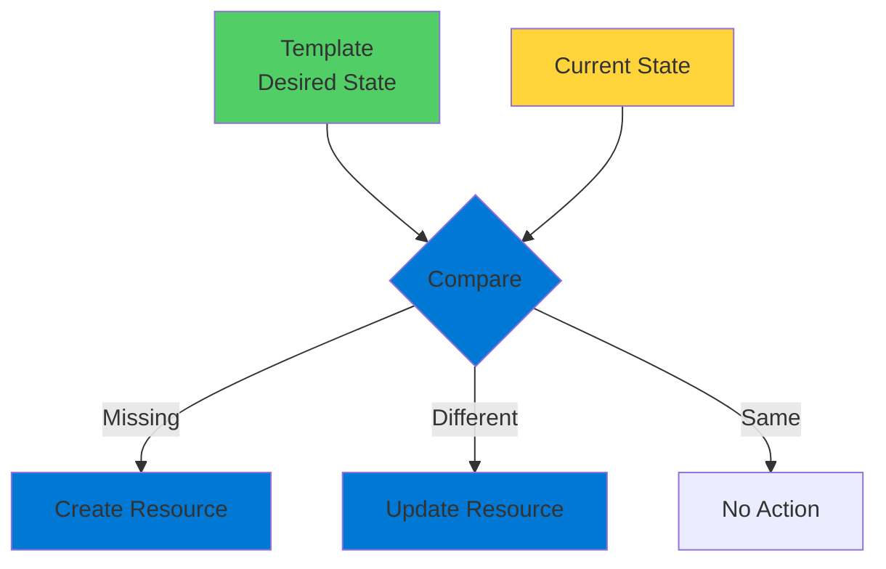
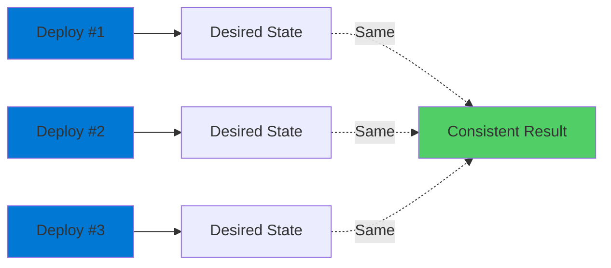

# Azure Resource Manager Templates

Declarative Infrastructure as Code

  <carbon-document-tasks class="text-8xl text-blue-400 opacity-80" />

---
layout: center
---

# Welcome

<v-click>

Explore ARM templates The declarative approach to Azure infrastructure

</v-click>

---
layout: section
---

# Imperative vs Declarative

---

# The Imperative Approach

<v-click>

  <carbon-command-line class="text-6xl text-blue-400" />

</v-click>

<v-click>

Azure CLI: Tell Azure exactly what to do

</v-click>

<v-click>

</v-click>

<v-click>

Lots of checks needed

</v-click>

<v-click>

Can't create resources that already exist

</v-click>

---

# The Declarative Approach

<v-click>

  <carbon-document-tasks class="text-6xl text-green-400" />

</v-click>

<v-click>

Describe WHAT you want, not HOW to do it

</v-click>

<v-click>

</v-click>

<v-click>

Tooling handles the complexity

</v-click>

---
layout: section
---

# What Are ARM Templates?

---

# JSON-Based Infrastructure

<v-click>

  <carbon-document-blank class="text-6xl text-blue-400" />

</v-click>

<v-click>

JSON files modeling desired Azure state

</v-click>

<v-click>

  

    <carbon-version-major class="text-6xl text-green-400" />
    
Version Control

  

  

    <carbon-repeat class="text-6xl text-purple-400" />
    
Repeatability

  

  

    <carbon-code class="text-6xl text-orange-400" />
    
Alongside Code

  

</v-click>

<v-click>

Infrastructure lives with application code

</v-click>

---
layout: section
---

# Template Structure

---

# Key Components

<v-click>

  <carbon-parameter class="text-5xl text-blue-400 mt-1" />
  

    
Parameters

    
Values that change per deployment

    
Think of them as inputs

  

</v-click>

<v-click>

  <carbon-variable class="text-5xl text-green-400 mt-1" />
  

    
Variables

    
Values used throughout template

    
Keep template clean and maintainable

  

</v-click>

<v-click>

  <carbon-cube class="text-5xl text-purple-400 mt-1" />
  

    
Resources

    
Actual Azure resources to create

    
Using parameters and variables

  

</v-click>

---

# Template Flow

<v-click>

</v-click>

<v-click>

Parameters feed into variables

</v-click>

<v-click>

Variables used in resource definitions

</v-click>

---
layout: section
---

# Storage Account Example

---

# Resource Definition Elements

<v-click>

  <carbon-data-class class="text-4xl text-blue-400 mt-1" />
  

    
Type & API Version

    
Microsoft.Storage/storageAccounts

    
Specific API version for consistency

  

</v-click>

<v-click>

  <carbon-label class="text-4xl text-green-400 mt-1" />
  

    
Name & Location

    
Read from parameters

    
Makes template reusable

  

</v-click>

<v-click>

  <carbon-pricing-traditional class="text-4xl text-purple-400 mt-1" />
  

    
SKU

    
Read from variable

    
Standard_LRS in this example

  

</v-click>

<v-click>

  <carbon-settings class="text-4xl text-orange-400 mt-1" />
  

    
Properties

    
Configuration details

    
supportsHttpsTrafficOnly: true

  

</v-click>

---

# Consistency Benefits

<v-click>

Everyone who deploys gets the same result

</v-click>

<v-click>

  

    <carbon-version class="text-6xl text-blue-400" />
    
Version 2

  

  

    <carbon-data-backup class="text-6xl text-green-400" />
    
Standard LRS

  

  

    <carbon-locked class="text-6xl text-red-400" />
    
HTTPS Only

  

  

    <carbon-earth class="text-6xl text-purple-400" />
    
Any Region

  

</v-click>

<v-click>

Key benefit of declarative approach

</v-click>

---
layout: section
---

# Desired State Deployment

---

# How ARM Templates Work

<v-click>

Azure compares template to current state

</v-click>

<v-click>

</v-click>

<v-click>

Makes only necessary changes

</v-click>

---

# Idempotent Deployments

<v-click>

  <carbon-repeat class="text-6xl text-green-400" />

</v-click>

<v-click>

Run same deployment multiple times

</v-click>

<v-click>

</v-click>

<v-click>

Same result regardless of current state

</v-click>

---
layout: section
---

# What's Next

---

# In the Exercises

<v-click>

  <carbon-deployment-pattern class="text-4xl text-blue-400" />
  Deploy ARM templates using Azure CLI

</v-click>

<v-click>

  <carbon-search class="text-4xl text-green-400" />
  Explore what-if feature to preview changes

</v-click>

<v-click>

  <carbon-warning class="text-4xl text-orange-400" />
  Identify and fix configuration drift

</v-click>

<v-click>

Hands-on with declarative infrastructure

</v-click>

---
layout: center
class: text-center
---

<v-click>

<carbon-play-outline class="text-8xl text-green-400 inline-block" />

</v-click>

<v-click>

Let's Get Started!

</v-click>

<v-click>

Explore ARM templates hands-on

</v-click>

