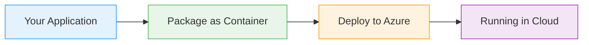

# ARM Templates

  <iconify-icon icon="vscode-icons:file-type-azure" style="font-size: 4rem;" />

---

---
layout: center
class: text-center
---

# Welcome

Welcome to this module on Azure Resource Manager templates, or ARM templates

  <iconify-icon icon="carbon:rocket" style="font-size: 3rem; color: #0078d4;" />

---

---
layout: center
---

# What Are ARM Templates?

So far in this course, we've been using the Azure CLI to create and manage resources. This is what we call an imperative approach - you tell Azure exa...

---

---
layout: center
---

# Understanding ARM Template Structure

Let's look at what an ARM template contains. Open the simple storage account template in your lab files. You'll see it has multiple blocks in the JSON:

---

---
layout: center
---

# The Storage Account Resource

Let's examine the storage account resource definition. You'll see several key elements:

---

---
layout: center
---

# Desired State Deployment

Here's where ARM templates really shine. When you deploy an ARM template, Azure compares what you've described in the template with what currently exists in your subscription. It then makes only the c

---

---
layout: center
---

# What's Next

In the exercises, we'll deploy ARM templates using the Azure CLI, explore the what-if feature to preview changes, and see how ARM templates help you identify and fix configuration drift.

