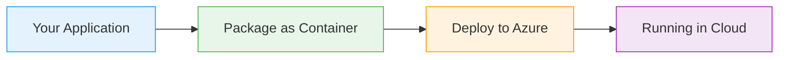
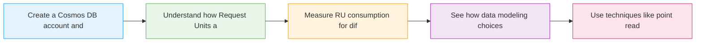

# Cosmos DB Performance Provisioning

  <iconify-icon icon="vscode-icons:file-type-azure" style="font-size: 4rem;" />

---

---
layout: center
class: text-center
---

# Welcome

Welcome to this lab on Cosmos DB Performance Provisioning

  <iconify-icon icon="carbon:rocket" style="font-size: 3rem; color: #0078d4;" />

---

---
layout: center
---

# What is Cosmos DB Pricing?

Cosmos DB charges you for two main things: storage and compute....

---

---
layout: center
---

# Provisioning Models

You have two main options for how you pay for these Request Units:

---

---
layout: center
---

# Why This Matters

Cost is often cited as a concern when considering Cosmos DB. But here's the truth - if you plan appropriately and understand how RUs work, Cosmos DB can actually be very cost-effective. The key is kno

---

---
layout: center
---

# What You'll Learn

---

---
layout: center
---

# The Lab Scenario

We'll be working with a shop database containing product information. You'll create containers with different configurations, load data in different formats, and run queries to see exactly how many Re

