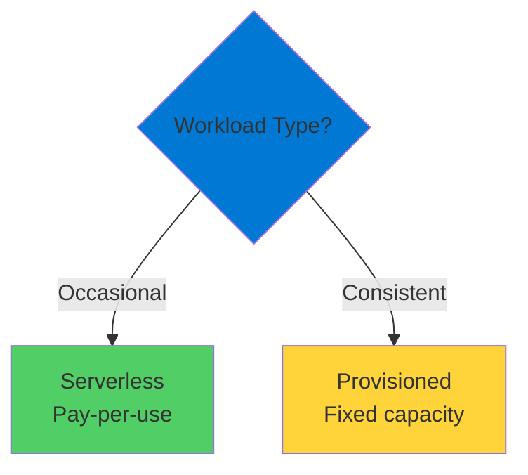
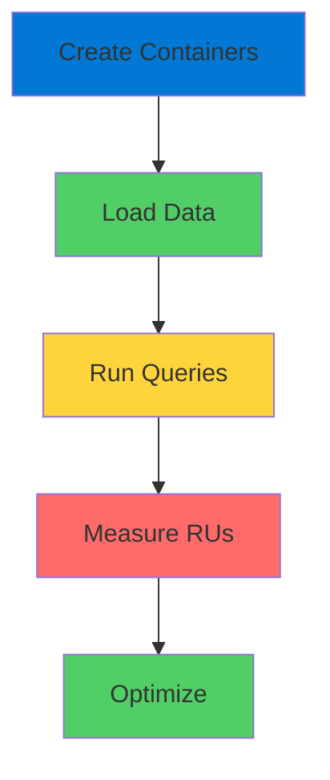

# Cosmos DB Performance Provisioning

Understanding Request Units

  <carbon-dashboard class="text-8xl text-blue-400 opacity-80" />

---
layout: center
---

# Welcome

<v-click>

Explore Cosmos DB performance provisioning Control both performance and cost

</v-click>

---
layout: section
---

# Cosmos DB Pricing

---

# Two Main Charges

<v-click>

  <carbon-data-base class="text-5xl text-blue-400 mt-1" />
  

    
Storage

    
Flat rate based on data stored

    
Same rate regardless of performance

  

</v-click>

<v-click>

  <carbon-dashboard class="text-5xl text-green-400 mt-1" />
  

    
Compute

    
Measured in Request Units (RUs)

    
All access operations charged

  

</v-click>

<v-click>

This is where things get interesting

</v-click>

---

# Request Units

<v-click>

  <carbon-activity class="text-6xl text-purple-400" />

</v-click>

<v-click>

All operations consume RUs

</v-click>

<v-click>

  

    <carbon-view class="text-5xl text-blue-400" />
    
Reads

  

  

    <carbon-edit class="text-5xl text-green-400" />
    
Writes

  

  

    <carbon-delete class="text-5xl text-red-400" />
    
Deletes

  

  

    <carbon-search class="text-5xl text-purple-400" />
    
Queries

  

</v-click>

<v-click>

You pay for every access

</v-click>

---
layout: section
---

# Provisioning Models

---

# Two Payment Options

<v-click>

  <carbon-cloud class="text-5xl text-blue-400 mt-1" />
  

    
Serverless

    
Pay only for RUs consumed

    
Great for dev/test

    
Unpredictable workloads

  

</v-click>

<v-click>

  <carbon-plan class="text-5xl text-green-400 mt-1" />
  

    
Provisioned

    
Fixed RUs per second

    
Pay whether used or not

    
Cost-effective for consistent workloads

  

</v-click>

<v-click>

</v-click>

---
layout: section
---

# Why This Matters

---

# Cost Optimization

<v-click>

Cost is often cited as a concern

</v-click>

<v-click>

But here's the truth

</v-click>

<v-click>

With proper planning and understanding

</v-click>

<v-click>

Cosmos DB can be very cost-effective

</v-click>

<v-click>

The key is knowing how to measure

</v-click>

---
layout: section
---

# What You'll Learn

---

# Lab Objectives

<v-click>

  <carbon-add class="text-4xl text-blue-400" />
  Create database with fixed performance levels

</v-click>

<v-click>

  <carbon-calculate class="text-4xl text-green-400" />
  Understand how RUs are calculated

</v-click>

<v-click>

  <carbon-chart-line class="text-4xl text-purple-400" />
  Measure RU consumption for different queries

</v-click>

<v-click>

  <carbon-data-structured class="text-4xl text-orange-400" />
  See data modeling impact on RU usage

</v-click>

<v-click>

  <carbon-focus class="text-4xl text-red-400" />
  Use point reads to minimize costs

</v-click>

<v-click>

  <carbon-settings class="text-4xl text-blue-500" />
  Apply index policies for optimization

</v-click>

---
layout: section
---

# Lab Scenario

---

# Shop Database

<v-click>

Product information with different configurations

</v-click>

<v-click>

</v-click>

<v-click>

See exactly how many RUs each operation consumes

</v-click>

---

# Practical Experience

<v-click>

  

    <carbon-analytics class="text-6xl text-blue-400" />
    
Measure Consumption

  

  

    <carbon-decision-tree class="text-6xl text-green-400" />
    
Make Informed Decisions

  

  

    <carbon-money class="text-6xl text-purple-400" />
    
Optimize Cost

  

</v-click>

<v-click>

Structure solutions for optimal cost and performance

</v-click>

---
layout: center
class: text-center
---

<v-click>

<carbon-play-outline class="text-8xl text-green-400 inline-block" />

</v-click>

<v-click>

Let's Get Started!

</v-click>

<v-click>

Master Request Units and cost optimization

</v-click>

