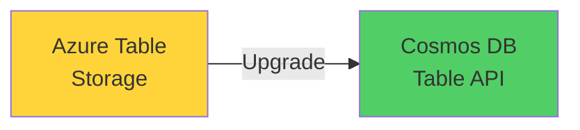
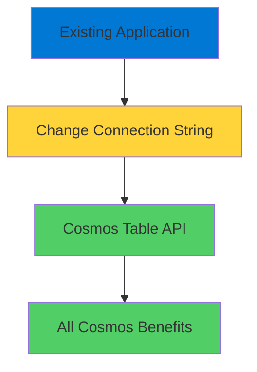
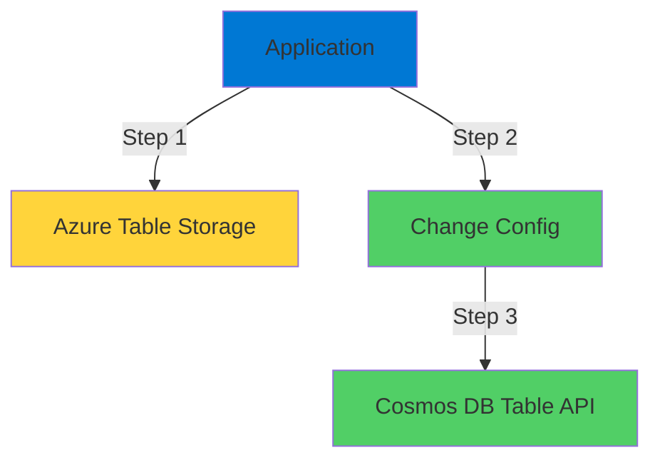
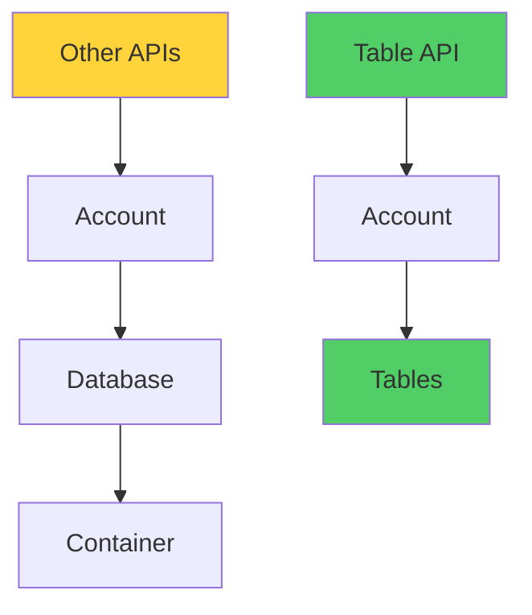
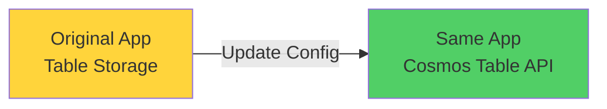

# Cosmos DB Table API

Modern Scalable Table Storage

  <carbon-data-table class="text-8xl text-blue-400 opacity-80" />

---
layout: center
---

# Welcome

<v-click>

Explore Cosmos DB Table API Easy migration from Azure Table Storage

</v-click>

---
layout: section
---

# What is Table API?

---

# Direct Replacement

<v-click>

  <carbon-upgrade class="text-6xl text-green-400" />

</v-click>

<v-click>

Straight replacement for Azure Table Storage

</v-click>

<v-click>

</v-click>

<v-click>

Designed for easy migration

</v-click>

<v-click>

For older applications built with Table Storage

</v-click>

---

# Zero Code Changes

<v-click>

  <carbon-checkmark-outline class="text-6xl text-green-400" />

</v-click>

<v-click>

Use Cosmos Table API without changing applications

</v-click>

<v-click>

</v-click>

<v-click>

Move to modern storage with minimal effort

</v-click>

---
layout: section
---

# Why Use Table API?

---

# Upgrade Path for Legacy Apps

<v-click>

If you have legacy applications using Table Storage

</v-click>

<v-click>

Table API gives you an upgrade path

</v-click>

<v-click>

Without rewriting code

</v-click>

---

# All the Cosmos Benefits

<v-click>

  <carbon-earth class="text-4xl text-blue-400" />
  Global distribution

</v-click>

<v-click>

  <carbon-flash class="text-4xl text-green-400" />
  Guaranteed low latency

</v-click>

<v-click>

  <carbon-data-connected class="text-4xl text-purple-400" />
  Multiple consistency models

</v-click>

<v-click>

  <carbon-certificate-check class="text-4xl text-orange-400" />
  Enterprise-grade SLA

</v-click>

<v-click>

While keeping existing table storage code

</v-click>

---
layout: section
---

# Lab Overview

---

# Seamless Migration Demo

<v-click>

Run application writing to Table Storage

</v-click>

<v-click>

</v-click>

<v-click>

Just a configuration change

</v-click>

<v-click>

Zero code changes required

</v-click>

---
layout: section
---

# Key Concepts

---

# Simpler Structure

<v-click>

Unlike other Cosmos DB APIs

</v-click>

<v-click>

</v-click>

<v-click>

No collections or containers in between

</v-click>

<v-click>

Matches original Table Storage architecture

</v-click>

---

# Two-Level Hierarchy

<v-click>

  

    <carbon-cloud-services class="text-6xl text-blue-400" />
    
Account Level

  

  

    <carbon-arrow-right class="text-6xl text-gray-400" />
  

  

    <carbon-data-table class="text-6xl text-green-400" />
    
Tables

  

</v-click>

<v-click>

Makes migration even more straightforward

</v-click>

---
layout: section
---

# What You'll Learn

---

# Lab Objectives

<v-click>

  <carbon-add class="text-4xl text-blue-400" />
  Create Cosmos DB account with Table API

</v-click>

<v-click>

  <carbon-data-table class="text-4xl text-green-400" />
  Create tables using Portal and CLI

</v-click>

<v-click>

  <carbon-deployment-pattern class="text-4xl text-purple-400" />
  Deploy app that writes to Table Storage

</v-click>

<v-click>

  <carbon-settings class="text-4xl text-orange-400" />
  Switch to Cosmos DB with connection string change

</v-click>

<v-click>

  <carbon-search class="text-4xl text-red-400" />
  Query data using Table API

</v-click>

---

# The Migration Experience

<v-click>

</v-click>

<v-click>

That's the power of Table API

</v-click>

<v-click>

Seamless migration

</v-click>

---
layout: center
class: text-center
---

<v-click>

<carbon-play-outline class="text-8xl text-green-400 inline-block" />

</v-click>

<v-click>

Let's Get Started!

</v-click>

<v-click>

Experience seamless migration to Cosmos DB

</v-click>

