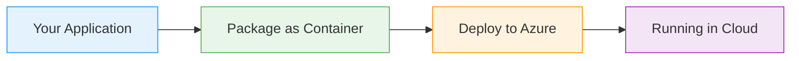
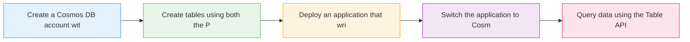

# Cosmos DB Table API

  <iconify-icon icon="vscode-icons:file-type-azure" style="font-size: 4rem;" />

---

---
layout: center
---

# Cosmos DB Table API - Introduction

Welcome to this lab on Cosmos DB Table API. In this session, we'll explore how Cosmos DB's Table API provides a modern, scalable replacement for Azure Table Storage.

---

---
layout: center
---

# What is Cosmos DB Table API?

The Cosmos DB Table API is a straight replacement for Azure Table Storage. It's designed specifically to offer easy migration paths for older applicat...

---

---
layout: center
---

# Why Use Cosmos DB Table API?

If you have legacy applications using Azure Table Storage, the Table API gives you an upgrade path without rewriting code. You get all the benefits of Cosmos DB - global distribution, guaranteed low l

---

---
layout: center
---

# Lab Overview

In today's lab, we'll explore the Table API hands-on. We'll run an application that writes to Table Storage, and then we'll switch it to using Cosmos DB with just a configuration change. This demonstr

---

---
layout: center
---

# Key Concepts

---

---
layout: center
---

# What You'll Learn

