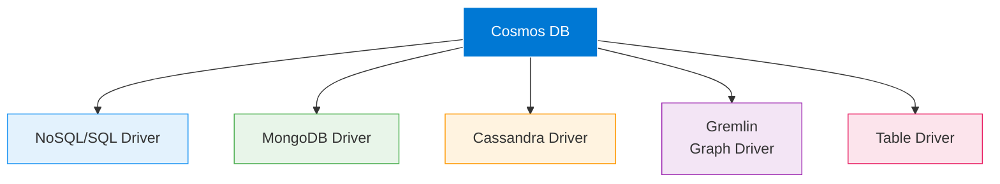

# Multi-Model Database

```mermaid
graph TB
    Cosmos[Cosmos DB] --> NoSQL[NoSQL/SQL Driver]
    Cosmos --> Mongo[MongoDB Driver]
    Cosmos --> Cassandra[Cassandra Driver]
    Cosmos --> Gremlin[Gremlin<br/>Graph Driver]
    Cosmos --> Table[Table Driver]

    style Cosmos fill:#0078d4,stroke:#fff,color:#fff
    style NoSQL fill:#e3f2fd,stroke:#2196f3
    style Mongo fill:#e8f5e9,stroke:#4caf50
    style Cassandra fill:#fff3e0,stroke:#ff9800
    style Gremlin fill:#f3e5f5,stroke:#9c27b0
    style Table fill:#fce4ec,stroke:#e91e63
```

  
One service, multiple storage models

