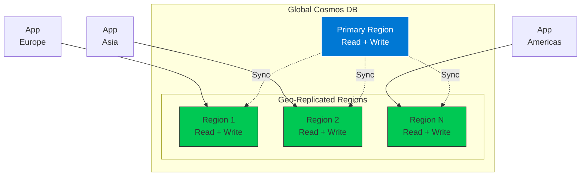

# Global Distribution

```mermaid
graph TB
    subgraph "Global Cosmos DB"
        Primary[Primary Region<br/>Read + Write]

        subgraph Replicas["Geo-Replicated Regions"]
            R1[Region 1<br/>Read + Write]
            R2[Region 2<br/>Read + Write]
            R3[Region N<br/>Read + Write]
        end
    end

    App1[App<br/>Europe] --> R1
    App2[App<br/>Asia] --> R2
    App3[App<br/>Americas] --> R3

    Primary -.Sync.-> R1
    Primary -.Sync.-> R2
    Primary -.Sync.-> R3

    style Primary fill:#0078d4,stroke:#fff,color:#fff
    style R1 fill:#00c853,stroke:#333
    style R2 fill:#00c853,stroke:#333
    style R3 fill:#00c853,stroke:#333
```
