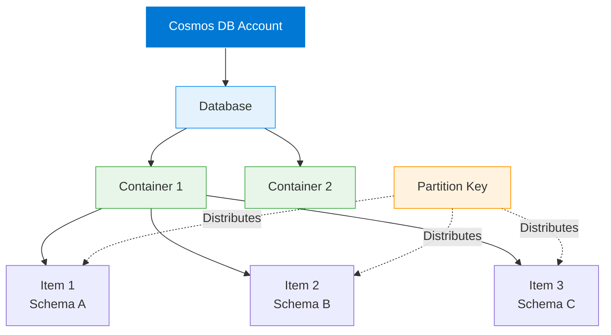

# Data Structure

```mermaid
graph TB
    Account[Cosmos DB Account] --> DB1[Database]
    DB1 --> C1[Container 1]
    DB1 --> C2[Container 2]

    C1 --> I1[Item 1<br/>Schema A]
    C1 --> I2[Item 2<br/>Schema B]
    C1 --> I3[Item 3<br/>Schema C]

    PK[Partition Key] -.Distributes.-> I1
    PK -.Distributes.-> I2
    PK -.Distributes.-> I3

    style Account fill:#0078d4,stroke:#fff,color:#fff
    style DB1 fill:#e3f2fd,stroke:#2196f3
    style C1 fill:#e8f5e9,stroke:#4caf50
    style C2 fill:#e8f5e9,stroke:#4caf50
    style PK fill:#fff3e0,stroke:#ff9800
```

- Flexible schemas
- Partition key critical
- Request Unit pricing

