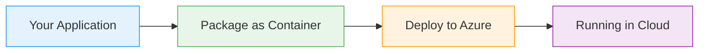

# Cosmos DB

  <iconify-icon icon="vscode-icons:file-type-azure" style="font-size: 4rem;" />

---

---
layout: center
class: text-center
---

# Welcome

Welcome to this tutorial on Azure Cosmos DB

  <iconify-icon icon="carbon:rocket" style="font-size: 3rem; color: #0078d4;" />

---

---
layout: center
---

# What is Cosmos DB?

Cosmos DB is billed as a planet-scale database, and for good reason. You can start small with a localized instance and then expand it for global repli...

---

---
layout: center
---

# Understanding the NoSQL Driver

Here's something that might confuse you at first: NoSQL is the native driver for CosmosDB, but it was previously called the SQL driver. You'll see it referred to as "NoSQL" in the Azure Portal, but th

---

---
layout: center
---

# Why Choose Cosmos DB?

Cosmos DB excels at scaling because of its intelligent data partitioning. It spreads data across multiple storage locations, and all those locations can be read from and written to simultaneously. Whe

---

---
layout: center
---

# Key Capabilities

Let's talk about what makes Cosmos DB special:

---

---
layout: center
---

# Cost Considerations

Before diving in, it's important to understand that CosmosDB is an enterprise-grade database. The pricing model is based on Request Units, or RUs, which represent the computational resources needed fo

---

---
layout: center
---

# Real-World Use Cases

---

---
layout: center
class: text-center
---

# Getting Started

<iconify-icon icon="mdi:checkbox-marked-circle" class="text-blue-500" /> Create a Cosmos DB account and database

<iconify-icon icon="mdi:checkbox-marked-circle" class="text-blue-500" /> Understand how containers work differently from traditional tables

<iconify-icon icon="mdi:checkbox-marked-circle" class="text-blue-500" /> Run applications that use Cosmos DB for storage

<iconify-icon icon="mdi:checkbox-marked-circle" class="text-blue-500" /> Query data using SQL-like syntax

<iconify-icon icon="mdi:checkbox-marked-circle" class="text-blue-500" /> Explore partitioning and data modeling

  <iconify-icon icon="carbon:rocket" style="font-size: 3rem; color: #0078d4;" />

---

---
layout: center
---

# Important Concepts

Before we move to the hands-on exercises, let's cover some terminology:

---

---
layout: center
---

# What's Next

In the following exercises, we'll create our first Cosmos DB account, set up a database with the NoSQL driver, and run a sample application that demonstrates how to work with Cosmos DB using Entity Fr

---

---
layout: center
---

# Closing

By the end of this series, you'll understand how to leverage Cosmos DB's powerful features for building globally distributed, highly responsive applications. Whether you're preparing for the AZ-204 ce

