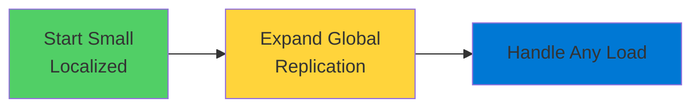
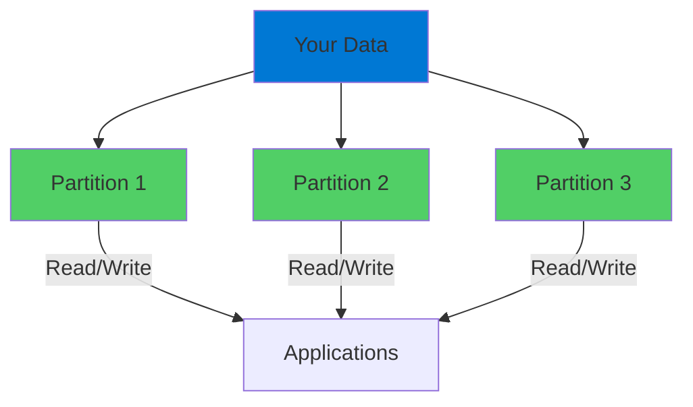
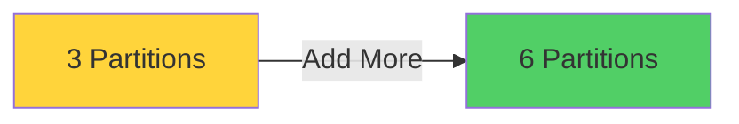
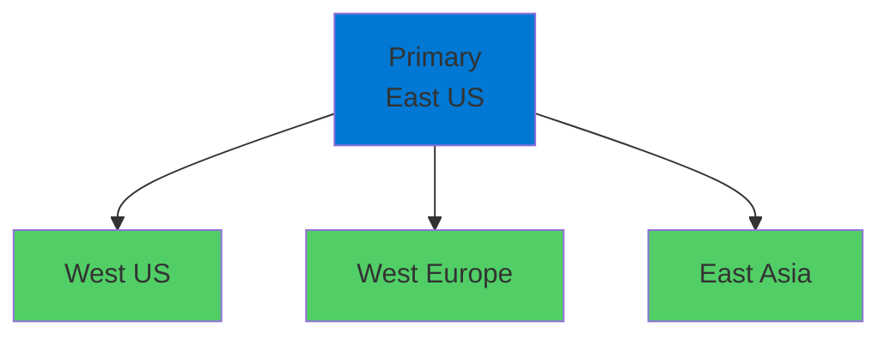
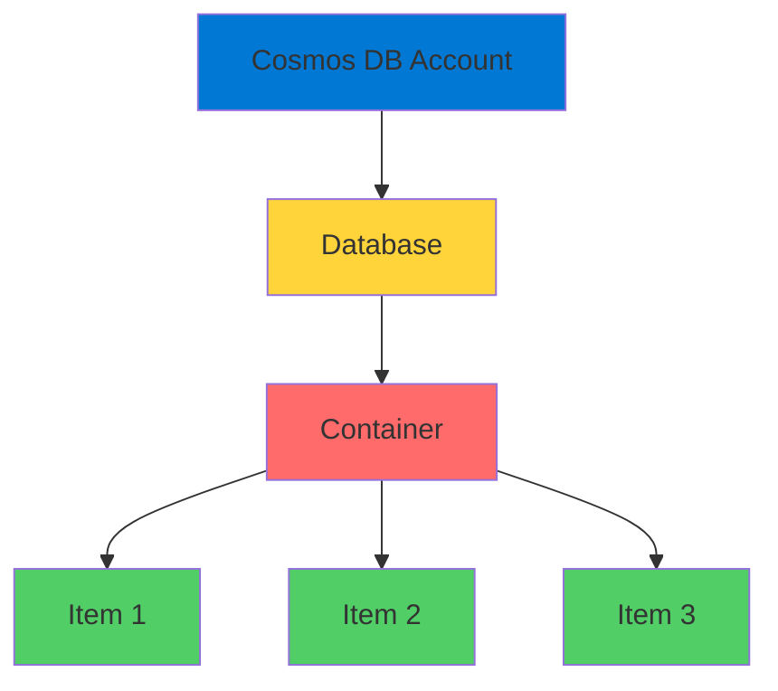

# Azure Cosmos DB

Planet-Scale Globally Distributed Database

  <carbon-data-base class="text-8xl text-purple-400 opacity-80" />

---
layout: center
---

# Welcome

<v-click>

Explore Azure Cosmos DB Globally distributed, multi-model database

</v-click>

<v-click>

Designed for planet-scale applications

</v-click>

---
layout: section
---

# What is Cosmos DB?

---

# Planet-Scale Database

<v-click>

  <carbon-earth class="text-8xl text-blue-400" />

</v-click>

<v-click>

</v-click>

<v-click>

Start small, expand globally

</v-click>

---

# Multi-Model Support

<v-click>

Single product, different storage drivers

</v-click>

<v-click>

  

    <carbon-data-1 class="text-5xl text-blue-400" />
    
NoSQL

  

  

    <carbon-data-base class="text-5xl text-green-400" />
    
MongoDB

  

  

    <carbon-network-3 class="text-5xl text-purple-400" />
    
Cassandra

  

  

    <carbon-share class="text-5xl text-orange-400" />
    
Gremlin (Graph)

  

  

    <carbon-table class="text-5xl text-red-400" />
    
Table

  

</v-click>

<v-click>

Different storage approaches, consistent management

</v-click>

---
layout: section
---

# Understanding the NoSQL Driver

---

# Naming Confusion

<v-click>

  <carbon-warning class="text-6xl text-orange-400" />

</v-click>

<v-click>

NoSQL is the native driver for Cosmos DB

</v-click>

<v-click>

Previously called the "SQL" driver

</v-click>

<v-click>

  

    <carbon-portal class="text-5xl text-blue-400" />
    
Portal: "NoSQL"

  

  

    <carbon-command-line class="text-5xl text-green-400" />
    
CLI: "SQL"

  

</v-click>

<v-click>

Keep this in mind to avoid confusion

</v-click>

---
layout: section
---

# Why Choose Cosmos DB?

---

# Intelligent Partitioning

<v-click>

  <carbon-data-enrichment class="text-6xl text-purple-400" />

</v-click>

<v-click>

Spreads data across multiple storage locations

</v-click>

<v-click>

</v-click>

<v-click>

All locations can be read from and written to simultaneously

</v-click>

---

# Automatic Scaling

<v-click>

Need more capacity?

</v-click>

<v-click>

</v-click>

<v-click>

Cosmos DB simply adds more partitions

</v-click>

<v-click>

Completely managed for you

</v-click>

---
layout: section
---

# Key Capabilities

---

# Global Distribution

<v-click>

  <carbon-earth-filled class="text-6xl text-blue-400" />

</v-click>

<v-click>

</v-click>

<v-click>

Replicate across multiple Azure regions worldwide

</v-click>

<v-click>

Data closer to users = reduced latency

</v-click>

---

# Flexible Consistency Levels

<v-click>

  

    <carbon-locked class="text-5xl text-red-400" />
    
Strong

    
Critical data

  

  

    <carbon-renew class="text-5xl text-orange-400" />
    
Bounded Staleness

    
Predictable lag

  

  

    <carbon-network-overlay class="text-5xl text-yellow-400" />
    
Session

    
User sessions

  

  

    <carbon-data-enrichment class="text-5xl text-green-400" />
    
Consistent Prefix

    
Ordered updates

  

  

    <carbon-forward class="text-5xl text-blue-400" />
    
Eventual

    
Lowest latency

  

</v-click>

<v-click>

Five consistency levels - choose based on needs

</v-click>

---

# Guaranteed Performance

<v-click>

Service Level Agreements for:

</v-click>

<v-click>

  

    <carbon-meter-alt class="text-4xl text-blue-400" />
    Throughput
  

  

    <carbon-time class="text-4xl text-green-400" />
    Latency
  

  

    <carbon-checkmark-outline class="text-4xl text-purple-400" />
    Availability
  

  

    <carbon-data-check class="text-4xl text-orange-400" />
    Consistency
  

</v-click>

<v-click>

Predictable performance at any scale

</v-click>

---
layout: section
---

# Cost Considerations

---

# Enterprise-Grade Database

<v-click>

  <carbon-currency-dollar class="text-6xl text-green-400" />

</v-click>

<v-click>

Pricing based on Request Units (RUs)

</v-click>

<v-click>

Computational resources needed for operations

</v-click>

---

# Pricing Options

<v-click>

  <carbon-meter-alt class="text-5xl text-blue-400 mt-1" />
  

    
Provisioned Throughput

    
Free tier available, set price caps

  

</v-click>

<v-click>

  <carbon-cloud class="text-5xl text-green-400 mt-1" />
  

    
Serverless

    
Development and smaller workloads

  

</v-click>

<v-click>

  <carbon-scale class="text-5xl text-purple-400 mt-1" />
  

    
Autoscale

    
Adjusts automatically based on demand

  

</v-click>

<v-click>

⚠️ Understand pricing before production deployment

</v-click>

---
layout: section
---

# Real-World Use Cases

---

# Perfect For

<v-click>

  <carbon-iot-platform class="text-4xl text-blue-400" />
  

    
IoT and Telemetry

    
Massive volumes from connected devices

  

</v-click>

<v-click>

  <carbon-shopping-cart class="text-4xl text-green-400" />
  

    
Retail and E-commerce

    
Product catalogs, global transactions

  

</v-click>

<v-click>

  <carbon-game-console class="text-4xl text-purple-400" />
  

    
Gaming

    
Player profiles, leaderboards, low latency

  

</v-click>

<v-click>

  <carbon-application-mobile class="text-4xl text-orange-400" />
  

    
Web and Mobile Apps

    
Data distributed close to users

  

</v-click>

<v-click>

  <carbon-chart-line class="text-4xl text-red-400" />
  

    
Financial Services

    
Strong consistency guarantees

  

</v-click>

---
layout: section
---

# Important Concepts

---

# Terminology

<v-click>

  <carbon-user-identification class="text-4xl text-blue-400" />
  

    
Account

    
Top-level resource containing databases

  

</v-click>

<v-click>

  <carbon-data-base class="text-4xl text-green-400" />
  

    
Database

    
Container for collections of data

  

</v-click>

<v-click>

  <carbon-container-software class="text-4xl text-purple-400" />
  

    
Container

    
Similar to table, flexible schema

  

</v-click>

<v-click>

  <carbon-document class="text-4xl text-orange-400" />
  

    
Items

    
Individual records in containers

  

</v-click>

<v-click>

  <carbon-data-enrichment class="text-4xl text-red-400" />
  

    
Partition Key

    
Property to distribute data - critical for performance

  

</v-click>

---

# Hierarchy

<v-click>

</v-click>

---
layout: section
---

# What's Next

---

# Lab Objectives

<v-click>

  <carbon-add class="text-3xl text-blue-400 mt-1" />
  Create Cosmos DB account

</v-click>

<v-click>

  <carbon-data-base class="text-3xl text-green-400 mt-1" />
  Set up database with NoSQL driver

</v-click>

<v-click>

  <carbon-application class="text-3xl text-purple-400 mt-1" />
  Run sample app with Entity Framework

</v-click>

<v-click>

  <carbon-search class="text-3xl text-orange-400 mt-1" />
  Explore Data Explorer in Azure Portal

</v-click>

<v-click>

  <carbon-password class="text-3xl text-red-400 mt-1" />
  Retrieve connection strings via Portal and CLI

</v-click>

---
layout: center
class: text-center
---

<v-click>

<carbon-play-outline class="text-8xl text-green-400 inline-block" />

</v-click>

<v-click>

Let's Get Started!

</v-click>

<v-click>

Build globally distributed applications with Cosmos DB

</v-click>

