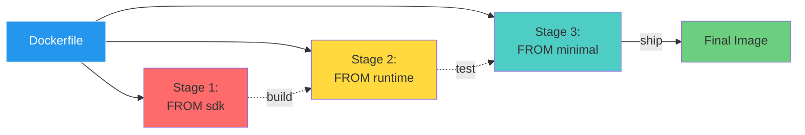

# What Are Multi-Stage Builds?

Multiple FROM commands in one Dockerfile

```mermaid
graph LR
    D[Dockerfile] --> S1[Stage 1:<br/>FROM sdk]
    D --> S2[Stage 2:<br/>FROM runtime]
    D --> S3[Stage 3:<br/>FROM minimal]
    S1 -.->|build| S2
    S2 -.->|test| S3
    S3 -->|ship| F[Final Image]

    style D fill:#2496ed,stroke:#fff,color:#fff
    style S1 fill:#ff6b6b
    style S2 fill:#ffd93d
    style S3 fill:#4ecdc4
    style F fill:#6bcf7f
```

Like an assembly line: multiple stations, ship only the finished product

