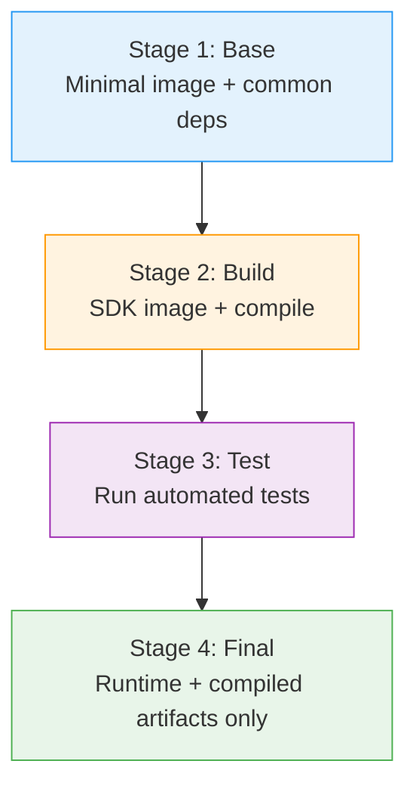

# The Basic Pattern

Typical multi-stage workflow

```mermaid
graph TD
    S1[Stage 1: Base<br/>Minimal image + common deps] --> S2[Stage 2: Build<br/>SDK image + compile]
    S2 --> S3[Stage 3: Test<br/>Run automated tests]
    S3 --> S4[Stage 4: Final<br/>Runtime + compiled artifacts only]

    style S1 fill:#e3f2fd,stroke:#2196f3
    style S2 fill:#fff3e0,stroke:#ff9800
    style S3 fill:#f3e5f5,stroke:#9c27b0
    style S4 fill:#e8f5e9,stroke:#4caf50
```

Each stage = temporary workspace

Final image = only what you explicitly copy

