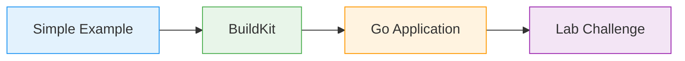

# What We'll Cover

Practical examples ahead

<iconify-icon icon="mdi:check-circle" class="text-green-500" /> Examine multi-stage mechanics

<iconify-icon icon="mdi:check-circle" class="text-green-500" /> Explore BuildKit optimization

<iconify-icon icon="mdi:check-circle" class="text-green-500" /> Build real Go app

<iconify-icon icon="mdi:check-circle" class="text-green-500" /> Configure application arguments

See dramatic size differences in action!

