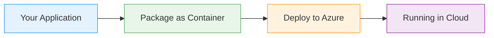

# Docker Multi-Stage Builds

  <iconify-icon icon="logos:docker-icon" style="font-size: 4rem;" />

---

---
layout: center
class: text-center
---

# Welcome

Welcome to this session on Docker Multi-Stage Builds

  <iconify-icon icon="carbon:rocket" style="font-size: 3rem; color: #0078d4;" />

---

---
layout: center
---

# What Are Multi-Stage Builds?

Multi-stage builds use the standard Dockerfile syntax with a key difference: they contain multiple FROM commands, each representing a separate build s...

---

---
layout: center
---

# Why Use Multi-Stage Builds?

You won't see multi-stage builds used everywhere, but they offer significant advantages:

---

---
layout: center
---

# The Basic Pattern

A typical multi-stage Dockerfile follows this pattern:

---

---
layout: center
---

# Language Support

Multi-stage builds work with all major programming languages. Docker Hub provides official images for:

---

---
layout: center
---

# What We'll Cover

<iconify-icon icon="mdi:check-circle" class="text-blue-500" /> stage build to understand the mechanics

<iconify-icon icon="mdi:check-circle" class="text-blue-500" /> stage builds

