# Docker Multi-Stage Builds

Creating Optimized Production Images

<div class="abs-bottom-10 left-10">
  <carbon-build-tool class="text-8xl text-blue-400 opacity-80" />
</div>

---
layout: center
---

# Welcome

<v-click>

<div class="text-xl mt-8">
Explore one of Docker's most powerful features<br/>for creating optimized, production-ready images
</div>

</v-click>

---
layout: section
---

# What Are Multi-Stage Builds?

---

# Multiple FROM Commands

<v-click>

<div class="mt-8">

```dockerfile
FROM mcr.microsoft.com/dotnet/sdk:8.0 AS build
# Build stage

FROM mcr.microsoft.com/dotnet/runtime:8.0 AS final
# Final stage
```

</div>

</v-click>

<v-click>

<div class="mt-8 text-center text-xl">
Each FROM represents a separate build stage
</div>

</v-click>

<v-click>

<div class="mt-12">


</div>

</v-click>

---

# Factory Assembly Line

<v-click>

<div class="mt-8 text-center text-xl">
Like an assembly line in a factory
</div>

</v-click>

<v-click>

<div class="mt-12">


</div>

</v-click>

<v-click>

<div class="mt-8 text-center text-lg opacity-70">
Ship the finished product, not the manufacturing equipment
</div>

</v-click>

---
layout: section
---

# Why Use Multi-Stage Builds?

---

# Centralized Toolset

<v-click>

<div class="mt-4">
  <carbon-tools class="text-6xl text-blue-400" />
</div>

</v-click>

<v-click>

<div class="mt-8 text-xl text-center">
Developers and build servers only need:
</div>

</v-click>

<v-click>

<div class="mt-12 flex justify-center gap-12">
  <div class="text-center">
    <carbon-docker class="text-6xl text-blue-500" />
    <div class="text-sm mt-3">Docker</div>
  </div>
  <div class="text-center">
    <carbon-code class="text-6xl text-green-400" />
    <div class="text-sm mt-3">Source Code</div>
  </div>
</div>

</v-click>

<v-click>

<div class="mt-12 text-center text-lg">
Build tools come packaged in Docker images
</div>

</v-click>

<v-click>

<div class="mt-4 text-center text-sm opacity-70">
Everyone uses same versions of everything
</div>

</v-click>

---

# Smaller Images

<v-click>

<div class="mt-8">


</div>

</v-click>

<v-click>

<div class="mt-12 text-center text-2xl">
Final image: only what's necessary to run
</div>

</v-click>

<v-click>

<div class="mt-6 text-center text-xl text-green-400">
Reduce from hundreds of MB to just a few MB
</div>

</v-click>

---

# Security

<v-click>

<div class="mt-4">
  <carbon-security class="text-6xl text-red-400" />
</div>

</v-click>

<v-click>

<div class="mt-8 text-xl text-center">
Fewer components = Smaller attack surface
</div>

</v-click>

<v-click>

<div class="mt-12">


</div>

</v-click>

<v-click>

<div class="mt-8 text-center text-lg opacity-70">
Build tools don't make it into production
</div>

</v-click>

---

# Simplified Pipeline

<v-click>

<div class="mt-8 text-center text-xl">
One Dockerfile handles everything
</div>

</v-click>

<v-click>

<div class="mt-12">


</div>

</v-click>

<v-click>

<div class="mt-8 text-center text-xl text-green-400">
Cleaner, more maintainable CI/CD pipelines
</div>

</v-click>

---
layout: section
---

# The Basic Pattern

---

# Typical Multi-Stage Dockerfile

<v-click>

<div class="mt-6 flex items-start gap-4">
  <div class="text-3xl text-blue-400 mt-1">1</div>
  <div>
    <carbon-data-base class="text-3xl inline-block" />
    <span class="ml-3 text-lg">Base Stage - Minimal image + common dependencies</span>
  </div>
</div>

</v-click>

<v-click>

<div class="mt-6 flex items-start gap-4">
  <div class="text-3xl text-yellow-400 mt-1">2</div>
  <div>
    <carbon-build-tool class="text-3xl inline-block" />
    <span class="ml-3 text-lg">Build Stage - SDK image compiles application</span>
  </div>
</div>

</v-click>

<v-click>

<div class="mt-6 flex items-start gap-4">
  <div class="text-3xl text-red-400 mt-1">3</div>
  <div>
    <carbon-test-tool class="text-3xl inline-block" />
    <span class="ml-3 text-lg">Test Stage - Optional automated tests</span>
  </div>
</div>

</v-click>

<v-click>

<div class="mt-6 flex items-start gap-4">
  <div class="text-3xl text-green-400 mt-1">4</div>
  <div>
    <carbon-checkmark-outline class="text-3xl inline-block" />
    <span class="ml-3 text-lg">Final Stage - Minimal runtime + compiled artifacts only</span>
  </div>
</div>

</v-click>

---

# Stage as Temporary Workspace

```mermaid
graph TB
    Build[Build Stage<br/>Temporary Workspace] -->|Artifacts| Final[Final Stage]
    Build -.->|Discarded| Trash[🗑️]
    style Build fill:#ffd43b
    style Final fill:#51cf66
    style Trash fill:#ff6b6b
```

<v-click>

<div class="mt-8">



</div>

</v-click>

<v-click>

<div class="mt-12 text-center text-xl">
Docker executes all stages during build
</div>

</v-click>

<v-click>

<div class="mt-6 text-center text-xl text-green-400">
Final image only contains what you explicitly copy
</div>

</v-click>

---
layout: section
---

# Language Support

---

# Multi-Stage Works Everywhere

<v-click>

<div class="mt-8 grid grid-cols-3 gap-6">
  <div class="text-center">
    <carbon-logo-java class="text-6xl text-red-400" />
    <div class="text-sm mt-3">Java</div>
    <div class="text-xs opacity-70">Maven/Gradle + OpenJDK</div>
  </div>
  <div class="text-center">
    <carbon-logo-python class="text-6xl text-blue-400" />
    <div class="text-sm mt-3">Python</div>
    <div class="text-xs opacity-70">Python + pip</div>
  </div>
  <div class="text-center">
    <carbon-logo-nodejs class="text-6xl text-green-400" />
    <div class="text-sm mt-3">Node.js</div>
    <div class="text-xs opacity-70">Node + npm</div>
  </div>
  <div class="text-center">
    <carbon-logo-go-gopher class="text-6xl text-blue-300" />
    <div class="text-sm mt-3">Go</div>
    <div class="text-xs opacity-70">Golang SDK + scratch</div>
  </div>
  <div class="text-center">
    <carbon-logo-dotnet class="text-6xl text-purple-400" />
    <div class="text-sm mt-3">.NET</div>
    <div class="text-xs opacity-70">SDK + Runtime</div>
  </div>
  <div class="text-center">
    <carbon-code class="text-6xl text-orange-400" />
    <div class="text-sm mt-3">More...</div>
    <div class="text-xs opacity-70">All major languages</div>
  </div>
</div>

</v-click>

<v-click>

<div class="mt-8 text-center text-lg">
Patterns are consistent across languages
</div>

</v-click>

---
layout: section
---

# What We'll Cover

---

# Lab Objectives

<v-click>

<div class="mt-6 flex items-start gap-4">
  <div class="text-3xl text-blue-400 mt-1">1</div>
  <div>
    <carbon-search class="text-3xl inline-block" />
    <span class="ml-3 text-lg">Examine simple multi-stage build mechanics</span>
  </div>
</div>

</v-click>

<v-click>

<div class="mt-6 flex items-start gap-4">
  <div class="text-3xl text-green-400 mt-1">2</div>
  <div>
    <carbon-meter-alt class="text-3xl inline-block" />
    <span class="ml-3 text-lg">Explore BuildKit - Docker's optimized build engine</span>
  </div>
</div>

</v-click>

<v-click>

<div class="mt-6 flex items-start gap-4">
  <div class="text-3xl text-purple-400 mt-1">3</div>
  <div>
    <carbon-logo-go-gopher class="text-3xl inline-block" />
    <span class="ml-3 text-lg">Build real Go application - see dramatic size differences</span>
  </div>
</div>

</v-click>

<v-click>

<div class="mt-6 flex items-start gap-4">
  <div class="text-3xl text-orange-400 mt-1">4</div>
  <div>
    <carbon-chemistry class="text-3xl inline-block" />
    <span class="ml-3 text-lg">Lab challenge: configure application arguments</span>
  </div>
</div>

</v-click>

---
layout: center
class: text-center
---

<div>

<v-click>

<carbon-play-outline class="text-8xl text-green-400 inline-block" />

</v-click>

<v-click>

<div class="text-4xl mt-8 font-bold">
Let's Get Started!
</div>

</v-click>

<v-click>

<div class="text-xl mt-6 opacity-70">
Build optimized container images
</div>

</v-click>

</div>
