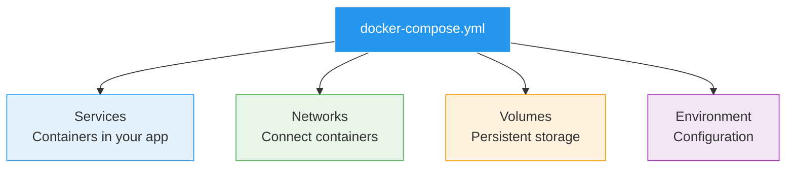

# The Compose Specification

Key elements in YAML

```mermaid
graph TB
    CF[docker-compose.yml] --> S[Services<br/>Containers in your app]
    CF --> N[Networks<br/>Connect containers]
    CF --> V[Volumes<br/>Persistent storage]
    CF --> E[Environment<br/>Configuration]

    style CF fill:#2496ed,stroke:#fff,color:#fff
    style S fill:#e3f2fd,stroke:#2196f3
    style N fill:#e8f5e9,stroke:#4caf50
    style V fill:#fff3e0,stroke:#ff9800
    style E fill:#f3e5f5,stroke:#9c27b0
```

Define your complete application architecture in one file

