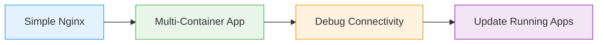

# Looking Ahead

What we'll practice

<iconify-icon icon="mdi:check-circle" class="text-green-500" /> Start with single container

<iconify-icon icon="mdi:check-circle" class="text-green-500" /> Build distributed application

<iconify-icon icon="mdi:check-circle" class="text-green-500" /> Learn debugging techniques

<iconify-icon icon="mdi:check-circle" class="text-green-500" /> Manage application lifecycle

Important skill for AZ-204 certification

