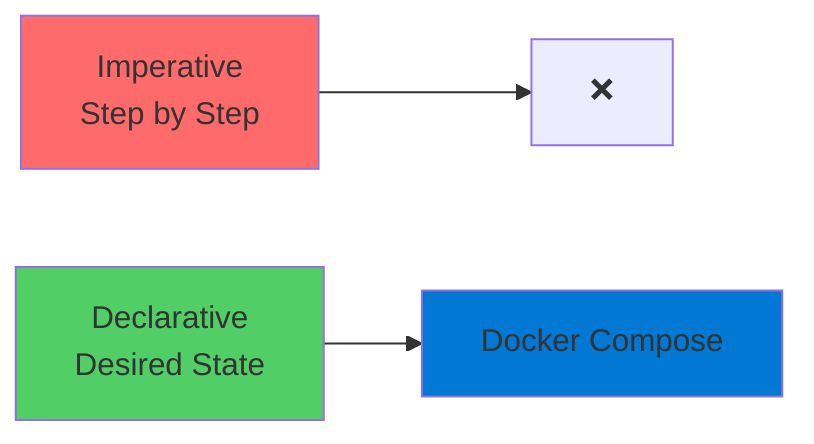
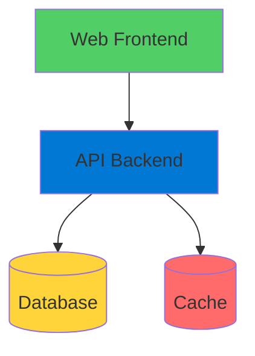
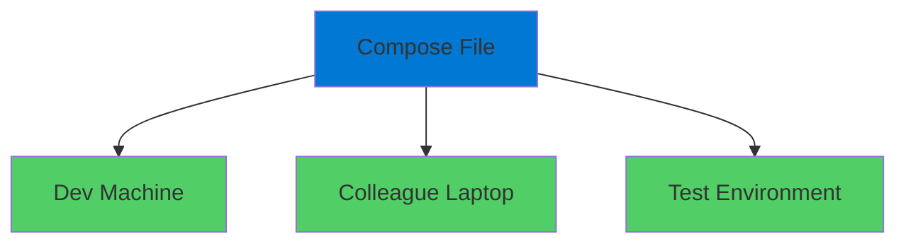
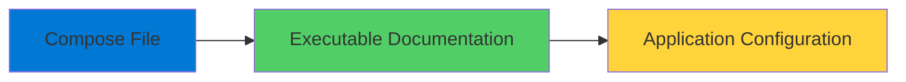

# Docker Compose

Managing Multi-Container Applications

<div class="abs-bottom-10 left-10">
  <carbon-application-web class="text-8xl text-blue-400 opacity-80" />
</div>

---
layout: center
---

# Welcome

<v-click>

<div class="text-xl mt-8">
Explore Docker Compose<br/>Define and manage multi-container apps with YAML
</div>

</v-click>

---
layout: section
---

# What is Docker Compose?

---

# Two Things

<v-click>

<div class="mt-8 flex items-start gap-4">
  <div class="text-4xl text-blue-400 mt-1">1</div>
  <div>
    <carbon-document class="text-4xl inline-block" />
    <div class="ml-3 mt-2">
      <div class="text-xl font-bold">Specification</div>
      <div class="text-sm mt-2 opacity-70">For describing distributed applications in containers</div>
    </div>
  </div>
</div>

</v-click>

<v-click>

<div class="mt-10 flex items-start gap-4">
  <div class="text-4xl text-green-400 mt-1">2</div>
  <div>
    <carbon-command-line class="text-4xl inline-block" />
    <div class="ml-3 mt-2">
      <div class="text-xl font-bold">CLI Tool</div>
      <div class="text-sm mt-2 opacity-70">Takes specifications and runs them in Docker</div>
    </div>
  </div>
</div>

</v-click>

---

# Desired-State Approach

<v-click>

<div class="mt-8 text-center text-xl">
Similar to ARM templates or Bicep
</div>

</v-click>

<v-click>

<div class="mt-12">



</div>

</v-click>

<v-click>

<div class="mt-8 text-center text-xl">
Declare what you want, Compose makes it happen
</div>

</v-click>

---
layout: section
---

# Why Use Docker Compose?

---

# Why Not Just docker run?

<v-click>

<div class="mt-12">

```bash
docker run -d -p 80:80 --name web nginx
docker run -d -p 5432:5432 --name db postgres
docker run -d -p 6379:6379 --name cache redis
docker run -d --link db --link cache api-app
```

</div>

</v-click>

<v-click>

<div class="mt-8 text-center text-2xl text-red-400">
Complex, tedious, error-prone
</div>

</v-click>

---

# Benefit 1: Living Documentation

<v-click>

<div class="mt-4">
  <carbon-document class="text-6xl text-blue-400" />
</div>

</v-click>

<v-click>

<div class="mt-8 text-xl text-center">
Clear YAML file shows entire architecture
</div>

</v-click>

<v-click>

<div class="mt-12">

```yaml
services:
  web:
    image: nginx
  api:
    image: myapi
  db:
    image: postgres
```

</div>

</v-click>

<v-click>

<div class="mt-6 text-center text-lg text-green-400">
vs. sharing complex docker run commands
</div>

</v-click>

---

# Benefit 2: Simplifies Multi-Container

<v-click>

<div class="mt-8 text-center text-xl">
Modern distributed applications
</div>

</v-click>

<v-click>

<div class="mt-12">



</div>

</v-click>

<v-click>

<div class="mt-8 text-center text-lg opacity-70">
Managing all these with individual commands is tedious
</div>

</v-click>

---

# Benefit 3: Consistent Deployment

<v-click>

<div class="mt-8">



</div>

</v-click>

<v-click>

<div class="mt-12 text-center text-2xl text-green-400">
Same application configuration everywhere
</div>

</v-click>

---
layout: section
---

# The Compose Specification

---

# YAML Format

<v-click>

<div class="mt-8">

```yaml
version: '3.8'

services:
  web:
    image: nginx
    ports:
      - "80:80"

networks:
  default:
    name: mynetwork

volumes:
  data:
```

</div>

</v-click>

---

# Key Elements

<v-click>

<div class="mt-6 flex items-center gap-4">
  <carbon-application class="text-4xl text-blue-400" />
  <div>
    <div class="text-lg font-bold">Services</div>
    <div class="text-sm opacity-70">Containers that make up your application</div>
  </div>
</div>

</v-click>

<v-click>

<div class="mt-6 flex items-center gap-4">
  <carbon-network-3 class="text-4xl text-green-400" />
  <div>
    <div class="text-lg font-bold">Networks</div>
    <div class="text-sm opacity-70">Connect containers for communication</div>
  </div>
</div>

</v-click>

<v-click>

<div class="mt-6 flex items-center gap-4">
  <carbon-data-storage class="text-4xl text-purple-400" />
  <div>
    <div class="text-lg font-bold">Volumes</div>
    <div class="text-sm opacity-70">Provide persistent storage</div>
  </div>
</div>

</v-click>

<v-click>

<div class="mt-6 flex items-center gap-4">
  <carbon-data-1 class="text-4xl text-orange-400" />
  <div>
    <div class="text-lg font-bold">Environment Variables</div>
    <div class="text-sm opacity-70">Configure application components</div>
  </div>
</div>

</v-click>

---
layout: section
---

# CLI Tools

---

# Two Versions

<v-click>

<div class="mt-8 flex items-start gap-4">
  <div class="text-4xl text-blue-400 mt-1">1</div>
  <div>
    <div class="text-xl font-bold font-mono">docker-compose</div>
    <div class="text-sm mt-2 opacity-70">Original tool - separate binary (with hyphen)</div>
  </div>
</div>

</v-click>

<v-click>

<div class="mt-10 flex items-start gap-4">
  <div class="text-4xl text-green-400 mt-1">2</div>
  <div>
    <div class="text-xl font-bold font-mono">docker compose</div>
    <div class="text-sm mt-2 opacity-70">Built into Docker - newer versions (with space)</div>
  </div>
</div>

</v-click>

<v-click>

<div class="mt-12 text-center text-xl text-green-400">
Commands are identical - just swap hyphen for space
</div>

</v-click>

---

# CLI Examples

<v-click>

<div class="mt-8">

```bash
# Original (hyphen)
docker-compose up
docker-compose down
docker-compose ps

# Built-in (space)
docker compose up
docker compose down
docker compose ps
```

</div>

</v-click>

<v-click>

<div class="mt-8 text-center text-lg opacity-70">
Use whichever version you have available
</div>

</v-click>

---
layout: section
---

# When to Use Docker Compose

---

# Perfect For

<v-click>

<div class="mt-6 flex items-center gap-4">
  <carbon-code class="text-4xl text-blue-400" />
  <span class="text-lg">Development environments - run multiple services locally</span>
</div>

</v-click>

<v-click>

<div class="mt-6 flex items-center gap-4">
  <carbon-test-tool class="text-4xl text-green-400" />
  <span class="text-lg">Testing multi-container applications</span>
</div>

</v-click>

<v-click>

<div class="mt-6 flex items-center gap-4">
  <carbon-document-tasks class="text-4xl text-purple-400" />
  <span class="text-lg">Defining architecture for later K8s/ACI deployment</span>
</div>

</v-click>

<v-click>

<div class="mt-6 flex items-center gap-4">
  <carbon-cloud-services class="text-4xl text-orange-400" />
  <span class="text-lg">Small production deployments</span>
</div>

</v-click>

---

# Even for Single Containers

<v-click>

<div class="mt-12 text-center text-xl">
Even simple single-container apps benefit
</div>

</v-click>

<v-click>

<div class="mt-12">



</div>

</v-click>

<v-click>

<div class="mt-12 text-center text-lg text-green-400">
Valuable as executable documentation
</div>

</v-click>

---
layout: section
---

# Looking Ahead

---

# Lab Exercises

<v-click>

<div class="mt-6 flex items-start gap-4">
  <div class="text-3xl text-blue-400 mt-1">1</div>
  <div>
    <carbon-document class="text-3xl inline-block" />
    <span class="ml-3 text-lg">Start simple - single Nginx container in Compose</span>
  </div>
</div>

</v-click>

<v-click>

<div class="mt-6 flex items-start gap-4">
  <div class="text-3xl text-green-400 mt-1">2</div>
  <div>
    <carbon-application-web class="text-3xl inline-block" />
    <span class="ml-3 text-lg">Multi-container distributed application</span>
  </div>
</div>

</v-click>

<v-click>

<div class="mt-6 flex items-start gap-4">
  <div class="text-3xl text-purple-400 mt-1">3</div>
  <div>
    <carbon-network-3 class="text-3xl inline-block" />
    <span class="ml-3 text-lg">Debug connectivity issues</span>
  </div>
</div>

</v-click>

<v-click>

<div class="mt-6 flex items-start gap-4">
  <div class="text-3xl text-orange-400 mt-1">4</div>
  <div>
    <carbon-renew class="text-3xl inline-block" />
    <span class="ml-3 text-lg">Update running applications</span>
  </div>
</div>

</v-click>

<v-click>

<div class="mt-6 flex items-start gap-4">
  <div class="text-3xl text-red-400 mt-1">5</div>
  <div>
    <carbon-chart-line class="text-3xl inline-block" />
    <span class="ml-3 text-lg">Manage entire lifecycle</span>
  </div>
</div>

</v-click>

---

# Fundamental Skill

<v-click>

<div class="mt-12 text-center text-2xl">
Docker Compose is essential for:
</div>

</v-click>

<v-click>

<div class="mt-12 flex justify-center gap-12">
  <div class="text-center">
    <carbon-container-software class="text-6xl text-blue-400" />
    <div class="text-sm mt-3">Working with Containers</div>
  </div>
  <div class="text-center">
    <carbon-certificate class="text-6xl text-green-400" />
    <div class="text-sm mt-3">AZ-204 Exam</div>
  </div>
</div>

</v-click>

---
layout: center
class: text-center
---

<div>

<v-click>

<carbon-play-outline class="text-8xl text-green-400 inline-block" />

</v-click>

<v-click>

<div class="text-4xl mt-8 font-bold">
Let's Get Started!
</div>

</v-click>

<v-click>

<div class="text-xl mt-6 opacity-70">
See Docker Compose in action
</div>

</v-click>

</div>
