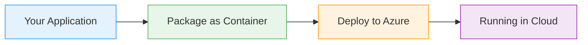

# Docker Compose

  <iconify-icon icon="logos:docker-icon" style="font-size: 4rem;" />

---

---
layout: center
class: text-center
---

# Welcome

Welcome to this lesson on Docker Compose

  <iconify-icon icon="carbon:rocket" style="font-size: 3rem; color: #0078d4;" />

---

---
layout: center
---

# What is Docker Compose?

Docker Compose is two things: first, it's a specification for describing distributed applications that run in containers. Second, it's a command-line ...

---

---
layout: center
---

# Why Use Docker Compose?

You might be wondering - why not just use docker run commands? Well, there are several compelling reasons.

---

---
layout: center
---

# The Compose Specification

Docker Compose files are written in YAML format. A typical Compose file defines several key elements:

---

---
layout: center
---

# CLI Tools

There are actually two versions of the Docker Compose CLI you might encounter.

---

---
layout: center
---

# When to Use Docker Compose

<iconify-icon icon="mdi:web" /> Development environments where you need to run multiple services locally

<iconify-icon icon="mdi:cog" /> Testing multi-container applications

<iconify-icon icon="mdi:code-braces" /> Defining application architecture that will later be deployed to orchestrators like Kubernetes or Azure Container Instances

<iconify-icon icon="mdi:test-tube" /> Small production deployments where you don't need full orchestration

---

---
layout: center
---

# Looking Ahead

In the exercises that follow, we'll start simple with a single Nginx container in Compose, then move on to a multi-container distributed application. We'll see how to debug connectivity issues, update

