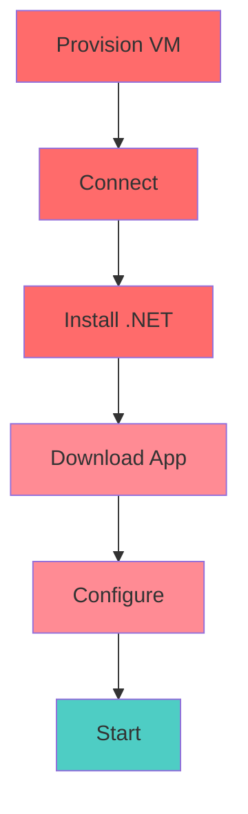

# The Problem

How to run .NET on Azure?

**Traditional Approach:**
- Provision virtual machine
- Install .NET runtime
- Download binaries
- Configure settings
- Start application

::right::

<v-click>

**Challenges:**
- Hard to automate
- Time consuming
- Difficult to sync
- "Works on my machine"

</v-click>
