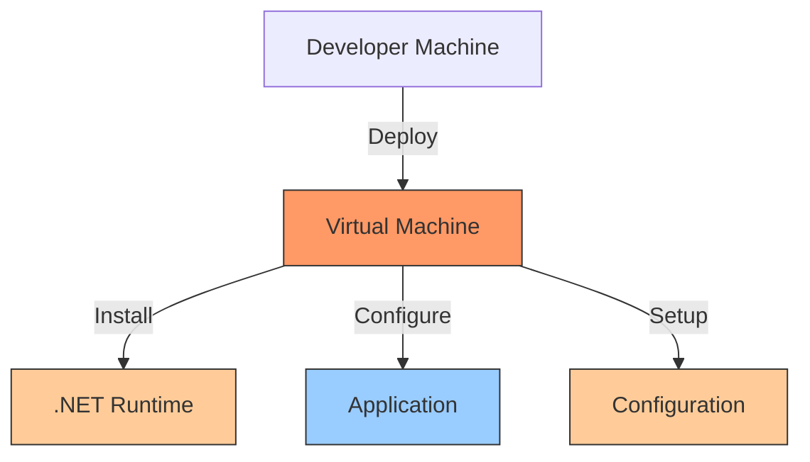

# The Challenge

Traditional deployment issues:

- Hard to automate
- Time-consuming setup
- Configuration drift
- "Works on my machine"

::right::

```mermaid
graph TB
    Dev[Developer Machine] -->|Deploy| VM[Virtual Machine]
    VM -->|Install| Runtime[.NET Runtime]
    VM -->|Configure| App[Application]
    VM -->|Setup| Config[Configuration]

    style VM fill:#f96,stroke:#333
    style Runtime fill:#fc9,stroke:#333
    style App fill:#9cf,stroke:#333
    style Config fill:#fc9,stroke:#333
```
