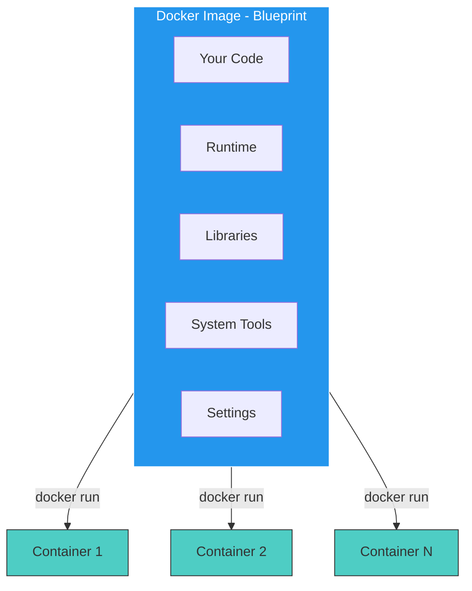

# Enter Docker

Images and Containers

**Image**: Static package
- Contains everything
- Built once
- Runs anywhere
- Like a blueprint

**Container**: Running instance
- Lightweight
- Portable
- Isolated
- Consistent behavior

