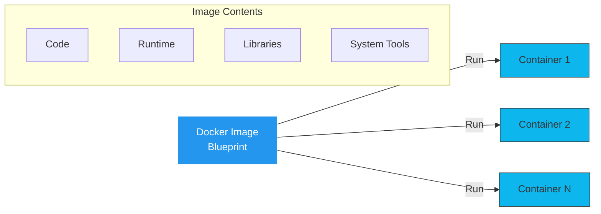

# Docker Architecture

```mermaid
graph LR
    Image[Docker Image<br/>Blueprint] -->|Run| C1[Container 1]
    Image -->|Run| C2[Container 2]
    Image -->|Run| C3[Container N]

    subgraph "Image Contents"
        Code[Code]
        Runtime[Runtime]
        Libs[Libraries]
        Tools[System Tools]
    end

    style Image fill:#2496ed,stroke:#fff,color:#fff
    style C1 fill:#0db7ed,stroke:#333
    style C2 fill:#0db7ed,stroke:#333
    style C3 fill:#0db7ed,stroke:#333
```

  
Image = Blueprint | Container = Running Instance

