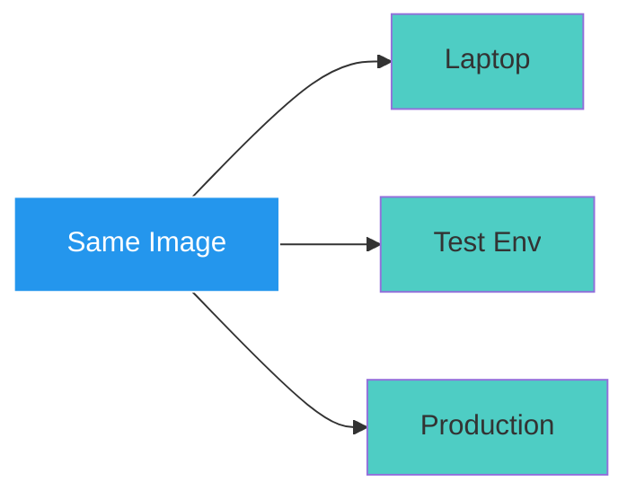
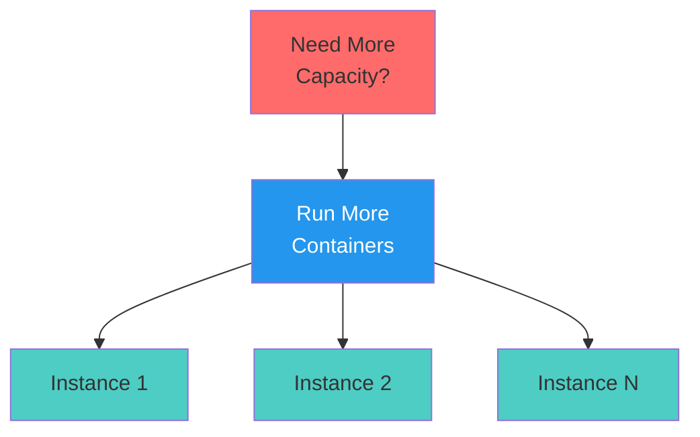

# Key Benefits

Consistency and Easy Scaling

**Consistency Everywhere**

- Eliminates environment bugs
- Reliable deployments
- Same behavior guaranteed

::right::

**Easy Scaling**

- No VM provisioning
- Start from same image
- Instant replicas

