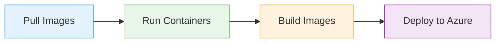

# What You'll Learn

```mermaid
graph LR
    A[<iconify-icon icon='mdi:download' /> Pull Images] --> B[<iconify-icon icon='mdi:play' /> Run Containers]
    B --> C[<iconify-icon icon='mdi:hammer-wrench' /> Build Images]
    C --> D[<iconify-icon icon='mdi:cloud-upload' /> Deploy to Azure]

    style A fill:#e3f2fd,stroke:#2196f3
    style B fill:#e8f5e9,stroke:#4caf50
    style C fill:#fff3e0,stroke:#ff9800
    style D fill:#f3e5f5,stroke:#9c27b0
```

- Run pre-built images
- Work with .NET containers
- Build custom images
- Package applications

