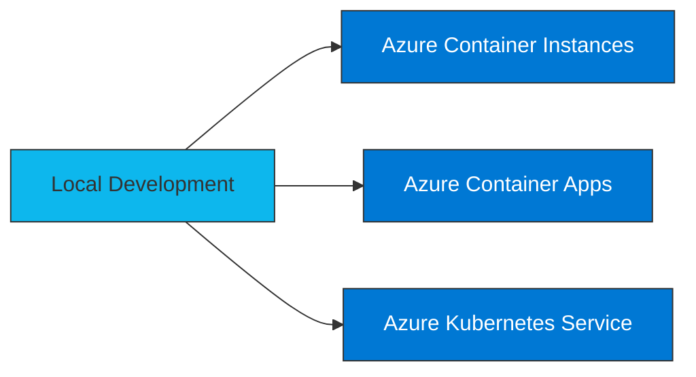

# Ready to Start

## Prerequisites

<iconify-icon icon="logos:docker-icon" style="font-size: 4rem;" />

Docker Desktop installed

Linux container mode enabled

```mermaid
graph LR
    Local[Local Development] --> ACI[Azure Container Instances]
    Local --> ACA[Azure Container Apps]
    Local --> AKS[Azure Kubernetes Service]

    style Local fill:#0db7ed,stroke:#333
    style ACI fill:#0078d4,stroke:#333,color:#fff
    style ACA fill:#0078d4,stroke:#333,color:#fff
    style AKS fill:#0078d4,stroke:#333,color:#fff
```

