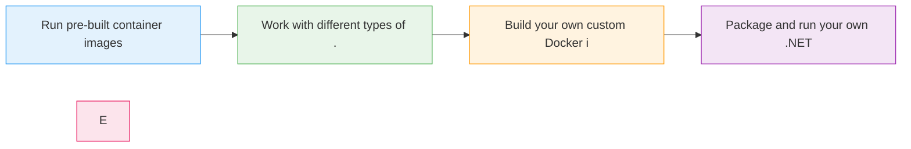

# Docker 101

  <iconify-icon icon="logos:docker-icon" style="font-size: 4rem;" />

---

---
layout: center
class: text-center
---

# Welcome

Welcome to Docker 101

  <iconify-icon icon="carbon:rocket" style="font-size: 3rem; color: #0078d4;" />

---

---
layout: center
---

# The Problem Statement

So let's start with a question: How would you run a .NET application on Azure?

---

---
layout: center
---

# Enter Docker

This is where Docker comes in.

---

---
layout: two-cols
---

# Key Benefits

<iconify-icon icon="mdi:check-circle" class="text-green-500" /> The beauty of Docker is consistency

<iconify-icon icon="mdi:check-circle" class="text-green-500" /> Docker also makes scaling easier

::right::

  <iconify-icon icon="carbon:chart-line-smooth" style="font-size: 8rem; color: #4caf50;" />

---

---
layout: center
---

# What We'll Cover

---

---
layout: center
class: text-center
---

# Getting Started

<iconify-icon icon="mdi:checkbox-marked-circle" class="text-blue-500" /> line interface, which works similarly to the Azure CLI. It has built-in help, supports various subcommands, and gives you complete control over your container environment.

  <iconify-icon icon="carbon:rocket" style="font-size: 3rem; color: #0078d4;" />

