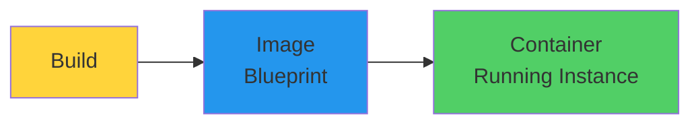
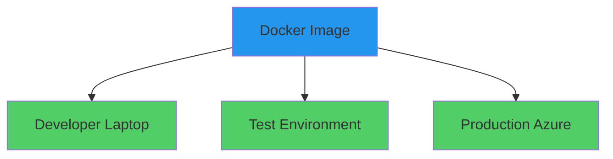
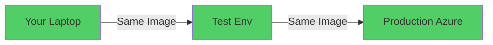
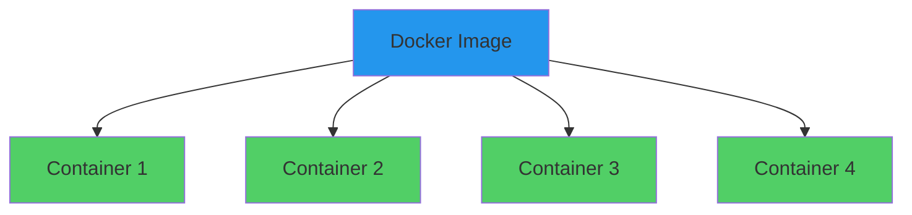

# Docker 101

Container Fundamentals

<div class="abs-bottom-10 left-10">
  <carbon-docker class="text-8xl text-blue-500 opacity-80" />
</div>

---
layout: center
---

# Welcome to Docker

<v-click>

<div class="text-xl mt-8">
Explore one of the most important technologies<br/>for deploying applications in the cloud
</div>

</v-click>

---
layout: section
---

# The Problem Statement

---

# How to Run a .NET App on Azure?

<v-click>

<div class="mt-12 text-center text-xl">
Traditional approach:
</div>

</v-click>

<v-click>

<div class="mt-8 flex items-start gap-4">
  <div class="text-3xl text-blue-400 mt-1">1</div>
  <span>Provision a virtual machine</span>
</div>

</v-click>

<v-click>

<div class="mt-4 flex items-start gap-4">
  <div class="text-3xl text-blue-400 mt-1">2</div>
  <span>Connect to it</span>
</div>

</v-click>

<v-click>

<div class="mt-4 flex items-start gap-4">
  <div class="text-3xl text-blue-400 mt-1">3</div>
  <span>Install .NET</span>
</div>

</v-click>

<v-click>

<div class="mt-4 flex items-start gap-4">
  <div class="text-3xl text-blue-400 mt-1">4</div>
  <span>Download application binaries</span>
</div>

</v-click>

<v-click>

<div class="mt-4 flex items-start gap-4">
  <div class="text-3xl text-blue-400 mt-1">5</div>
  <span>Set up configuration</span>
</div>

</v-click>

<v-click>

<div class="mt-4 flex items-start gap-4">
  <div class="text-3xl text-blue-400 mt-1">6</div>
  <span>Start the app</span>
</div>

</v-click>

---

# Significant Challenges

<v-click>

<div class="mt-10 flex items-center gap-4">
  <carbon-warning class="text-5xl text-red-400" />
  <div>
    <div class="text-xl font-bold">Hard to Automate</div>
    <div class="text-sm mt-2 opacity-70">Many manual steps</div>
  </div>
</div>

</v-click>

<v-click>

<div class="mt-8 flex items-center gap-4">
  <carbon-time class="text-5xl text-orange-400" />
  <div>
    <div class="text-xl font-bold">Time-Consuming</div>
    <div class="text-sm mt-2 opacity-70">Slow to spin up new instances</div>
  </div>
</div>

</v-click>

<v-click>

<div class="mt-8 flex items-center gap-4">
  <carbon-misuse class="text-5xl text-purple-400" />
  <div>
    <div class="text-xl font-bold">Difficult to Sync</div>
    <div class="text-sm mt-2 opacity-70">Keeping multiple instances consistent</div>
  </div>
</div>

</v-click>

<v-click>

<div class="mt-10 text-center text-xl text-red-400">
Managing application AND infrastructure
</div>

</v-click>

---

# What About App Service?

<v-click>

<div class="mt-12 text-center text-xl">
Azure App Service simplifies things...
</div>

</v-click>

<v-click>

<div class="mt-12 flex justify-center gap-12">
  <div class="text-center">
    <carbon-checkmark class="text-6xl text-green-400" />
    <div class="text-sm mt-3">Less Setup</div>
  </div>
  <div class="text-center">
    <carbon-warning class="text-6xl text-orange-400" />
    <div class="text-sm mt-3">Still Requires Config</div>
  </div>
</div>

</v-click>

<v-click>

<div class="mt-12 text-center text-xl text-red-400">
Different hosting environment than local dev
</div>

</v-click>

<v-click>

<div class="mt-8 text-center text-lg opacity-70">
"It works on my machine" problem
</div>

</v-click>

---
layout: section
---

# Enter Docker

---

# The Docker Approach

<v-click>

<div class="mt-4">
  <carbon-docker class="text-8xl text-blue-500" />
</div>

</v-click>

<v-click>

<div class="mt-12 text-center text-xl">
Build components and dependencies into a package
</div>

</v-click>

<v-click>

<div class="mt-12">



</div>

</v-click>

---

# Docker Image

<v-click>

<div class="mt-4">
  <carbon-document-blank class="text-6xl text-blue-500" />
</div>

</v-click>

<v-click>

<div class="mt-8 text-xl text-center">
A blueprint - static package
</div>

</v-click>

<v-click>

<div class="mt-12 text-lg">
Contains everything your app needs:
</div>

</v-click>

<v-click>

<div class="mt-6 flex items-center gap-4">
  <carbon-code class="text-3xl text-green-400" />
  <span>Your code</span>
</div>

</v-click>

<v-click>

<div class="mt-4 flex items-center gap-4">
  <carbon-chip class="text-3xl text-blue-400" />
  <span>The runtime</span>
</div>

</v-click>

<v-click>

<div class="mt-4 flex items-center gap-4">
  <carbon-application class="text-3xl text-purple-400" />
  <span>System tools and libraries</span>
</div>

</v-click>

<v-click>

<div class="mt-4 flex items-center gap-4">
  <carbon-settings class="text-3xl text-orange-400" />
  <span>Settings</span>
</div>

</v-click>

---

# Run Anywhere

<v-click>

<div class="mt-8">



</div>

</v-click>

<v-click>

<div class="mt-12 text-center text-2xl text-green-400">
Behaves exactly the same way everywhere
</div>

</v-click>

<v-click>

<div class="mt-6 text-center text-lg opacity-70">
Anywhere that has Docker installed
</div>

</v-click>

---

# Docker Container

<v-click>

<div class="mt-4">
  <carbon-container-software class="text-6xl text-green-400" />
</div>

</v-click>

<v-click>

<div class="mt-8 text-xl text-center">
A running instance of an image
</div>

</v-click>

<v-click>

<div class="mt-12 grid grid-cols-3 gap-8">
  <div class="text-center">
    <carbon-ibm-cloud-bare-metal-servers-vpc class="text-5xl text-blue-400" />
    <div class="text-sm mt-3">Lightweight</div>
  </div>
  <div class="text-center">
    <carbon-delivery class="text-5xl text-green-400" />
    <div class="text-sm mt-3">Portable</div>
  </div>
  <div class="text-center">
    <carbon-locked class="text-5xl text-purple-400" />
    <div class="text-sm mt-3">Isolated</div>
  </div>
</div>

</v-click>

<v-click>

<div class="mt-12 text-center text-lg opacity-70">
Isolated from other containers and host system
</div>

</v-click>

---
layout: section
---

# Key Benefits

---

# Consistency

<v-click>

<div class="mt-4">
  <carbon-checkmark-outline class="text-8xl text-green-400" />
</div>

</v-click>

<v-click>

<div class="mt-12 text-center text-2xl">
Container starts from exactly the same image
</div>

</v-click>

<v-click>

<div class="mt-12">



</div>

</v-click>

<v-click>

<div class="mt-8 text-center text-xl text-green-400">
Eliminates environment-specific bugs
</div>

</v-click>

---

# Scaling Made Easy

<v-click>

<div class="mt-8 text-center text-xl">
Need to handle more traffic?
</div>

</v-click>

<v-click>

<div class="mt-12">



</div>

</v-click>

<v-click>

<div class="mt-8 text-center text-xl text-green-400">
Just run more containers from the same image
</div>

</v-click>

<v-click>

<div class="mt-6 text-center text-lg opacity-70">
No need to provision and configure new VMs
</div>

</v-click>

---
layout: section
---

# What We'll Cover

---

# Lab Objectives

<v-click>

<div class="mt-6 flex items-center gap-4">
  <carbon-play class="text-4xl text-blue-400" />
  <span class="text-lg">Run pre-built container images from public registries</span>
</div>

</v-click>

<v-click>

<div class="mt-6 flex items-center gap-4">
  <carbon-logo-dotnet class="text-4xl text-purple-400" />
  <span class="text-lg">Work with different .NET container images</span>
</div>

</v-click>

<v-click>

<div class="mt-6 flex items-center gap-4">
  <carbon-build-tool class="text-4xl text-green-400" />
  <span class="text-lg">Build your own custom Docker images</span>
</div>

</v-click>

<v-click>

<div class="mt-6 flex items-center gap-4">
  <carbon-package class="text-4xl text-orange-400" />
  <span class="text-lg">Package and run your own .NET applications</span>
</div>

</v-click>

---

# Beyond This Lab

<v-click>

<div class="mt-12 text-center text-xl">
These same containers can be deployed to:
</div>

</v-click>

<v-click>

<div class="mt-10 grid grid-cols-3 gap-8">
  <div class="text-center">
    <carbon-container-software class="text-5xl text-blue-400" />
    <div class="text-sm mt-3">Azure Container Instances</div>
  </div>
  <div class="text-center">
    <carbon-application class="text-5xl text-green-400" />
    <div class="text-sm mt-3">Azure Container Apps</div>
  </div>
  <div class="text-center">
    <carbon-kubernetes class="text-5xl text-purple-400" />
    <div class="text-sm mt-3">Azure Kubernetes Service</div>
  </div>
</div>

</v-click>

---
layout: section
---

# Getting Started

---

# Prerequisites

<v-click>

<div class="mt-8 flex items-center gap-4">
  <carbon-docker class="text-5xl text-blue-500" />
  <div>
    <div class="text-xl font-bold">Docker Desktop</div>
    <div class="text-sm mt-2 opacity-70">Installed and running</div>
  </div>
</div>

</v-click>

<v-click>

<div class="mt-10 flex items-center gap-4">
  <carbon-logo-linux class="text-5xl text-orange-400" />
  <div>
    <div class="text-xl font-bold">Linux Container Mode</div>
    <div class="text-sm mt-2 opacity-70">Windows users: ensure Linux mode is enabled</div>
  </div>
</div>

</v-click>

<v-click>

<div class="mt-10 flex items-center gap-4">
  <carbon-command-line class="text-5xl text-green-400" />
  <div>
    <div class="text-xl font-bold">Docker CLI</div>
    <div class="text-sm mt-2 opacity-70">Command-line interface</div>
  </div>
</div>

</v-click>

---

# Docker CLI

<v-click>

<div class="mt-8">

```bash
docker --help
docker run --help
docker build --help
```

</div>

</v-click>

<v-click>

<div class="mt-8 text-center text-xl">
Similar to Azure CLI
</div>

</v-click>

<v-click>

<div class="mt-8 flex justify-center gap-12">
  <div class="text-center">
    <carbon-help class="text-5xl text-blue-400" />
    <div class="text-sm mt-3">Built-in help</div>
  </div>
  <div class="text-center">
    <carbon-terminal class="text-5xl text-green-400" />
    <div class="text-sm mt-3">Subcommands</div>
  </div>
  <div class="text-center">
    <carbon-settings class="text-5xl text-purple-400" />
    <div class="text-sm mt-3">Complete control</div>
  </div>
</div>

</v-click>

---
layout: center
class: text-center
---

<div>

<v-click>

<carbon-play-outline class="text-8xl text-green-400 inline-block" />

</v-click>

<v-click>

<div class="text-4xl mt-8 font-bold">
Let's Get Started!
</div>

</v-click>

<v-click>

<div class="text-xl mt-6 opacity-70">
Run your first container
</div>

</v-click>

</div>
