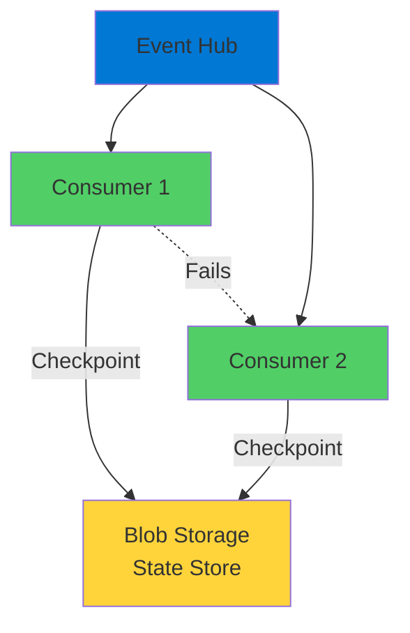
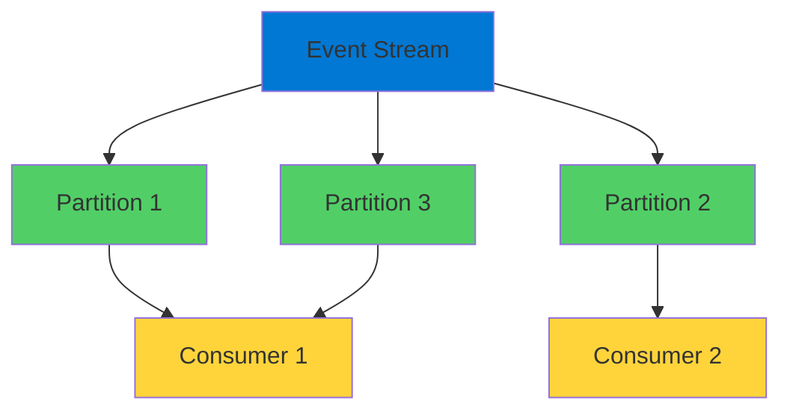
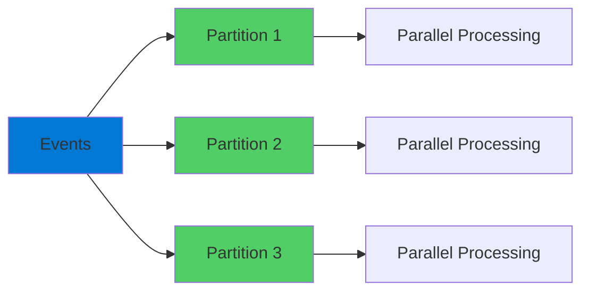
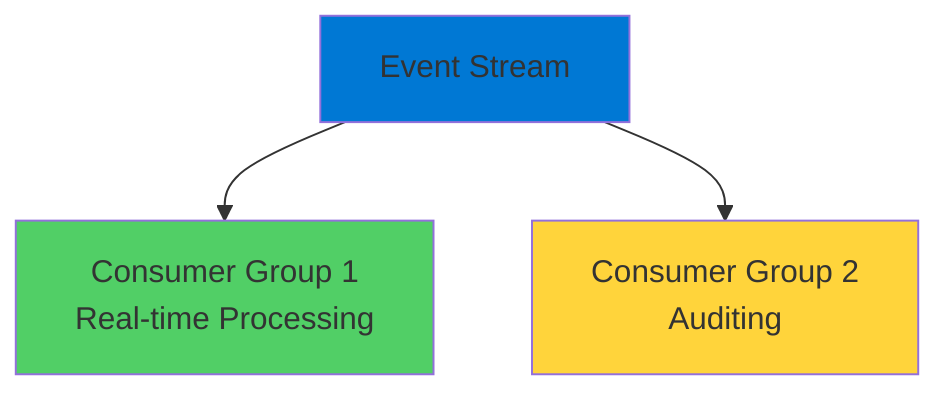
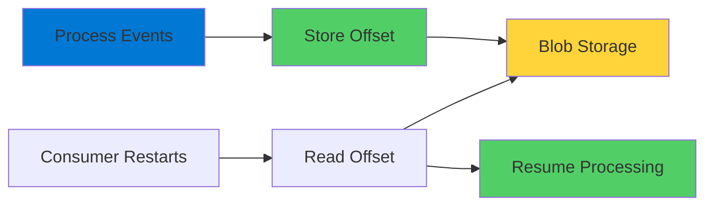

# Event Hubs Partitioned Consumers

Reliable Stream Processing at Scale

  <carbon-data-stream class="text-8xl text-blue-400 opacity-80" />

---
layout: center
---

# Welcome

<v-click>

Explore Event Hubs partitioned consumers Process event streams reliably at scale

</v-click>

---
layout: section
---

# What is Event Hubs?

---

# Big Data Streaming Platform

<v-click>

  <carbon-flow-stream class="text-6xl text-blue-400" />

</v-click>

<v-click>

Azure's event ingestion service

</v-click>

<v-click>

  

    <carbon-send-alt class="text-6xl text-green-400" />
    
Event Ingestion

  

  

    <carbon-data-stream class="text-6xl text-purple-400" />
    
Data Streaming

  

</v-click>

<v-click>

Consuming events at scale requires careful handling

</v-click>

---
layout: section
---

# The Challenge

---

# Problems to Solve

<v-click>

  
1

  

    <carbon-bookmark class="text-3xl inline-block" />
    Track Progress
    
Where did we leave off after restart?

    
Don't miss events or process duplicates

  

</v-click>

<v-click>

  
2

  

    <carbon-scale class="text-3xl inline-block" />
    Scale Processing
    
Single consumer can't keep up

    
Multiple consumers without duplicate work

  

</v-click>

<v-click>

  
3

  

    <carbon-availability class="text-3xl inline-block" />
    High Availability
    
If one consumer fails

    
Others pick up the work automatically

  

</v-click>

---
layout: section
---

# The Solution

---

# Built into Client Libraries

<v-click>

  <carbon-checkmark-outline class="text-6xl text-green-400" />

</v-click>

<v-click>

Microsoft has built this logic for you

</v-click>

<v-click>

  <carbon-data-backup class="text-4xl text-blue-400" />
  Recording processed offset using blob storage

</v-click>

<v-click>

  <carbon-reset class="text-4xl text-green-400" />
  Resume where consumer left off

</v-click>

<v-click>

  <carbon-scale class="text-4xl text-purple-400" />
  Multiple consumers running at scale

</v-click>

<v-click>

  <carbon-renew class="text-4xl text-orange-400" />
  Automatic failover when consumer fails

</v-click>

---

# How It Works

<v-click>

</v-click>

<v-click>

Blob storage as simple state store

</v-click>

---
layout: section
---

# What We'll Build

---

# Device Logging Scenario

<v-click>

  <carbon-add class="text-4xl text-blue-400" />
  Create Event Hub namespace (Standard SKU)

</v-click>

<v-click>

  <carbon-data-partition class="text-4xl text-green-400" />
  Set up Event Hub with multiple partitions

</v-click>

<v-click>

  <carbon-user-multiple class="text-4xl text-purple-400" />
  Configure consumer groups

</v-click>

<v-click>

  <carbon-data-backup class="text-4xl text-orange-400" />
  Use blob storage to track progress

</v-click>

<v-click>

  <carbon-collaborate class="text-4xl text-red-400" />
  Run multiple consumers and observe workload sharing

</v-click>

<v-click>

  <carbon-save class="text-4xl text-blue-500" />
  Enable Event Hub Capture

</v-click>

---

# Competing Consumer Pattern

<v-click>

</v-click>

<v-click>

Multiple consumers reading from same stream

</v-click>

<v-click>

Library manages partition ownership and failover

</v-click>

---
layout: section
---

# Key Concepts

---

# Partitions

<v-click>

  <carbon-data-partition class="text-6xl text-blue-400" />

</v-click>

<v-click>

Event stream split into multiple partitions

</v-click>

<v-click>

</v-click>

<v-click>

Allows parallel processing and increases throughput

</v-click>

<v-click>

Partition count set at creation - cannot be changed

</v-click>

---

# Consumer Groups

<v-click>

  <carbon-user-multiple class="text-6xl text-green-400" />

</v-click>

<v-click>

Logical views of the event stream

</v-click>

<v-click>

</v-click>

<v-click>

Different groups process same events at different speeds

</v-click>

---

# Checkpoints

<v-click>

  <carbon-bookmark class="text-6xl text-purple-400" />

</v-click>

<v-click>

Record position in event stream

</v-click>

<v-click>

</v-click>

<v-click>

Resume from where they left off after restart

</v-click>

---

# At-Least-Once Delivery

<v-click>

Delivery guarantee

</v-click>

<v-click>

Every event processed at least once

</v-click>

<v-click>

Events might be processed more than once

</v-click>

<v-click>

If consumer crashes between processing and checkpointing

</v-click>

<v-click>

Design for idempotent processing

</v-click>

---
layout: center
class: text-center
---

<v-click>

<carbon-play-outline class="text-8xl text-green-400 inline-block" />

</v-click>

<v-click>

Let's Get Started!

</v-click>

<v-click>

See these concepts in action

</v-click>

