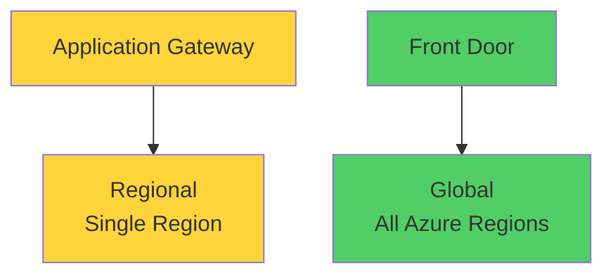
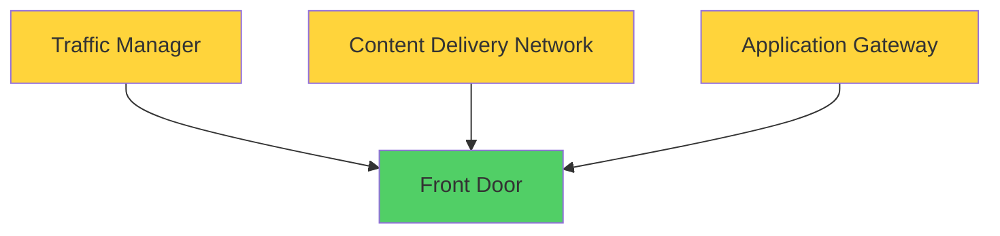
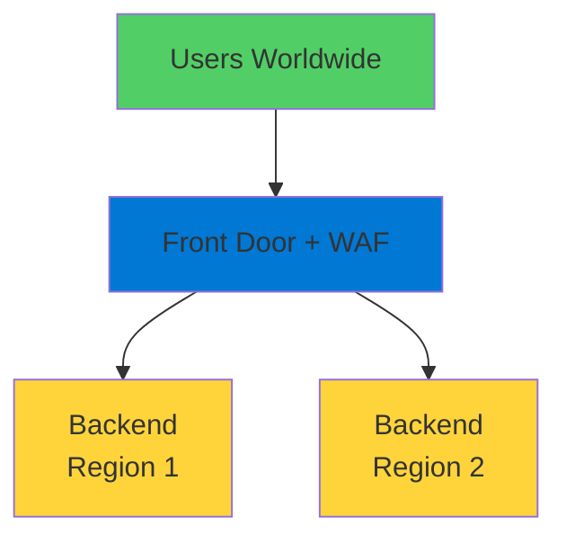

# Azure Front Door

Global Load Balancing and Content Delivery

  <carbon-earth class="text-8xl text-blue-400 opacity-80" />

---
layout: center
---

# Welcome

<v-click>

Explore Azure Front Door Global access to your applications

</v-click>

---
layout: section
---

# What is Azure Front Door?

---

# Modern Cloud CDN

<v-click>

  <carbon-network-4 class="text-6xl text-blue-400" />

</v-click>

<v-click>

Microsoft's modern cloud CDN

</v-click>

<v-click>

  

    <carbon-flash class="text-6xl text-green-400" />
    
Fast

  

  

    <carbon-checkmark-outline class="text-6xl text-blue-400" />
    
Reliable

  

  

    <carbon-locked class="text-6xl text-red-400" />
    
Secure

  

</v-click>

<v-click>

Application Gateway with global CDN built in

</v-click>

---

# Regional vs Global

<v-click>

</v-click>

<v-click>

Application Gateway operates at regional level

</v-click>

<v-click>

Front Door works globally across all regions

</v-click>

<v-click>

Users routed to nearest available backend

</v-click>

---
layout: section
---

# Key Features

---

# What Front Door Provides

<v-click>

  
1

  

    <carbon-earth class="text-3xl inline-block" />
    Global Load Balancing
    
Distribute traffic across multiple regions

    
High availability and optimal performance

  

</v-click>

<v-click>

  
2

  

    <carbon-network-2 class="text-3xl inline-block" />
    Integrated CDN
    
Cache static resources at edge locations

    
Reduce latency worldwide

  

</v-click>

<v-click>

  
3

  

    <carbon-security class="text-3xl inline-block" />
    Web Application Firewall
    
Protect from common vulnerabilities

    
Same WAF as Application Gateway

  

</v-click>

<v-click>

  
4

  

    <carbon-warning class="text-3xl inline-block" />
    DDoS Protection
    
Shield from distributed attacks

  

</v-click>

---

# Additional Capabilities

<v-click>

  <carbon-direction-right class="text-4xl text-blue-400" />
  Intelligent routing based on performance and health

</v-click>

<v-click>

  <carbon-scale class="text-4xl text-green-400" />
  Weighted load balancing configurations

</v-click>

<v-click>

  <carbon-locked class="text-4xl text-purple-400" />
  SSL offloading and certificate management

</v-click>

<v-click>

  <carbon-data-connected class="text-4xl text-orange-400" />
  Session affinity for stateful applications

</v-click>

<v-click>

  <carbon-flow class="text-4xl text-red-400" />
  Advanced routing based on URL paths or headers

</v-click>

---
layout: section
---

# Evolution of Azure Services

---

# Bringing It All Together

<v-click>

</v-click>

<v-click>

Combines best features of multiple services

</v-click>

<v-click>

Single, comprehensive solution

</v-click>

---

# Microsoft's Recommendation

<v-click>

  <carbon-favorite class="text-6xl text-purple-400" />

</v-click>

<v-click>

Front Door is now the preferred option

</v-click>

<v-click>

For frontend to your HTTP services

</v-click>

<v-click>

  

    <carbon-application-web class="text-5xl text-blue-400" />
    
Web Apps

  

  

    <carbon-api class="text-5xl text-green-400" />
    
API Management

  

  

    <carbon-network-3 class="text-5xl text-purple-400" />
    
HTTP Applications

  

</v-click>

---
layout: section
---

# Use Cases

---

# When to Use Front Door

<v-click>

  <carbon-earth class="text-4xl text-blue-400" />
  Global load balancing across multiple regions

</v-click>

<v-click>

  <carbon-network-2 class="text-4xl text-green-400" />
  CDN capabilities for static content

</v-click>

<v-click>

  <carbon-security class="text-4xl text-purple-400" />
  Web application firewall protection

</v-click>

<v-click>

  <carbon-locked class="text-4xl text-orange-400" />
  SSL offloading and certificate management

</v-click>

<v-click>

  <carbon-flow class="text-4xl text-red-400" />
  Advanced routing based on URL paths or headers

</v-click>

<v-click>

  <carbon-data-connected class="text-4xl text-blue-500" />
  Session affinity for stateful applications

</v-click>

---
layout: section
---

# Lab Overview

---

# What We'll Build

<v-click>

Create and configure Azure Front Door with WAF

</v-click>

<v-click>

</v-click>

<v-click>

Deploy backends in multiple regions

</v-click>

<v-click>

Configure traffic routing and security policies

</v-click>

---

# Learning Outcomes

<v-click>

  

    <carbon-diagram class="text-6xl text-blue-400" />
    
Architect

  

  

    <carbon-deployment-pattern class="text-6xl text-green-400" />
    
Implement

  

  

    <carbon-earth class="text-6xl text-purple-400" />
    
Globally Distributed

  

</v-click>

<v-click>

Using Azure Front Door

</v-click>

---
layout: center
class: text-center
---

<v-click>

<carbon-play-outline class="text-8xl text-green-400 inline-block" />

</v-click>

<v-click>

Let's Get Started!

</v-click>

<v-click>

Build a globally distributed application

</v-click>

