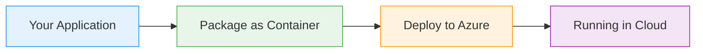

# Azure Front Door

  <iconify-icon icon="vscode-icons:file-type-azure" style="font-size: 4rem;" />

---

---
layout: center
class: text-center
---

# Welcome

Welcome to this lab on Azure Front Door

  <iconify-icon icon="carbon:rocket" style="font-size: 3rem; color: #0078d4;" />

---

---
layout: center
---

# What is Azure Front Door?

Azure Front Door is Microsoft's modern cloud CDN that provides fast, reliable, and secure access to your applications. Think of it as Application Gate...

---

---
layout: center
---

# Key Features

Front Door brings together several critical capabilities:

---

---
layout: center
---

# Evolution of Azure Services

Front Door represents the evolution of various Azure load balancing and CDN services. It combines the best features of Traffic Manager, Content Delivery Network, and Application Gateway into a single,

---

---
layout: center
---

# Use Cases

<iconify-icon icon="mdi:web" /> Global load balancing across multiple regions

<iconify-icon icon="mdi:cog" /> CDN capabilities for static content

<iconify-icon icon="mdi:code-braces" /> Web application firewall protection

<iconify-icon icon="mdi:test-tube" /> SSL offloading and certificate management

<iconify-icon icon="mdi:lightning-bolt" /> Advanced routing based on URL paths or headers

---

---
layout: center
---

# Lab Overview

In this lab, we'll create and configure Azure Front Door with Web Application Firewall. We'll deploy backend applications in multiple regions, configure Front Door to route traffic between them, and a

