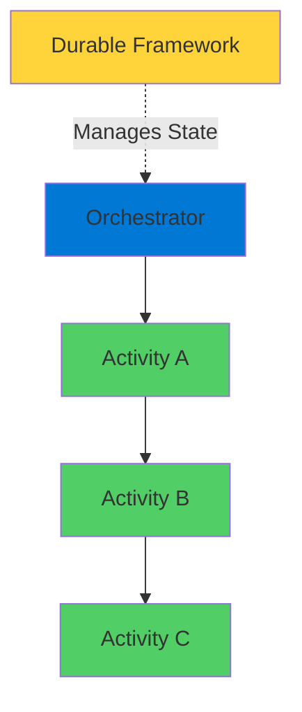
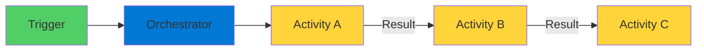
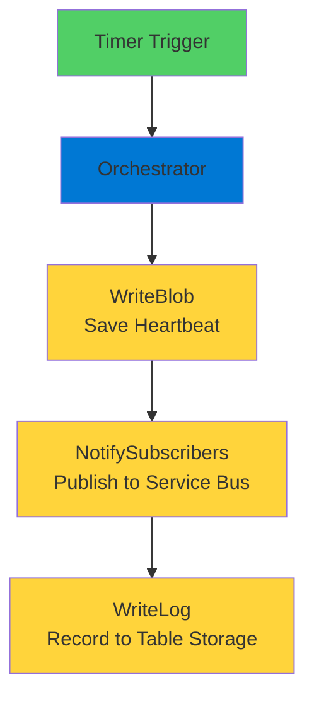

# Azure Durable Functions

Chained Pattern for Sequential Workflows

<div class="abs-bottom-10 left-10">
  <carbon-flow class="text-8xl text-blue-400 opacity-80" />
</div>

---
layout: center
---

# Welcome

<!--
METADATA:
sentence: Durable Functions let you write stateful workflows in a serverless environment.
search_anchor: Durable Functions let you write
-->
<v-click>

<div class="text-xl mt-8">
Explore Azure Durable Functions<br/>Orchestrate sequential workflows in serverless
</div>

</v-click>

---
layout: section
---

# The Challenge

---

# Regular Functions Limitations

<!--
METADATA:
sentence: Imagine you need to build a workflow with multiple steps that must run in a specific order.
search_anchor: Imagine you need to build
-->
<v-click>

<div class="mt-8 text-center text-xl">
Multiple steps in specific order
</div>

</v-click>

<v-click>

<div class="mt-12">


</div>

</v-click>

<!--
METADATA:
sentence: This works, but it has some serious limitations.
search_anchor: This works, but it has
-->
<v-click>

<div class="mt-12 text-center text-lg text-red-400">
This works, but has serious limitations
</div>

</v-click>

---

# The Problems

<!--
METADATA:
sentence: First, you can't guarantee the exact running order when dealing with distributed triggers.
search_anchor: First, you can't guarantee the
-->
<v-click>

<div class="mt-6 flex items-start gap-4">
  <carbon-warning class="text-4xl text-red-400 mt-1" />
  <div>
    <div class="text-lg font-bold">No Order Guarantee</div>
    <div class="text-sm mt-2 opacity-70">Can't guarantee exact running order</div>
    <div class="text-sm opacity-70">Distributed triggers are unpredictable</div>
  </div>
</div>

</v-click>

<!--
METADATA:
sentence: Second, passing data between functions becomes complicated - you need intermediate storage.
search_anchor: Second, passing data between functions
-->
<v-click>

<div class="mt-6 flex items-start gap-4">
  <carbon-data-base class="text-4xl text-orange-400 mt-1" />
  <div>
    <div class="text-lg font-bold">Data Passing Complex</div>
    <div class="text-sm mt-2 opacity-70">Need intermediate storage</div>
    <div class="text-sm opacity-70">Complicated state management</div>
  </div>
</div>

</v-click>

<!--
METADATA:
sentence: Third, there's no single place to see the overall workflow status.
search_anchor: Third, there's no single place
-->
<v-click>

<div class="mt-6 flex items-start gap-4">
  <carbon-view class="text-4xl text-purple-400 mt-1" />
  <div>
    <div class="text-lg font-bold">No Workflow Status</div>
    <div class="text-sm mt-2 opacity-70">No single place to see overall status</div>
  </div>
</div>

</v-click>

<!--
METADATA:
sentence: And finally, error handling and retry logic gets messy when spread across multiple independent functions.
search_anchor: finally, error handling and retry
-->
<v-click>

<div class="mt-6 flex items-start gap-4">
  <carbon-reset class="text-4xl text-blue-400 mt-1" />
  <div>
    <div class="text-lg font-bold">Messy Error Handling</div>
    <div class="text-sm mt-2 opacity-70">Retry logic spread across functions</div>
  </div>
</div>

</v-click>

---
layout: section
---

# Enter Durable Functions

---

# Stateful Workflows in Serverless

<v-click>

<div class="mt-4">
  <carbon-flow class="text-6xl text-green-400" />
</div>

</v-click>

<!--
METADATA:
sentence: Durable Functions let you write stateful workflows in a serverless environment.
search_anchor: Durable Functions let you write
-->
<v-click>

<div class="mt-8 text-xl text-center text-green-400">
Durable Functions let you write stateful workflows
</div>

</v-click>

<!--
METADATA:
sentence: The key word here is stateful - the framework automatically manages state between function calls, so you don't have to worry about it.
search_anchor: key word here is stateful
-->
<v-click>

<div class="mt-12 text-center text-2xl">
The key word: Stateful
</div>

</v-click>

<v-click>

<div class="mt-12">



</div>

</v-click>

<!--
METADATA:
sentence: State Management: The durable functions framework automatically saves the orchestrator's progress.
search_anchor: State Management: The durable functions
-->
<v-click>

<div class="mt-8 text-center text-xl">
Framework automatically manages state
</div>

</v-click>

---

# How It Works

<!--
METADATA:
sentence: With the chained pattern, you write an orchestrator function that calls multiple activity functions in sequence.
search_anchor: chained pattern, you write an
-->
<v-click>

<div class="mt-8 text-center text-xl">
Write an orchestrator that calls activity functions
</div>

</v-click>

<!--
METADATA:
sentence: The orchestrator controls the workflow, manages data flow, and handles the execution order.
search_anchor: orchestrator controls the workflow, manages
-->
<v-click>

<div class="mt-12 flex justify-center gap-12">
  <div class="text-center">
    <carbon-flow class="text-6xl text-blue-400" />
    <div class="text-sm mt-3">Orchestrator</div>
    <div class="text-xs mt-2 opacity-70">Controls workflow</div>
  </div>
  <div class="text-center">
    <carbon-task class="text-6xl text-green-400" />
    <div class="text-sm mt-3">Activities</div>
    <div class="text-xs mt-2 opacity-70">Do one thing well</div>
  </div>
</div>

</v-click>

<!--
METADATA:
sentence: The orchestrator controls the workflow, manages data flow, and handles the execution order.
search_anchor: orchestrator controls the workflow, manages
-->
<v-click>

<div class="mt-12 text-center text-xl">
Orchestrator manages data flow and execution order
</div>

</v-click>

---
layout: section
---

# The Chained Pattern

---

# Pipeline Execution

<v-click>

<div class="mt-4">
  <carbon-diagram class="text-6xl text-purple-400" />
</div>

</v-click>

<!--
METADATA:
sentence: Think of it as a pipeline where the output of one step becomes the input to the next step.
search_anchor: Think of it as a
-->
<v-click>

<div class="mt-8 text-xl text-center">
Output of one step becomes input to next
</div>

</v-click>

<v-click>

<div class="mt-12">



</div>

</v-click>

<!--
METADATA:
sentence: Each step runs only after the previous one completes successfully.
search_anchor: Each step runs only after
-->
<v-click>

<div class="mt-12 text-center text-xl text-green-400">
Each step runs after previous one completes
</div>

</v-click>

---

# Defined in Code

<!--
METADATA:
sentence: The beauty is that this entire workflow is defined in code, in one place.
search_anchor: beauty is that this entire
-->
<v-click>

<div class="mt-8 text-center text-xl">
Entire workflow in one place
</div>

</v-click>

<!--
METADATA:
sentence: You can see the logic, understand the flow, and manage it as a single unit.
search_anchor: You can see the logic
-->
<v-click>

<div class="mt-12 flex justify-center gap-12">
  <div class="text-center">
    <carbon-view class="text-6xl text-blue-400" />
    <div class="text-sm mt-3">See the Logic</div>
  </div>
  <div class="text-center">
    <carbon-flow-data class="text-6xl text-green-400" />
    <div class="text-sm mt-3">Understand Flow</div>
  </div>
  <div class="text-center">
    <carbon-settings-adjust class="text-6xl text-purple-400" />
    <div class="text-sm mt-3">Manage as Unit</div>
  </div>
</div>

</v-click>

<!--
METADATA:
sentence: Each activity is just a simple function that does one thing well.
search_anchor: Each activity is just a
-->
<v-click>

<div class="mt-12 text-center text-xl text-green-400">
Beautiful simplicity
</div>

</v-click>

---
layout: section
---

# Key Concepts

---

# The Components

<!--
METADATA:
sentence: It defines what activities run and in what order.
search_anchor: It defines what activities run
-->
<v-click>

<div class="mt-6 flex items-start gap-4">
  <div class="text-3xl text-blue-400 mt-1">1</div>
  <div>
    <carbon-flow class="text-3xl inline-block" />
    <span class="ml-3 text-lg font-bold">Orchestrator Function</span>
    <div class="text-sm mt-2 opacity-70">Conductor of workflow</div>
    <div class="text-sm opacity-70">Defines what runs and in what order</div>
    <div class="text-sm mt-2 text-red-400">Must be deterministic!</div>
  </div>
</div>

</v-click>

<!--
METADATA:
sentence: They use the ActivityTrigger binding, which means they can only be called by an orchestrator.
search_anchor: They use the ActivityTrigger binding
-->
<v-click>

<div class="mt-6 flex items-start gap-4">
  <div class="text-3xl text-green-400 mt-1">2</div>
  <div>
    <carbon-task class="text-3xl inline-block" />
    <span class="ml-3 text-lg font-bold">Activity Functions</span>
    <div class="text-sm mt-2 opacity-70">Workers that do actual tasks</div>
    <div class="text-sm opacity-70">Use ActivityTrigger binding</div>
    <div class="text-sm opacity-70">Can only be called by orchestrator</div>
  </div>
</div>

</v-click>

<!--
METADATA:
sentence: The Durable Client: This is what starts the orchestration.
search_anchor: Durable Client: This is what
-->
<v-click>

<div class="mt-6 flex items-start gap-4">
  <div class="text-3xl text-purple-400 mt-1">3</div>
  <div>
    <carbon-play class="text-3xl inline-block" />
    <span class="ml-3 text-lg font-bold">Durable Client</span>
    <div class="text-sm mt-2 opacity-70">Starts the orchestration</div>
    <div class="text-sm opacity-70">DurableClient binding</div>
  </div>
</div>

</v-click>

---

# State Management

<v-click>

<div class="mt-4">
  <carbon-data-backup class="text-6xl text-green-400" />
</div>

</v-click>

<!--
METADATA:
sentence: State Management: The durable functions framework automatically saves the orchestrator's progress.
search_anchor: State Management: The durable functions
-->
<v-click>

<div class="mt-8 text-xl text-center text-green-400">
Automatic progress saving
</div>

</v-click>

<v-click>

<div class="mt-12">

```mermaid
graph TB
    Orch[Orchestrator Running] --> Save[Framework Saves State]
    Save --> Fail[Something Fails]
    Fail --> Restore[Framework Restores]
    Restore --> Continue[Continue from Checkpoint]
    style Orch fill:#0078d4
    style Save fill=#51cf66
    style Fail fill:#ff6b6b
    style Restore fill:#ffd43b
    style Continue fill:#51cf66
```

</div>

</v-click>

<!--
METADATA:
sentence: You get this reliability without writing any state management code.
search_anchor: You get this reliability without
-->
<v-click>

<div class="mt-12 text-center text-xl">
Reliability without writing state management code
</div>

</v-click>

---
layout: section
---

# Real-World Use Cases

---

# Perfect Scenarios

<!--
METADATA:
sentence: Real-World Use Cases The chained pattern is perfect for many scenarios: Data processing pipelines: Extract data from a source, transform it, validate it, and load it into a destination.
search_anchor: Real-World Use Cases The chained
-->
<v-click>

<div class="mt-6 flex items-center gap-4">
  <carbon-data-structured class="text-4xl text-blue-400" />
  <span class="text-lg">Data processing pipelines</span>
</div>

</v-click>

<!--
METADATA:
sentence: Third, there's no single place to see the overall workflow status.
search_anchor: Third, there's no single place
-->
<v-click>

<div class="mt-4 flex items-center gap-4">
  <carbon-shopping-cart class="text-4xl text-green-400" />
  <span class="text-lg">Order processing workflows</span>
</div>

</v-click>

<!--
METADATA:
sentence: System initialization: Start a service, wait for it to be healthy, configure it, run tests, promote to production.
search_anchor: System initialization: Start a service
-->
<v-click>

<div class="mt-4 flex items-center gap-4">
  <carbon-settings class="text-4xl text-purple-400" />
  <span class="text-lg">System initialization sequences</span>
</div>

</v-click>

<!--
METADATA:
sentence: Batch operations: Process a set of items where each item goes through multiple transformation stages in order.
search_anchor: Batch operations: Process a set
-->
<v-click>

<div class="mt-4 flex items-center gap-4">
  <carbon-batch-job class="text-4xl text-orange-400" />
  <span class="text-lg">Batch operations with transformations</span>
</div>

</v-click>

<!--
METADATA:
sentence: The workflow starts with a timer trigger that runs periodically.
search_anchor: workflow starts with a timer
-->
<v-click>

<div class="mt-12 text-center text-xl text-green-400">
Any sequential workflow with dependencies
</div>

</v-click>

---
layout: section
---

# What You'll Build

---

# Health Monitoring System

<v-click>

<div class="mt-8">



</div>

</v-click>

<!--
METADATA:
sentence: You'll see how simple it is to coordinate multiple Azure services in a reliable, sequential workflow.
search_anchor: You'll see how simple it
-->
<v-click>

<div class="mt-12 text-center text-xl">
Coordinate multiple Azure services
</div>

</v-click>

<!--
METADATA:
sentence: You'll see how simple it is to coordinate multiple Azure services in a reliable, sequential workflow.
search_anchor: You'll see how simple it
-->
<v-click>

<div class="mt-4 text-center text-lg opacity-70">
In a reliable, sequential workflow
</div>

</v-click>

---

# Development Approach

<!--
METADATA:
sentence: Once everything works locally, you'll deploy the durable function to Azure and see it running in a production environment.
search_anchor: Once everything works locally, you'll
-->
<v-click>

<div class="mt-8 flex justify-center gap-12">
  <div class="text-center">
    <carbon-laptop class="text-6xl text-blue-400" />
    <div class="text-sm mt-3">Test Locally</div>
    <div class="text-xs mt-2 opacity-70">Storage Emulator</div>
  </div>
  <div class="text-center">
    <carbon-arrow-right class="text-6xl text-gray-400" />
  </div>
  <div class="text-center">
    <carbon-cloud class="text-6xl text-green-400" />
    <div class="text-sm mt-3">Deploy to Azure</div>
    <div class="text-xs mt-2 opacity-70">Production Environment</div>
  </div>
</div>

</v-click>

<!--
METADATA:
sentence: This gives you a fast development cycle without deploying to Azure.
search_anchor: This gives you a fast
-->
<v-click>

<div class="mt-12 text-center text-xl text-green-400">
Fast development cycle
</div>

</v-click>

---
layout: center
class: text-center
---

<div>

<v-click>

<carbon-play-outline class="text-8xl text-green-400 inline-block" />

</v-click>

<!--
METADATA:
sentence: Let's dive in and build something great!
search_anchor: Let's dive in and build
-->
<v-click>

<div class="text-4xl mt-8 font-bold">
Let's Get Started!
</div>

</v-click>

<!--
METADATA:
sentence: Let's dive in and build something great!
search_anchor: Let's dive in and build
-->
<v-click>

<div class="text-xl mt-6 opacity-70">
Build something great with durable functions
</div>

</v-click>

</div>
