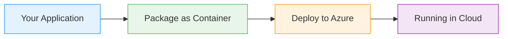

# Azure Durable Functions: Fan-Out/Fan-In Pattern

  <iconify-icon icon="vscode-icons:file-type-azure" style="font-size: 4rem;" />

---

---
layout: center
---

# Azure Durable Functions: Fan-Out/Fan-In Pattern - Introduction

**Duration:** 2-3 minutes
**Format:** Presentation with slides

---

---
layout: center
---

# SLIDE 1: Title Slide

**Visual:** Azure Durable Functions logo with "Fan-Out/Fan-In Pattern"

---

---
layout: center
---

# SLIDE 2: The Challenge of Parallel Processing

**Visual:** Diagram showing sequential vs. parallel processing timelines

---

---
layout: center
---

# SLIDE 3: What is Fan-Out/Fan-In?

**Visual:** Animation showing one orchestrator fanning out to multiple activities, then collecting results back...

---

---
layout: center
---

# SLIDE 4: Key Concepts

<h3 class="text-xl font-bold">Visual:</h3>

Three boxes showing Orchestrator Function, Activity Functions, and Durable Task Framework

---

---
layout: center
---

# SLIDE 5: Real-World Use Cases

<iconify-icon icon="mdi:web" /> 

---

---
layout: two-cols
---

# SLIDE 6: The HTTP Orchestration Advantage

<iconify-icon icon="mdi:check-circle" class="text-green-500" /> Visual:: Diagram showing HTTP trigger returning status URLs

::right::

  <iconify-icon icon="carbon:chart-line-smooth" style="font-size: 8rem; color: #4caf50;" />

---

---
layout: center
---

# SLIDE 7: AZ-204 Exam Focus

**Visual:** Checklist with exam topics highlighted

---

---
layout: center
---

# SLIDE 8: What You'll Build Today

**Visual:** Architecture diagram of the quote engine application

---

---
layout: center
---

# SLIDE 9: Preview of the Pattern

**Visual:** Code snippet showing the fan-out pattern structure

---

---
layout: center
---

# SLIDE 10: Let's Get Started

**Visual:** "Ready to Code" with lab exercise preview

