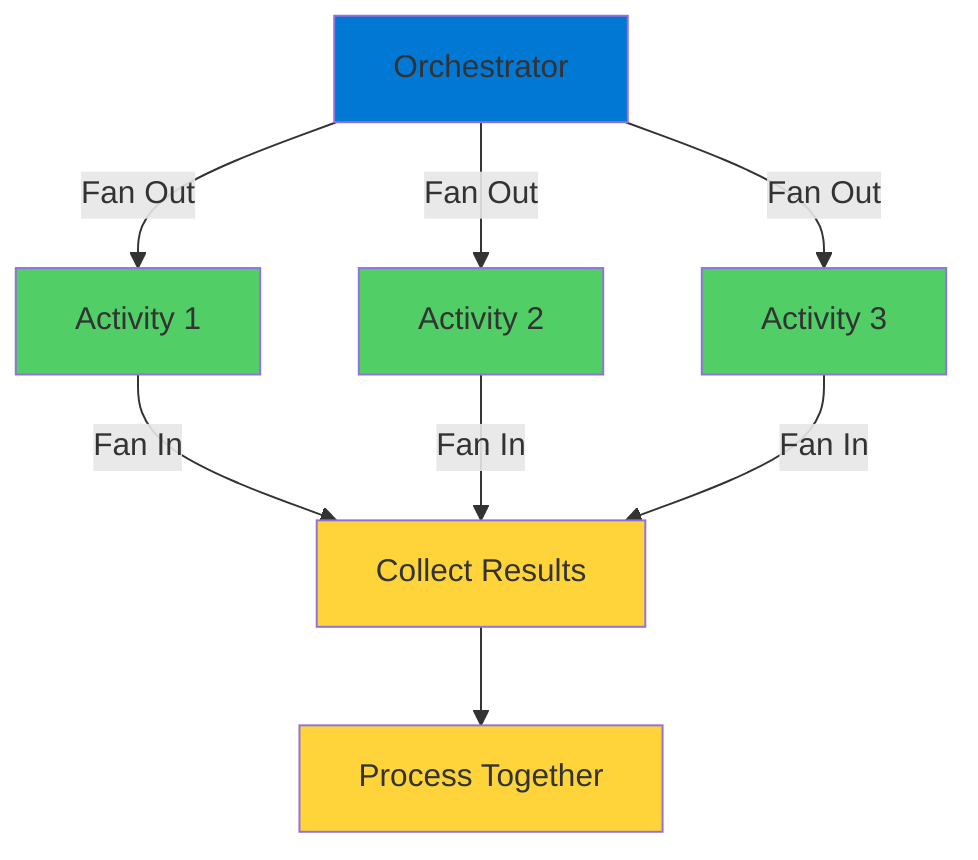
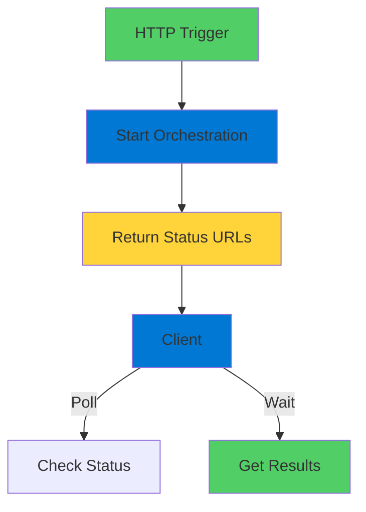
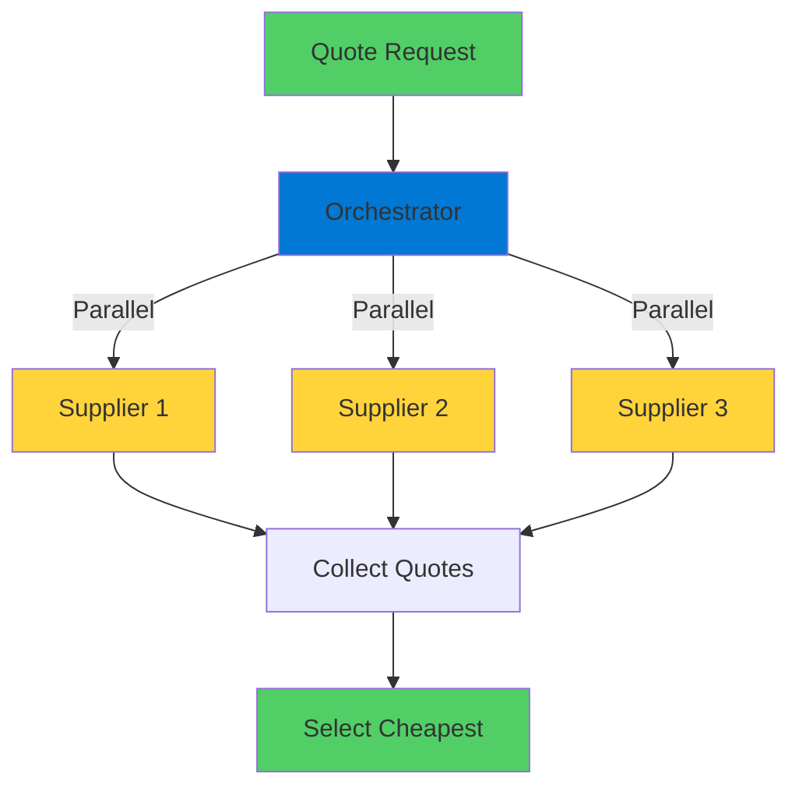

# Durable Functions: Fan-Out/Fan-In

Parallel Processing at Scale

<div class="abs-bottom-10 left-10">
  <carbon-network-overlay class="text-8xl text-blue-400 opacity-80" />
</div>

---
layout: center
---

# Welcome

<!--
METADATA:
sentence: This pattern is essential for building scalable, efficient cloud applications, and it's a key topic for the AZ-204 Azure Developer certification exam.
search_anchor: This pattern is essential for
-->
<v-click>

<div class="text-xl mt-8">
Explore the Fan-Out/Fan-In pattern<br/>Build scalable, efficient cloud applications
</div>

</v-click>

---
layout: section
---

# The Challenge

---

# Sequential vs Parallel

<v-click>

<div class="mt-8">

```mermaid
graph TB
    Sequential[Sequential Processing] --> Time1[5s + 3s + 7s]
    Time1 --> Total1[= 15 seconds]

    Parallel[Parallel Processing] --> Time2[max(5s, 3s, 7s)]
    Time2 --> Total2[= 7 seconds]

    style Sequential fill:#ff6b6b
    style Total1 fill:#ff6b6b
    style Parallel fill:#51cf66
    style Total2 fill:#51cf66
```

</div>

</v-click>

<!--
METADATA:
sentence: That's the power of parallel processing, and that's exactly what the fan-out/fan-in pattern gives us.
search_anchor: That's the power of parallel
-->
<v-click>

<div class="mt-12 text-center text-2xl text-green-400">
That's the power of parallel processing
</div>

</v-click>

---

# The Problem Statement

<!--
METADATA:
sentence: Validating information against multiple services simultaneously.
search_anchor: Validating information against multiple services
-->
<v-click>

<div class="mt-8 text-center text-xl">
Multiple external service calls
</div>

</v-click>

<!--
METADATA:
sentence: Maybe you're checking inventory across different warehouses, or getting price quotes from multiple suppliers.
search_anchor: Maybe you're checking inventory across
-->
<v-click>

<div class="mt-12 flex justify-center gap-12">
  <div class="text-center">
    <carbon-warehouse class="text-6xl text-blue-400" />
    <div class="text-sm mt-3">Check Inventory</div>
  </div>
  <div class="text-center">
    <carbon-money class="text-6xl text-green-400" />
    <div class="text-sm mt-3">Get Price Quotes</div>
  </div>
  <div class="text-center">
    <carbon-checkmark class="text-6xl text-purple-400" />
    <div class="text-sm mt-3">Validate Data</div>
  </div>
</div>

</v-click>

<!--
METADATA:
sentence: --- [END OF INTRODUCTION]
search_anchor: --- [END OF INTRODUCTION]
-->
<v-click>

<div class="mt-12 text-center text-xl text-red-400">
Sequential = Sum of all calls
</div>

</v-click>

<!--
METADATA:
sentence: Now your total time would only be as long as the slowest call.
search_anchor: Now your total time would
-->
<v-click>

<div class="mt-4 text-center text-xl text-green-400">
Parallel = Slowest call only
</div>

</v-click>

---
layout: section
---

# What is Fan-Out/Fan-In?

---

# Three Key Phases

<v-click>

<div class="mt-8">



</div>

</v-click>

---

# How It Works

<!--
METADATA:
sentence: First, an orchestrator function fans out by starting multiple activity functions in parallel.
search_anchor: First, an orchestrator function fans
-->
<v-click>

<div class="mt-6 flex items-start gap-4">
  <div class="text-3xl text-blue-400 mt-1">1</div>
  <div>
    <carbon-send-alt class="text-3xl inline-block" />
    <span class="ml-3 text-lg font-bold">Fan Out</span>
    <div class="text-sm mt-2 opacity-70">Start multiple activities in parallel</div>
  </div>
</div>

</v-click>

<!--
METADATA:
sentence: Then, the orchestrator waits for all of them to complete.
search_anchor: Then, the orchestrator waits for
-->
<v-click>

<div class="mt-6 flex items-start gap-4">
  <div class="text-3xl text-green-400 mt-1">2</div>
  <div>
    <carbon-time class="text-3xl inline-block" />
    <span class="ml-3 text-lg font-bold">Wait</span>
    <div class="text-sm mt-2 opacity-70">Orchestrator waits for all to complete</div>
  </div>
</div>

</v-click>

<!--
METADATA:
sentence: Finally, it fans in by collecting all the results and processing them together.
search_anchor: Finally, it fans in by
-->
<v-click>

<div class="mt-6 flex items-start gap-4">
  <div class="text-3xl text-purple-400 mt-1">3</div>
  <div>
    <carbon-data-collection class="text-3xl inline-block" />
    <span class="ml-3 text-lg font-bold">Fan In</span>
    <div class="text-sm mt-2 opacity-70">Collect all results and process together</div>
  </div>
</div>

</v-click>

<!--
METADATA:
sentence: Think of it like delegating tasks to a team.
search_anchor: Think of it like delegating
-->
<v-click>

<div class="mt-12 text-center text-xl text-green-400">
Like delegating tasks to a team
</div>

</v-click>

---
layout: section
---

# Key Concepts

---

# The Components

<!--
METADATA:
sentence: The orchestrator function is your coordinator.
search_anchor: orchestrator function is your coordinator
-->
<v-click>

<div class="mt-8 flex items-center gap-4">
  <carbon-flow class="text-4xl text-blue-400" />
  <span class="text-lg">Orchestrator Function - your coordinator</span>
</div>

</v-click>

<!--
METADATA:
sentence: Activity functions are the workers that perform the actual tasks.
search_anchor: Activity functions are the workers
-->
<v-click>

<div class="mt-6 flex items-center gap-4">
  <carbon-task class="text-4xl text-green-400" />
  <span class="text-lg">Activity Functions - the workers</span>
</div>

</v-click>

<!--
METADATA:
sentence: And the Durable Task Framework handles all the complexity of state management and coordination in the background.
search_anchor: Durable Task Framework handles all
-->
<v-click>

<div class="mt-6 flex items-center gap-4">
  <carbon-data-backup class="text-4xl text-purple-400" />
  <span class="text-lg">Durable Task Framework - manages everything</span>
</div>

</v-click>

---

# What Makes It Special

<v-click>

<div class="mt-4">
  <carbon-data-base class="text-6xl text-green-400" />
</div>

</v-click>

<!--
METADATA:
sentence: Here's what makes durable functions special: their state is persisted in Azure Storage.
search_anchor: Here's what makes durable functions
-->
<v-click>

<div class="mt-8 text-xl text-center text-green-400">
State persisted in Azure Storage
</div>

</v-click>

<!--
METADATA:
sentence: This means your orchestrator can wait for activities to complete, even if they take minutes or hours.
search_anchor: This means your orchestrator can
-->
<v-click>

<div class="mt-12 flex items-center gap-4">
  <carbon-time class="text-4xl text-blue-400" />
  <span class="text-lg">Can wait for minutes or hours</span>
</div>

</v-click>

<!--
METADATA:
sentence: It can retry failed activities automatically, and it's perfect for long-running transactions that involve multiple systems.
search_anchor: It can retry failed activities
-->
<v-click>

<div class="mt-6 flex items-center gap-4">
  <carbon-repeat class="text-4xl text-green-400" />
  <span class="text-lg">Automatic retry for failed activities</span>
</div>

</v-click>

<!--
METADATA:
sentence: This is perfect for building responsive user interfaces.
search_anchor: This is perfect for building
-->
<v-click>

<div class="mt-6 flex items-center gap-4">
  <carbon-checkmark-outline class="text-4xl text-purple-400" />
  <span class="text-lg">Perfect for long-running transactions</span>
</div>

</v-click>

---
layout: section
---

# Real-World Use Cases

---

# When to Use This Pattern

<!--
METADATA:
sentence: Here are some common scenarios: Getting quotes from multiple suppliers and selecting the best price.
search_anchor: Here are some common scenarios
-->
<v-click>

<div class="mt-6 flex items-center gap-4">
  <carbon-shopping-cart class="text-4xl text-blue-400" />
  <span class="text-lg">Get quotes from multiple suppliers</span>
</div>

</v-click>

<!--
METADATA:
sentence: Processing data by splitting it into chunks, working on each chunk in parallel, then combining the results.
search_anchor: Processing data by splitting it
-->
<v-click>

<div class="mt-6 flex items-center gap-4">
  <carbon-data-structured class="text-4xl text-green-400" />
  <span class="text-lg">Process data by splitting into chunks</span>
</div>

</v-click>

<!--
METADATA:
sentence: Validating information against multiple services simultaneously.
search_anchor: Validating information against multiple services
-->
<v-click>

<div class="mt-6 flex items-center gap-4">
  <carbon-checkmark-outline class="text-4xl text-purple-400" />
  <span class="text-lg">Validate against multiple services simultaneously</span>
</div>

</v-click>

<!--
METADATA:
sentence: Or aggregating data from multiple sources before performing analysis.
search_anchor: aggregating data from multiple sources
-->
<v-click>

<div class="mt-6 flex items-center gap-4">
  <carbon-data-collection class="text-4xl text-orange-400" />
  <span class="text-lg">Aggregate data from multiple sources</span>
</div>

</v-click>

<!--
METADATA:
sentence: Any time you need to make multiple independent calls and work with the complete set of results, fan-out/fan-in is your pattern.
search_anchor: Any time you need to
-->
<v-click>

<div class="mt-12 text-center text-xl text-green-400">
Multiple independent calls with complete results
</div>

</v-click>

---
layout: section
---

# HTTP Orchestration

---

# Instant Response with Status Tracking

<v-click>

<div class="mt-8">



</div>

</v-click>

<!--
METADATA:
sentence: This is perfect for building responsive user interfaces.
search_anchor: This is perfect for building
-->
<v-click>

<div class="mt-12 text-center text-xl text-green-400">
Perfect for responsive UIs
</div>

</v-click>

<!--
METADATA:
sentence: Your frontend can start the process, then poll for updates and show progress to the user, all without keeping a connection open.
search_anchor: Your frontend can start the
-->
<v-click>

<div class="mt-4 text-center text-lg opacity-70">
No need to keep connection open
</div>

</v-click>

---

# Status URLs

<!--
METADATA:
sentence: The HTTP trigger starts your orchestration and immediately returns a set of URLs.
search_anchor: HTTP trigger starts your orchestration
-->
<v-click>

<div class="mt-8 text-center text-xl">
HTTP trigger returns URLs for:
</div>

</v-click>

<!--
METADATA:
sentence: These URLs let you check the status of your long-running function, see when it completes, and retrieve the final results.
search_anchor: These URLs let you check
-->
<v-click>

<div class="mt-12 flex justify-center gap-12">
  <div class="text-center">
    <carbon-query class="text-6xl text-blue-400" />
    <div class="text-sm mt-3">Check Status</div>
  </div>
  <div class="text-center">
    <carbon-time class="text-6xl text-green-400" />
    <div class="text-sm mt-3">See Progress</div>
  </div>
  <div class="text-center">
    <carbon-checkmark class="text-6xl text-purple-400" />
    <div class="text-sm mt-3">Get Results</div>
  </div>
</div>

</v-click>

---
layout: section
---

# What You'll Build

---

# Quote Engine Application

<v-click>

<div class="mt-8">



</div>

</v-click>

<!--
METADATA:
sentence: This application will call three different suppliers in parallel to get price quotes, wait for all responses to come back, and then select the cheapest option.
search_anchor: This application will call three
-->
<v-click>

<div class="mt-12 text-center text-xl">
Call three suppliers in parallel
</div>

</v-click>

<!--
METADATA:
sentence: Then, the orchestrator waits for all of them to complete.
search_anchor: Then, the orchestrator waits for
-->
<v-click>

<div class="mt-4 text-center text-xl">
Wait for all responses
</div>

</v-click>

<!--
METADATA:
sentence: This application will call three different suppliers in parallel to get price quotes, wait for all responses to come back, and then select the cheapest option.
search_anchor: This application will call three
-->
<v-click>

<div class="mt-4 text-center text-xl text-green-400">
Select cheapest option
</div>

</v-click>

---

# The Code is Elegant

<v-click>

<div class="mt-8">

```csharp
// Start multiple activities
var tasks = new List<Task<Quote>>();
tasks.Add(context.CallActivityAsync<Quote>("GetQuote", "Supplier1"));
tasks.Add(context.CallActivityAsync<Quote>("GetQuote", "Supplier2"));
tasks.Add(context.CallActivityAsync<Quote>("GetQuote", "Supplier3"));

// Wait for all to complete
await Task.WhenAll(tasks);

// Process results
var cheapest = tasks.Select(t => t.Result).OrderBy(q => q.Price).First();
```

</div>

</v-click>

<!--
METADATA:
sentence: It's powerful, efficient, and surprisingly straightforward to implement.
search_anchor: It's powerful, efficient, and surprisingly
-->
<v-click>

<div class="mt-12 text-center text-xl text-green-400">
Powerful, efficient, straightforward
</div>

</v-click>

---
layout: center
class: text-center
---

<div>

<v-click>

<carbon-play-outline class="text-8xl text-green-400 inline-block" />

</v-click>

<!--
METADATA:
sentence: Let's dive into the hands-on exercises and build this pattern ourselves.
search_anchor: Let's dive into the hands-on
-->
<v-click>

<div class="text-4xl mt-8 font-bold">
Let's Get Started!
</div>

</v-click>

<!--
METADATA:
sentence: Let's dive into the hands-on exercises and build this pattern ourselves.
search_anchor: Let's dive into the hands-on
-->
<v-click>

<div class="text-xl mt-6 opacity-70">
Build this pattern yourself
</div>

</v-click>

</div>
