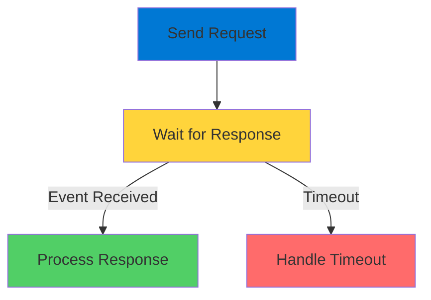

# Durable Functions: Human Interaction

Workflows That Wait for People

<div class="abs-bottom-10 left-10">
  <carbon-user-activity class="text-8xl text-blue-400 opacity-80" />
</div>

---
layout: center
---

# Welcome

<!--
METADATA:
sentence: This is where the Human Interaction pattern in Durable Functions really shines.
search_anchor: This is where the Human
-->
<v-click>

<div class="text-xl mt-8">
Explore the Human Interaction pattern<br/>Essential for real-world serverless applications
</div>

</v-click>

---
layout: section
---

# The Challenge

---

# Workflows That Wait

<!--
METADATA:
sentence: --- Slide 2: The Challenge - Workflows That Wait Think about common business scenarios.
search_anchor: --- Slide 2: The Challenge
-->
<v-click>

<div class="mt-8 text-center text-xl">
Common business scenarios
</div>

</v-click>

<!--
METADATA:
sentence: A password reset that requires verification.
search_anchor: password reset that requires verification
-->
<v-click>

<div class="mt-12 grid grid-cols-3 gap-8">
  <div class="text-center">
    <carbon-document-tasks class="text-6xl text-blue-400" />
    <div class="text-sm mt-3">Purchase Approval</div>
  </div>
  <div class="text-center">
    <carbon-password class="text-6xl text-green-400" />
    <div class="text-sm mt-3">Password Reset</div>
  </div>
  <div class="text-center">
    <carbon-ticket class="text-6xl text-purple-400" />
    <div class="text-sm mt-3">Support Review</div>
  </div>
</div>

</v-click>

<!--
METADATA:
sentence: These workflows all share something in common - they need to pause and wait for a person to take action.
search_anchor: These workflows all share something
-->
<v-click>

<div class="mt-12 text-center text-xl text-green-400">
All need to pause and wait for a person
</div>

</v-click>

---

# Traditional Approach Problems

<!--
METADATA:
sentence: You could store sensitive data in a database while waiting, but that creates security risks.
search_anchor: You could store sensitive data
-->
<v-click>

<div class="mt-8 flex items-start gap-4">
  <carbon-warning class="text-4xl text-red-400 mt-1" />
  <div>
    <div class="text-lg font-bold">Store in Database</div>
    <div class="text-sm mt-2 opacity-70">Security risks with sensitive data</div>
  </div>
</div>

</v-click>

<!--
METADATA:
sentence: You could keep a service running continuously, but that's expensive and inefficient.
search_anchor: You could keep a service
-->
<v-click>

<div class="mt-6 flex items-start gap-4">
  <carbon-money class="text-4xl text-orange-400 mt-1" />
  <div>
    <div class="text-lg font-bold">Keep Service Running</div>
    <div class="text-sm mt-2 opacity-70">Expensive and inefficient</div>
  </div>
</div>

</v-click>

<!--
METADATA:
sentence: --- Slide 3: How Durable Functions Solve This Durable Functions give us an elegant solution.
search_anchor: --- Slide 3: How Durable
-->
<v-click>

<div class="mt-12 text-center text-2xl text-green-400">
Durable Functions solve this elegantly
</div>

</v-click>

---
layout: section
---

# The Durable Solution

---

# Pause Without Running

<v-click>

<div class="mt-4">
  <carbon-sleep class="text-6xl text-green-400" />
</div>

</v-click>

<!--
METADATA:
sentence: They can pause for extended periods - minutes, hours, even days - waiting for human input.
search_anchor: They can pause for extended
-->
<v-click>

<div class="mt-8 text-xl text-center text-green-400">
Functions pause for extended periods
</div>

</v-click>

<!--
METADATA:
sentence: They can pause for extended periods - minutes, hours, even days - waiting for human input.
search_anchor: They can pause for extended
-->
<v-click>

<div class="mt-12 text-center text-lg">
Minutes, hours, even days
</div>

</v-click>

<v-click>

<div class="mt-12">

```mermaid
graph LR
    Start[Function Starts] --> Wait[Pause]
    Wait -.->|No Compute| Sleep[Suspended]
    Sleep -.->|No Cost| Sleep
    Response[Human Response] --> Resume[Resume]
    style Start fill:#0078d4
    style Wait fill:#ffd43b
    style Sleep fill:#gray
    style Response fill=#51cf66
    style Resume fill:#51cf66
```

</div>

</v-click>

---

# Key Advantages

<!--
METADATA:
sentence: No compute resources being consumed.
search_anchor: No compute resources being consumed
-->
<v-click>

<div class="mt-8 flex items-center gap-4">
  <carbon-close class="text-4xl text-green-400" />
  <span class="text-lg">No compute resources consumed during wait</span>
</div>

</v-click>

<!--
METADATA:
sentence: No sensitive data sitting in external storage.
search_anchor: No sensitive data sitting in
-->
<v-click>

<div class="mt-6 flex items-center gap-4">
  <carbon-locked class="text-4xl text-green-400" />
  <span class="text-lg">No sensitive data in external storage</span>
</div>

</v-click>

<!--
METADATA:
sentence: The function simply suspends, and resumes exactly where it left off when the human responds.
search_anchor: function simply suspends, and resumes
-->
<v-click>

<div class="mt-6 flex items-center gap-4">
  <carbon-reset class="text-4xl text-green-400" />
  <span class="text-lg">Resumes exactly where it left off</span>
</div>

</v-click>

<!--
METADATA:
sentence: This makes it perfect for scenarios like two-factor authentication, approval workflows, or any process that requires human verification before continuing.
search_anchor: This makes it perfect for
-->
<v-click>

<div class="mt-12 text-center text-xl text-green-400">
Perfect for human-in-the-loop workflows
</div>

</v-click>

---
layout: section
---

# Key Components

---

# Two Core Concepts

<!--
METADATA:
sentence: First, external events - these let you send information into a running orchestration.
search_anchor: First, external events - these
-->
<v-click>

<div class="mt-8 flex items-start gap-4">
  <div class="text-3xl text-blue-400 mt-1">1</div>
  <div>
    <carbon-send class="text-3xl inline-block" />
    <span class="ml-3 text-lg font-bold">External Events</span>
    <div class="text-sm mt-2 opacity-70">Send information into running orchestration</div>
    <div class="text-sm opacity-70">Wakes up waiting function</div>
  </div>
</div>

</v-click>

<!--
METADATA:
sentence: Second, durable timers - because humans don't always respond promptly.
search_anchor: Second, durable timers - because
-->
<v-click>

<div class="mt-10 flex items-start gap-4">
  <div class="text-3xl text-green-400 mt-1">2</div>
  <div>
    <carbon-time class="text-3xl inline-block" />
    <span class="ml-3 text-lg font-bold">Durable Timers</span>
    <div class="text-sm mt-2 opacity-70">Humans don't always respond promptly</div>
    <div class="text-sm opacity-70">Set timeout window for response</div>
  </div>
</div>

</v-click>

<v-click>

<div class="mt-12">



</div>

</v-click>

---
layout: section
---

# Real-World Example

---

# Two-Factor Authentication

<!--
METADATA:
sentence: Here's how it works: your function receives a phone number, sends an SMS with a verification code, then waits.
search_anchor: Here's how it works: your
-->
<v-click>

<div class="mt-8 text-center text-xl">
How it works
</div>

</v-click>

<v-click>

<div class="mt-12">

```mermaid
graph TB
    Phone[Receive Phone Number] --> Send[Send SMS Code]
    Send --> Wait[Wait for Response]
    Wait -->|Correct Code<br/>Within Time| Auth[Authenticated ✓]
    Wait -->|Wrong Code<br/>or Timeout| Fail[Authentication Failed ❌]
    style Phone fill:#0078d4
    style Send fill:#0078d4
    style Wait fill:#ffd43b
    style Auth fill=#51cf66
    style Fail fill:#ff6b6b
```

</div>

</v-click>

---

# The Flow

<!--
METADATA:
sentence: Here's how it works: your function receives a phone number, sends an SMS with a verification code, then waits.
search_anchor: Here's how it works: your
-->
<v-click>

<div class="mt-6 flex items-start gap-4">
  <div class="text-3xl text-blue-400 mt-1">1</div>
  <div>
    <carbon-phone class="text-3xl inline-block" />
    <span class="ml-3 text-lg">Function receives phone number</span>
  </div>
</div>

</v-click>

<!--
METADATA:
sentence: Here's how it works: your function receives a phone number, sends an SMS with a verification code, then waits.
search_anchor: Here's how it works: your
-->
<v-click>

<div class="mt-6 flex items-start gap-4">
  <div class="text-3xl text-green-400 mt-1">2</div>
  <div>
    <carbon-send class="text-3xl inline-block" />
    <span class="ml-3 text-lg">Sends SMS with verification code</span>
  </div>
</div>

</v-click>

<!--
METADATA:
sentence: The user has a limited time to respond with the correct code.
search_anchor: user has a limited time
-->
<v-click>

<div class="mt-6 flex items-start gap-4">
  <div class="text-3xl text-purple-400 mt-1">3</div>
  <div>
    <carbon-time class="text-3xl inline-block" />
    <span class="ml-3 text-lg">Waits for user response (with timeout)</span>
  </div>
</div>

</v-click>

<!--
METADATA:
sentence: If they respond correctly and within the time limit, they're authenticated.
search_anchor: If they respond correctly and
-->
<v-click>

<div class="mt-6 flex items-start gap-4">
  <div class="text-3xl text-orange-400 mt-1">4</div>
  <div>
    <carbon-checkmark class="text-3xl inline-block" />
    <span class="ml-3 text-lg">Validates code and timing</span>
  </div>
</div>

</v-click>

<!--
METADATA:
sentence: --- Slide 7: What You'll Learn Today In this lab session, you'll set up a Twilio account for sending SMS messages.
search_anchor: --- Slide 7: What You'll
-->
<v-click>

<div class="mt-12 text-center text-xl text-green-400">
Integrates with Twilio for SMS
</div>

</v-click>

---
layout: section
---

# Why This Matters for AZ-204

---

# Exam Focus Areas

<!--
METADATA:
sentence: You need to know when to use external events versus other trigger types.
search_anchor: You need to know when
-->
<v-click>

<div class="mt-8 flex items-center gap-4">
  <carbon-event class="text-4xl text-blue-400" />
  <span class="text-lg">Know when to use external events vs other triggers</span>
</div>

</v-click>

<!--
METADATA:
sentence: You should understand how durable timers work and how to implement timeout logic.
search_anchor: You should understand how durable
-->
<v-click>

<div class="mt-6 flex items-center gap-4">
  <carbon-time class="text-4xl text-green-400" />
  <span class="text-lg">Understand durable timers and timeout logic</span>
</div>

</v-click>

<!--
METADATA:
sentence: And importantly, you need to recognize scenarios where this pattern is the right architectural choice.
search_anchor: importantly, you need to recognize
-->
<v-click>

<div class="mt-6 flex items-center gap-4">
  <carbon-decision-tree class="text-4xl text-purple-400" />
  <span class="text-lg">Recognize scenarios for this pattern</span>
</div>

</v-click>

<!--
METADATA:
sentence: It's not just theoretical - it's a practical solution you'll use in production Azure applications.
search_anchor: It's not just theoretical -
-->
<v-click>

<div class="mt-12 text-center text-xl text-green-400">
Practical solution for production applications
</div>

</v-click>

<!--
METADATA:
sentence: This pattern appears in exam questions about workflow orchestration, state management, and serverless design patterns.
search_anchor: This pattern appears in exam
-->
<v-click>

<div class="mt-4 text-center text-lg opacity-70">
Appears in workflow and state management questions
</div>

</v-click>

---
layout: section
---

# What You'll Learn Today

---

# Lab Objectives

<!--
METADATA:
sentence: --- Slide 7: What You'll Learn Today In this lab session, you'll set up a Twilio account for sending SMS messages.
search_anchor: --- Slide 7: What You'll
-->
<v-click>

<div class="mt-6 flex items-center gap-4">
  <carbon-settings class="text-4xl text-blue-400" />
  <span class="text-lg">Set up Twilio account for SMS</span>
</div>

</v-click>

<!--
METADATA:
sentence: You'll build a durable function orchestration that sends verification codes and waits for user responses.
search_anchor: You'll build a durable function
-->
<v-click>

<div class="mt-6 flex items-center gap-4">
  <carbon-flow class="text-4xl text-green-400" />
  <span class="text-lg">Build orchestration with verification codes</span>
</div>

</v-click>

<!--
METADATA:
sentence: You'll test it locally with the Azure Storage emulator, then deploy it to Azure.
search_anchor: You'll test it locally with
-->
<v-click>

<div class="mt-6 flex items-center gap-4">
  <carbon-laptop class="text-4xl text-purple-400" />
  <span class="text-lg">Test locally with Storage Emulator</span>
</div>

</v-click>

<!--
METADATA:
sentence: You'll test it locally with the Azure Storage emulator, then deploy it to Azure.
search_anchor: You'll test it locally with
-->
<v-click>

<div class="mt-6 flex items-center gap-4">
  <carbon-cloud class="text-4xl text-orange-400" />
  <span class="text-lg">Deploy to Azure</span>
</div>

</v-click>

<!--
METADATA:
sentence: And you'll work with the HTTP endpoints that let you send events and check orchestration status.
search_anchor: you'll work with the HTTP
-->
<v-click>

<div class="mt-6 flex items-center gap-4">
  <carbon-api class="text-4xl text-red-400" />
  <span class="text-lg">Work with HTTP endpoints for events and status</span>
</div>

</v-click>

---

# Hands-On Experience

<!--
METADATA:
sentence: You'll test it locally with the Azure Storage emulator, then deploy it to Azure.
search_anchor: You'll test it locally with
-->
<v-click>

<div class="mt-12 flex justify-center gap-12">
  <div class="text-center">
    <carbon-code class="text-6xl text-blue-400" />
    <div class="text-sm mt-3">Build Pattern</div>
  </div>
  <div class="text-center">
    <carbon-test-tool class="text-6xl text-green-400" />
    <div class="text-sm mt-3">Test Workflow</div>
  </div>
  <div class="text-center">
    <carbon-deployment-pattern class="text-6xl text-purple-400" />
    <div class="text-sm mt-3">Deploy to Production</div>
  </div>
</div>

</v-click>

<!--
METADATA:
sentence: By the end, you'll have hands-on experience with one of the most powerful patterns in the Azure Functions toolkit.
search_anchor: By the end, you'll have
-->
<v-click>

<div class="mt-12 text-center text-xl text-green-400">
One of the most powerful patterns in Azure Functions
</div>

</v-click>

---
layout: center
class: text-center
---

<div>

<v-click>

<carbon-play-outline class="text-8xl text-green-400 inline-block" />

</v-click>

<!--
METADATA:
sentence: A support ticket that needs human review.
search_anchor: support ticket that needs human
-->
<v-click>

<div class="text-4xl mt-8 font-bold">
Let's Get Started!
</div>

</v-click>

<!--
METADATA:
sentence: --- Slide 2: The Challenge - Workflows That Wait Think about common business scenarios.
search_anchor: --- Slide 2: The Challenge
-->
<v-click>

<div class="text-xl mt-6 opacity-70">
Build powerful human-in-the-loop workflows
</div>

</v-click>

</div>
