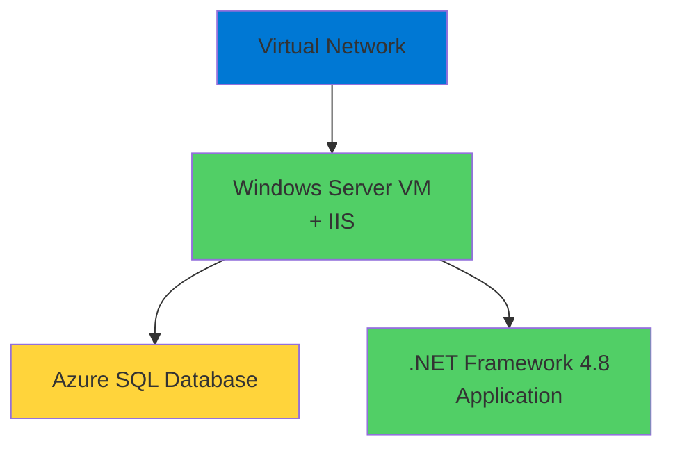
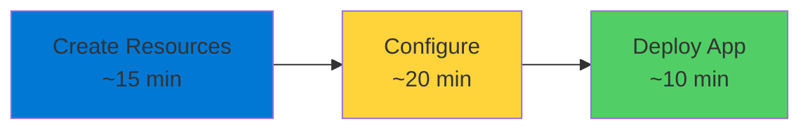

# IaaS Apps

Deploying Traditional Applications

  <carbon-virtual-machine class="text-8xl text-blue-400 opacity-80" />

---
layout: center
---

# Welcome

<!--
METADATA:
sentence: What You'll Learn In this hands-on lab, you'll learn how to deploy traditional applications to Azure using IaaS resources.
search_anchor: What You'll Learn In this
-->
<v-click>

Deploy applications using Azure IaaS Traditional workload migration path

</v-click>

---
layout: section
---

# What You'll Learn

---

# IaaS for Traditional Apps

<v-click>

  <carbon-virtual-machine class="text-6xl text-blue-400" />

</v-click>

<!--
METADATA:
sentence: What You'll Learn In this hands-on lab, you'll learn how to deploy traditional applications to Azure using IaaS resources.
search_anchor: What You'll Learn In this
-->
<v-click>

Deploy traditional applications using IaaS resources

</v-click>

<!--
METADATA:
sentence: While Platform-as-a-Service solutions are often the end goal for cloud-native applications, IaaS provides a straightforward migration path for existing workloads.
search_anchor: While Platform-as-a-Service solutions are often
-->
<v-click>

While PaaS is often the end goal

</v-click>

<!--
METADATA:
sentence: While Platform-as-a-Service solutions are often the end goal for cloud-native applications, IaaS provides a straightforward migration path for existing workloads.
search_anchor: While Platform-as-a-Service solutions are often
-->
<v-click>

IaaS provides straightforward migration path

</v-click>

<!--
METADATA:
sentence: While Platform-as-a-Service solutions are often the end goal for cloud-native applications, IaaS provides a straightforward migration path for existing workloads.
search_anchor: While Platform-as-a-Service solutions are often
-->
<v-click>

For existing workloads

</v-click>

---
layout: section
---

# Lab Scenario

---

# Legacy .NET Framework Application

<!--
METADATA:
sentence: Lab Scenario Today, we'll be working with a legacy .NET Framework application - the kind of application many organizations still run in production.
search_anchor: Lab Scenario Today, we'll be
-->
<v-click>

The kind many organizations still run

</v-click>

<!--
METADATA:
sentence: This application uses Windows Server and SQL Server, both of which are fully supported in Azure.
search_anchor: This application uses Windows Server
-->
<v-click>

  

    <carbon-logo-windows class="text-6xl text-blue-400" />
    
Windows Server

  

  

    <carbon-data-base class="text-6xl text-green-400" />
    
SQL Server

  

</v-click>

<!--
METADATA:
sentence: This application uses Windows Server and SQL Server, both of which are fully supported in Azure.
search_anchor: This application uses Windows Server
-->
<v-click>

Both fully supported in Azure

</v-click>

---
layout: section
---

# Key Concepts

---

# Infrastructure-as-a-Service

<v-click>

  <carbon-settings class="text-6xl text-purple-400" />

</v-click>

<!--
METADATA:
sentence: Key Concepts Infrastructure-as-a-Service gives you complete control over your virtual machines.
search_anchor: Key Concepts Infrastructure-as-a-Service gives you
-->
<v-click>

Complete control over virtual machines

</v-click>

<!--
METADATA:
sentence: You manage the operating system, runtime, and application configuration.
search_anchor: You manage the operating system
-->
<v-click>

  <carbon-settings-adjust class="text-4xl text-blue-400" />
  Manage operating system

</v-click>

<!--
METADATA:
sentence: You manage the operating system, runtime, and application configuration.
search_anchor: You manage the operating system
-->
<v-click>

  <carbon-app class="text-4xl text-green-400" />
  Control runtime environment

</v-click>

<!--
METADATA:
sentence: You manage the operating system, runtime, and application configuration.
search_anchor: You manage the operating system
-->
<v-click>

  <carbon-application class="text-4xl text-purple-400" />
  Configure applications

</v-click>

---

# When to Use IaaS

<!--
METADATA:
sentence: You manage the operating system, runtime, and application configuration.
search_anchor: You manage the operating system
-->
<v-click>

  <carbon-migrate class="text-4xl text-blue-400 mt-1" />
  

    
Migrating to Cloud

    
Lift and shift existing applications

  

</v-click>

<!--
METADATA:
sentence: You manage the operating system, runtime, and application configuration.
search_anchor: You manage the operating system
-->
<v-click>

  <carbon-settings class="text-4xl text-green-400 mt-1" />
  

    
Specific OS Config

    
Applications need specific configurations

  

</v-click>

<!--
METADATA:
sentence: Key Concepts Infrastructure-as-a-Service gives you complete control over your virtual machines.
search_anchor: Key Concepts Infrastructure-as-a-Service gives you
-->
<v-click>

  <carbon-security class="text-4xl text-purple-400 mt-1" />
  

    
Full Control

    
Need complete infrastructure control

  

</v-click>

---
layout: section
---

# What We'll Build

---

# Complete Application Environment

<!--
METADATA:
sentence: You manage the operating system, runtime, and application configuration.
search_anchor: You manage the operating system
-->
<v-click>

  <carbon-data-base class="text-4xl text-blue-400" />
  SQL Database for application data

</v-click>

<!--
METADATA:
sentence: This application uses Windows Server and SQL Server, both of which are fully supported in Azure.
search_anchor: This application uses Windows Server
-->
<v-click>

  <carbon-virtual-machine class="text-4xl text-green-400" />
  Windows Server 2022 virtual machine

</v-click>

<!--
METADATA:
sentence: The VM runs IIS as the web server, hosting our .NET Framework 4.8 application.
search_anchor: VM runs IIS as the
-->
<v-click>

  <carbon-application-web class="text-4xl text-purple-400" />
  IIS web server hosting .NET Framework app

</v-click>

<!--
METADATA:
sentence: You manage the operating system, runtime, and application configuration.
search_anchor: You manage the operating system
-->
<v-click>

  <carbon-network-3 class="text-4xl text-orange-400" />
  Network configuration for secure connectivity

</v-click>

---

# Architecture

<v-click>

</v-click>

<!--
METADATA:
sentence: Let's get started by creating our Azure resources.
search_anchor: Let's get started by creating
-->
<v-click>

Straightforward architecture

</v-click>

<!--
METADATA:
sentence: What You'll Learn In this hands-on lab, you'll learn how to deploy traditional applications to Azure using IaaS resources.
search_anchor: What You'll Learn In this
-->
<v-click>

VM in virtual network connected to SQL Database

</v-click>

---
layout: section
---

# Prerequisites

---

# What You Need

<!--
METADATA:
sentence: Let's get started by creating our Azure resources.
search_anchor: Let's get started by creating
-->
<v-click>

  <carbon-cloud-services class="text-4xl text-blue-400" />
  Active Azure subscription

</v-click>

<!--
METADATA:
sentence: You manage the operating system, runtime, and application configuration.
search_anchor: You manage the operating system
-->
<v-click>

  <carbon-command-line class="text-4xl text-green-400" />
  Azure CLI installed and configured

</v-click>

<!--
METADATA:
sentence: The VM runs IIS as the web server, hosting our .NET Framework 4.8 application.
search_anchor: VM runs IIS as the
-->
<v-click>

  <carbon-screen class="text-4xl text-purple-400" />
  Remote Desktop client for Windows VMs

</v-click>

<!--
METADATA:
sentence: Let's get started by creating our Azure resources.
search_anchor: Let's get started by creating
-->
<v-click>

  <carbon-script class="text-4xl text-orange-400" />
  Basic familiarity with PowerShell

</v-click>

---

# Time to Complete

<!--
METADATA:
sentence: Time to Complete This lab typically takes about 45 minutes to complete, including resource provisioning time.
search_anchor: Time to Complete This lab
-->
<v-click>

Approximately 45 minutes

</v-click>

<!--
METADATA:
sentence: Time to Complete This lab typically takes about 45 minutes to complete, including resource provisioning time.
search_anchor: Time to Complete This lab
-->
<v-click>

Including resource provisioning time

</v-click>

<v-click>

</v-click>

---
layout: center
class: text-center
---

<v-click>

<carbon-play-outline class="text-8xl text-green-400 inline-block" />

</v-click>

<!--
METADATA:
sentence: Let's get started by creating our Azure resources.
search_anchor: Let's get started by creating
-->
<v-click>

Let's Get Started!

</v-click>

<!--
METADATA:
sentence: You manage the operating system, runtime, and application configuration.
search_anchor: You manage the operating system
-->
<v-click>

Create Azure resources and deploy the application

</v-click>

