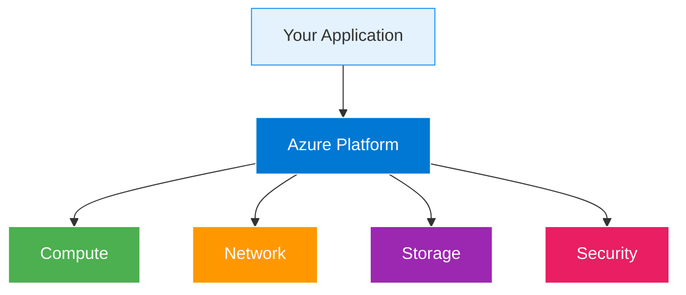

# IaaS Apps

  <iconify-icon icon="vscode-icons:file-type-azure" style="font-size: 4rem;" />

---

---
layout: center
class: text-center
---

# Welcome

Welcome to this lab on deploying applications using Azure Infrastructure-as-a-Service.

  <iconify-icon icon="carbon:rocket" style="font-size: 3rem; color: #0078d4;" />

---

---
layout: center
---

# What You'll Learn

<iconify-icon icon="mdi:check-circle" class="text-blue-500" /> on lab, you'll learn how to deploy traditional applications to Azure using IaaS resources. While Platform-as-a-Service solutions are often the end goal for cloud-native applications, IaaS provides a straightforward migration path for existing workloads.

---

---
layout: center
---

# Lab Scenario

Today, we'll be working with a legacy .NET Framework application - the kind of application many organizations still run in production. This application uses Windows Server and SQL Server, both of whic

---

---
layout: center
---

# Key Concepts

---

---
layout: center
---

# What We'll Build

We'll create a complete application environment including:
- A SQL Database to store application data
- A Windows Server virtual machine running the latest Windows Server 2022
- An IIS web server host

---

---
layout: center
class: text-center
---

# Prerequisites

<iconify-icon icon="mdi:checkbox-marked-circle" class="text-blue-500" /> An active Azure subscription

<iconify-icon icon="mdi:checkbox-marked-circle" class="text-blue-500" /> Azure CLI installed and configured

<iconify-icon icon="mdi:checkbox-marked-circle" class="text-blue-500" /> A Remote Desktop client for connecting to Windows VMs

<iconify-icon icon="mdi:checkbox-marked-circle" class="text-blue-500" /> Basic familiarity with PowerShell commands

  <iconify-icon icon="carbon:rocket" style="font-size: 3rem; color: #0078d4;" />

---

---
layout: two-cols
---

# Lab Architecture

::right::

<h3>Azure Manages</h3>
<ul>

</ul>

<h3>You Control</h3>
<ul>

</ul>

---

---
layout: center
---

# Time to Complete

This lab typically takes about 45 minutes to complete, including resource provisioning time.

