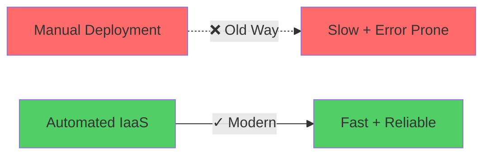
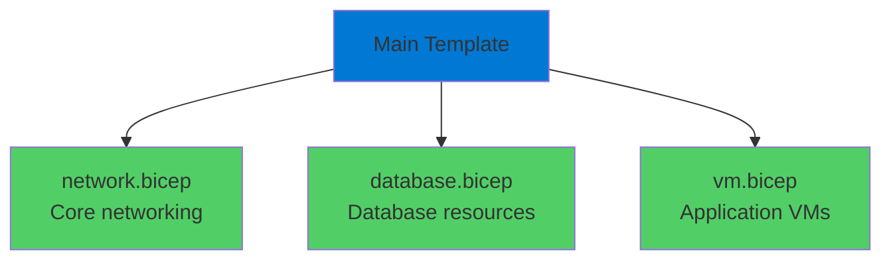

# IaaS with Bicep

Automating Application Deployment

<div class="abs-bottom-10 left-10">
  <carbon-deployment-pattern class="text-8xl text-blue-400 opacity-80" />
</div>

---
layout: center
---

# Welcome

<v-click>

<div class="text-xl mt-8">
Automate application deployment with IaaS<br/>Using Bicep for Infrastructure as Code
</div>

</v-click>

---
layout: section
---

# The IaaS Automation Story

---

# IaaS Doesn't Mean Manual

<v-click>

<div class="mt-4">
  <carbon-warning class="text-6xl text-red-400" />
</div>

</v-click>

<v-click>

<div class="mt-8 text-xl text-center text-red-400">
Easy to imagine: logging in and deploying by hand
</div>

</v-click>

<v-click>

<div class="mt-12 text-center text-2xl text-green-400">
But that's not how we work in modern cloud
</div>

</v-click>

<v-click>

<div class="mt-12">



</div>

</v-click>

---

# Full Control + Automation

<v-click>

<div class="mt-8 text-center text-xl text-green-400">
IaaS means full control over infrastructure
</div>

</v-click>

<v-click>

<div class="mt-12 text-center text-xl">
And we can automate every aspect of it
</div>

</v-click>

<v-click>

<div class="mt-12 flex justify-center gap-12">
  <div class="text-center">
    <carbon-settings class="text-6xl text-blue-400" />
    <div class="text-sm mt-3">Full Control</div>
  </div>
  <div class="text-center">
    <carbon-add class="text-6xl text-green-400" />
  </div>
  <div class="text-center">
    <carbon-automation class="text-6xl text-purple-400" />
    <div class="text-sm mt-3">Complete Automation</div>
  </div>
</div>

</v-click>

---
layout: section
---

# What We'll Build

---

# Complete Automated Stack

<v-click>

<div class="mt-8 text-center text-xl">
.NET web application with SQL Server backend
</div>

</v-click>

<v-click>

<div class="mt-12 text-center text-lg">
Traditional environment might take hours or days:
</div>

</v-click>

<v-click>

<div class="mt-8 grid grid-cols-2 gap-6">
  <div class="text-sm opacity-70">Provision VMs</div>
  <div class="text-sm opacity-70">Configure networks</div>
  <div class="text-sm opacity-70">Install SQL Server</div>
  <div class="text-sm opacity-70">Deploy application</div>
  <div class="text-sm opacity-70">Set up configuration</div>
  <div class="text-sm opacity-70">Test everything</div>
</div>

</v-click>

<v-click>

<div class="mt-12 text-center text-2xl text-green-400">
With Bicep and Azure IaaS: Minutes
</div>

</v-click>

---
layout: section
---

# The Bicep Approach

---

# Modular Infrastructure Files

<v-click>

<div class="mt-4">
  <carbon-document-multiple class="text-6xl text-green-400" />
</div>

</v-click>

<v-click>

<div class="mt-8 text-xl text-center text-green-400">
Split infrastructure across multiple files
</div>

</v-click>

<v-click>

<div class="mt-12">



</div>

</v-click>

<v-click>

<div class="mt-8 text-center text-xl">
Clean, modular, maintainable
</div>

</v-click>

---

# Not One Massive Template

<v-click>

<div class="mt-12 flex justify-center gap-16">
  <div class="text-center">
    <carbon-document class="text-6xl text-red-400" />
    <div class="text-sm mt-3">Single Huge File</div>
    <div class="text-xs mt-2 opacity-70">Hard to read</div>
    <div class="text-xs opacity-70">Hard to maintain</div>
  </div>
  <div class="text-center">
    <carbon-document-multiple class="text-6xl text-green-400" />
    <div class="text-sm mt-3">Modular Files</div>
    <div class="text-xs mt-2 opacity-70">Easy to read</div>
    <div class="text-xs opacity-70">Easy to maintain</div>
  </div>
</div>

</v-click>

<v-click>

<div class="mt-12 text-center text-xl text-green-400">
Files reference each other and share variables
</div>

</v-click>

---
layout: section
---

# Beyond Infrastructure

---

# VM Custom Script Extension

<v-click>

<div class="mt-4">
  <carbon-script class="text-6xl text-purple-400" />
</div>

</v-click>

<v-click>

<div class="mt-8 text-xl text-center text-green-400">
Run PowerShell scripts automatically when VM is created
</div>

</v-click>

<v-click>

<div class="mt-12 flex items-center gap-4">
  <carbon-download class="text-4xl text-blue-400" />
  <span class="text-lg">Install dependencies</span>
</div>

</v-click>

<v-click>

<div class="mt-6 flex items-center gap-4">
  <carbon-deployment-pattern class="text-4xl text-green-400" />
  <span class="text-lg">Deploy applications</span>
</div>

</v-click>

<v-click>

<div class="mt-6 flex items-center gap-4">
  <carbon-settings-adjust class="text-4xl text-purple-400" />
  <span class="text-lg">Configure everything exactly as needed</span>
</div>

</v-click>

---

# Fully Automated Deployment

<v-click>

<div class="mt-8">

```mermaid
graph TB
    Deploy[Run Deployment] --> Infra[Create Infrastructure]
    Infra --> Script[Execute Custom Scripts]
    Script --> Install[Install Dependencies]
    Install --> App[Deploy Application]
    App --> Config[Configure Services]
    Config --> Ready[✓ Ready to Use]
    style Deploy fill:#0078d4
    style Infra fill:#ffd43b
    style Script fill:#ffd43b
    style Install fill:#ffd43b
    style App fill=#ffd43b
    style Config fill:#ffd43b
    style Ready fill:#51cf66
```

</div>

</v-click>

<v-click>

<div class="mt-8 text-center text-xl text-green-400">
No manual intervention required
</div>

</v-click>

---

# The Power of Automation

<v-click>

<div class="mt-8 text-center text-xl">
Run a few commands
</div>

</v-click>

<v-click>

<div class="mt-12 text-center text-2xl text-green-400">
Get complete application stack
</div>

</v-click>

<v-click>

<div class="mt-12">

```bash
az deployment group create \
  --resource-group my-rg \
  --template-file main.bicep
```

</div>

</v-click>

<v-click>

<div class="mt-12 text-center text-xl">
Everything deployed and configured
</div>

</v-click>

<v-click>

<div class="mt-4 text-center text-lg opacity-70">
Infrastructure + Application + Configuration
</div>

</v-click>

---

# Repeatable and Reliable

<v-click>

<div class="mt-12 flex justify-center gap-12">
  <div class="text-center">
    <carbon-repeat class="text-6xl text-blue-400" />
    <div class="text-sm mt-3">Repeatable</div>
    <div class="text-xs mt-2 opacity-70">Same every time</div>
  </div>
  <div class="text-center">
    <carbon-checkmark-outline class="text-6xl text-green-400" />
    <div class="text-sm mt-3">Reliable</div>
    <div class="text-xs mt-2 opacity-70">No human error</div>
  </div>
  <div class="text-center">
    <carbon-flash class="text-6xl text-purple-400" />
    <div class="text-sm mt-3">Fast</div>
    <div class="text-xs mt-2 opacity-70">Minutes not hours</div>
  </div>
</div>

</v-click>

<v-click>

<div class="mt-12 text-center text-xl text-green-400">
This is the power of IaaS + Infrastructure as Code
</div>

</v-click>

---
layout: center
class: text-center
---

<div>

<v-click>

<carbon-play-outline class="text-8xl text-green-400 inline-block" />

</v-click>

<v-click>

<div class="text-4xl mt-8 font-bold">
Let's Get Started!
</div>

</v-click>

<v-click>

<div class="text-xl mt-6 opacity-70">
Build a fully automated deployment pipeline
</div>

</v-click>

</div>
