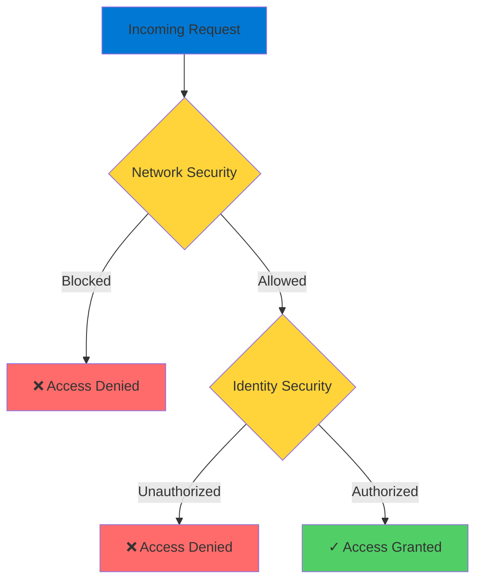
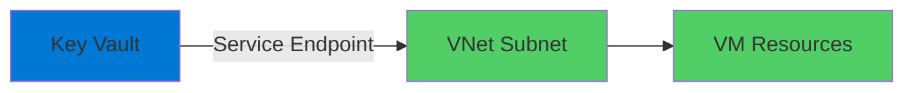
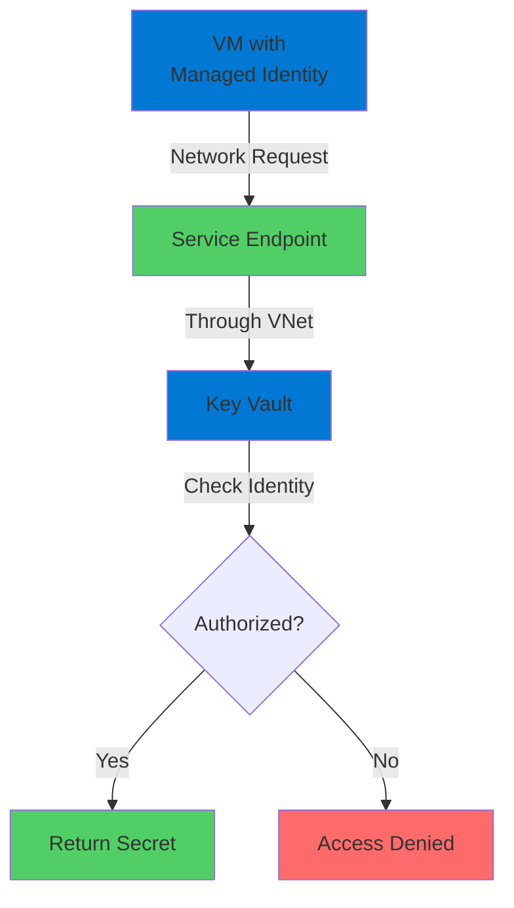

# Securing Key Vault Access

Defense in Depth for Sensitive Data

  <carbon-security class="text-8xl text-blue-400 opacity-80" />

---
layout: center
---

# Welcome

<!--
METADATA:
sentence: In this session, we'll explore how to properly lock down access to your Key Vaults to ensure only authorized resources can access your sensitive data.
search_anchor: this session, we'll explore how
-->
<v-click>

Explore Key Vault security Lock down access to sensitive data

</v-click>

---
layout: section
---

# Why Security Matters

---

# Your Most Sensitive Data

<v-click>

  <carbon-locked class="text-6xl text-red-400" />

</v-click>

<!--
METADATA:
sentence: Because of this, securing access to Key Vault is absolutely critical.
search_anchor: Because of this, securing access
-->
<v-click>

Key Vaults store critical secrets

</v-click>

<!--
METADATA:
sentence: Why Key Vault Security Matters Key Vaults store your most sensitive data - passwords, connection strings, API keys, and certificates.
search_anchor: Why Key Vault Security Matters
-->
<v-click>

  

    <carbon-password class="text-5xl text-blue-400" />
    
Passwords

  

  

    <carbon-data-connected class="text-5xl text-green-400" />
    
Connection Strings

  

  

    <carbon-api class="text-5xl text-purple-400" />
    
API Keys

  

  

    <carbon-certificate class="text-5xl text-orange-400" />
    
Certificates

  

</v-click>

<!--
METADATA:
sentence: A misconfigured Key Vault could expose your secrets to unauthorized users or services, potentially compromising your entire application infrastructure.
search_anchor: misconfigured Key Vault could expose
-->
<v-click>

Misconfiguration could expose everything

</v-click>

---
layout: section
---

# Two Layers of Security

---

# Defense in Depth

<v-click>

</v-click>

<!--
METADATA:
sentence: What We'll Cover In this lab, we'll work through both layers of security.
search_anchor: What We'll Cover In this
-->
<v-click>

Both layers work together

</v-click>

---

# Layer 1: Network Security

<v-click>

  <carbon-network-3 class="text-6xl text-blue-400" />

</v-click>

<!--
METADATA:
sentence: This controls whether a request can even reach the Key Vault service.
search_anchor: This controls whether a request
-->
<v-click>

Controls whether request can reach Key Vault

</v-click>

<!--
METADATA:
sentence: By default, Key Vaults are accessible from any network, but you can restrict access to specific virtual networks.
search_anchor: By default, Key Vaults are
-->
<v-click>

  

    <carbon-earth class="text-6xl text-orange-400" />
    
Default: Any Network

  

  

    <carbon-arrow-right class="text-6xl text-gray-400" />
  

  

    <carbon-network-4 class="text-6xl text-green-400" />
    
Restrict: Specific VNets

  

</v-click>

<!--
METADATA:
sentence: We'll start by creating a Key Vault and storing a secret.
search_anchor: We'll start by creating a
-->
<v-click>

First line of defense

</v-click>

---

# Layer 2: Identity Security

<v-click>

  <carbon-user-certification class="text-6xl text-purple-400" />

</v-click>

<!--
METADATA:
sentence: Even if a request can reach the Key Vault over the network, the caller still needs to authenticate as an authorized principal.
search_anchor: Even if a request can
-->
<v-click>

Caller must authenticate as authorized principal

</v-click>

<!--
METADATA:
sentence: Azure uses the term "principal" to refer to any identity - whether that's a user account, a group of users, a service principal, or a managed identity.
search_anchor: Azure uses the term "principal"
-->
<v-click>

Azure uses "principal" for any identity

</v-click>

<!--
METADATA:
sentence: Principals is Azure's general term for any authenticated identity - users, groups, service principals, or managed identities.
search_anchor: Principals is Azure's general term
-->
<v-click>

  

    <carbon-user class="text-5xl text-blue-400" />
    
User Accounts

  

  

    <carbon-user-multiple class="text-5xl text-green-400" />
    
User Groups

  

  

    <carbon-application class="text-5xl text-purple-400" />
    
Service Principals

  

  

    <carbon-id-management class="text-5xl text-orange-400" />
    
Managed Identities

  

</v-click>

---
layout: section
---

# What We'll Cover

---

# Lab Flow

<!--
METADATA:
sentence: We'll start by creating a Key Vault and storing a secret.
search_anchor: We'll start by creating a
-->
<v-click>

  
1

  

    <carbon-add class="text-3xl inline-block" />
    Create Key Vault and store secret
  

</v-click>

<!--
METADATA:
sentence: Then we'll lock down network access so only resources in a specific virtual network can reach the vault.
search_anchor: Then we'll lock down network
-->
<v-click>

  
2

  

    <carbon-network-3 class="text-3xl inline-block" />
    Lock down network access to specific VNet
  

</v-click>

<!--
METADATA:
sentence: Next, we'll create a virtual machine in that network and configure it with a managed identity.
search_anchor: Next, we'll create a virtual
-->
<v-click>

  
3

  

    <carbon-virtual-machine class="text-3xl inline-block" />
    Create VM in that network
  

</v-click>

<!--
METADATA:
sentence: Next, we'll create a virtual machine in that network and configure it with a managed identity.
search_anchor: Next, we'll create a virtual
-->
<v-click>

  
4

  

    <carbon-id-management class="text-3xl inline-block" />
    Configure managed identity
  

</v-click>

<!--
METADATA:
sentence: You configure these in the Key Vault itself.
search_anchor: You configure these in the
-->
<v-click>

Defense in depth in action

</v-click>

---
layout: section
---

# Key Concepts

---

# Access Policies

<v-click>

  <carbon-security class="text-6xl text-blue-400" />

</v-click>

<!--
METADATA:
sentence: Key Concepts Let's quickly review some key concepts you'll encounter: Access Policies define what a principal is allowed to do with secrets, keys, or certificates.
search_anchor: Key Concepts Let's quickly review
-->
<v-click>

Define what principals can do

</v-click>

<!--
METADATA:
sentence: Why Key Vault Security Matters Key Vaults store your most sensitive data - passwords, connection strings, API keys, and certificates.
search_anchor: Why Key Vault Security Matters
-->
<v-click>

  

    <carbon-view class="text-5xl text-blue-400" />
    
Secrets

  

  

    <carbon-locked class="text-5xl text-green-400" />
    
Keys

  

  

    <carbon-certificate class="text-5xl text-purple-400" />
    
Certificates

  

</v-click>

<!--
METADATA:
sentence: You configure these in the Key Vault itself.
search_anchor: You configure these in the
-->
<v-click>

Configured in Key Vault itself

</v-click>

---

# Service Endpoints

<v-click>

  <carbon-data-connected class="text-6xl text-green-400" />

</v-click>

<!--
METADATA:
sentence: Service Endpoints allow Azure services like Key Vault to communicate with resources inside a virtual network subnet.
search_anchor: Service Endpoints allow Azure services
-->
<v-click>

Allow Azure services to communicate with VNet resources

</v-click>

<v-click>

</v-click>

<!--
METADATA:
sentence: This will demonstrate how managed identities provide a secure way for Azure resources to authenticate with Key Vault without requiring any credentials in your code.
search_anchor: This will demonstrate how managed
-->
<v-click>

Secure connectivity without public internet

</v-click>

---

# Managed Identities

<v-click>

  <carbon-id-management class="text-6xl text-purple-400" />

</v-click>

<!--
METADATA:
sentence: Managed Identities are Azure-managed identities that Azure services can use to authenticate with other Azure services.
search_anchor: Managed Identities are Azure-managed identities
-->
<v-click>

Azure-managed identities for Azure services

</v-click>

<!--
METADATA:
sentence: There's no password or credential you need to manage - Azure handles everything automatically.
search_anchor: There's no password or credential
-->
<v-click>

  <carbon-close class="text-4xl text-green-400" />
  No passwords to manage

</v-click>

<!--
METADATA:
sentence: You configure these in the Key Vault itself.
search_anchor: You configure these in the
-->
<v-click>

  <carbon-close class="text-4xl text-green-400" />
  No credentials in code

</v-click>

<!--
METADATA:
sentence: There's no password or credential you need to manage - Azure handles everything automatically.
search_anchor: There's no password or credential
-->
<v-click>

  <carbon-checkmark class="text-4xl text-green-400" />
  Azure handles everything automatically

</v-click>

<!--
METADATA:
sentence: There's no password or credential you need to manage - Azure handles everything automatically.
search_anchor: There's no password or credential
-->
<v-click>

Secure authentication without credential management

</v-click>

---

# The Complete Flow

<v-click>

</v-click>

<!--
METADATA:
sentence: What We'll Cover In this lab, we'll work through both layers of security.
search_anchor: What We'll Cover In this
-->
<v-click>

Both layers protecting your secrets

</v-click>

---
layout: center
class: text-center
---

<v-click>

<carbon-play-outline class="text-8xl text-green-400 inline-block" />

</v-click>

<!--
METADATA:
sentence: Let's get started by creating our Key Vault and setting up the initial configuration.
search_anchor: Let's get started by creating
-->
<v-click>

Let's Get Started!

</v-click>

<!--
METADATA:
sentence: You configure these in the Key Vault itself.
search_anchor: You configure these in the
-->
<v-click>

Implement defense in depth for Key Vault

</v-click>

