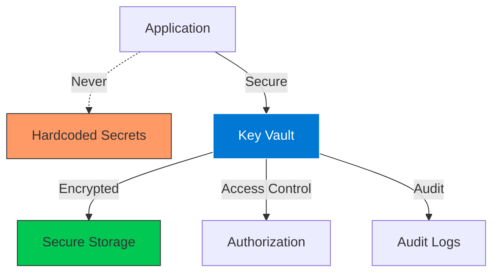

# The Security Challenge

Where to store secrets?

- ❌ Config files
- ❌ Environment variables
- ❌ Source code
- ✅ Key Vault

::right::

```mermaid
graph TB
    App[Application] -.Never.-> Code[Hardcoded Secrets]

    App -->|Secure| KV[Key Vault]

    KV -->|Encrypted| Store[Secure Storage]
    KV -->|Access Control| Auth[Authorization]
    KV -->|Audit| Log[Audit Logs]

    style Code fill:#f96,stroke:#333
    style KV fill:#0078d4,stroke:#fff,color:#fff
    style Store fill:#00c853,stroke:#333
```
