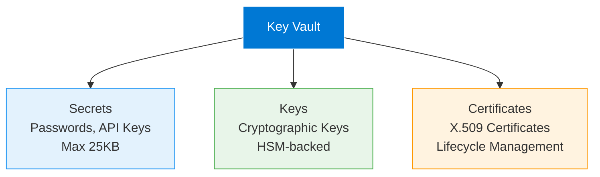

# What Key Vault Stores

```mermaid
graph TB
    KV[Key Vault] --> Secrets[Secrets<br/>Passwords, API Keys<br/>Max 25KB]
    KV --> Keys[Keys<br/>Cryptographic Keys<br/>HSM-backed]
    KV --> Certs[Certificates<br/>X.509 Certificates<br/>Lifecycle Management]

    style KV fill:#0078d4,stroke:#fff,color:#fff
    style Secrets fill:#e3f2fd,stroke:#2196f3
    style Keys fill:#e8f5e9,stroke:#4caf50
    style Certs fill:#fff3e0,stroke:#ff9800
```
