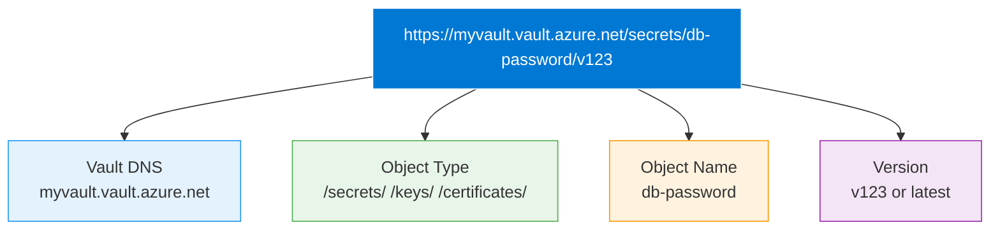

# URI Structure

```mermaid
graph TB
    URI["https://myvault.vault.azure.net/secrets/db-password/v123"]

    URI --> Base[Vault DNS<br/>myvault.vault.azure.net]
    URI --> Type[Object Type<br/>/secrets/ /keys/ /certificates/]
    URI --> Name[Object Name<br/>db-password]
    URI --> Ver[Version<br/>v123 or latest]

    style URI fill:#0078d4,stroke:#fff,color:#fff
    style Base fill:#e3f2fd,stroke:#2196f3
    style Type fill:#e8f5e9,stroke:#4caf50
    style Name fill:#fff3e0,stroke:#ff9800
    style Ver fill:#f3e5f5,stroke:#9c27b0
```

No version = always latest

Enables seamless secret rotation

