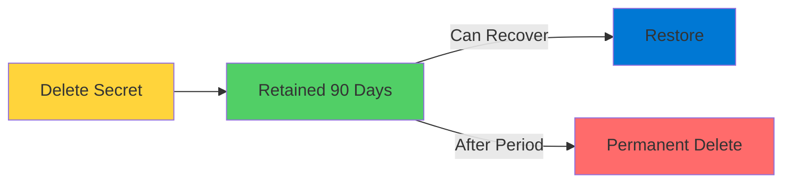
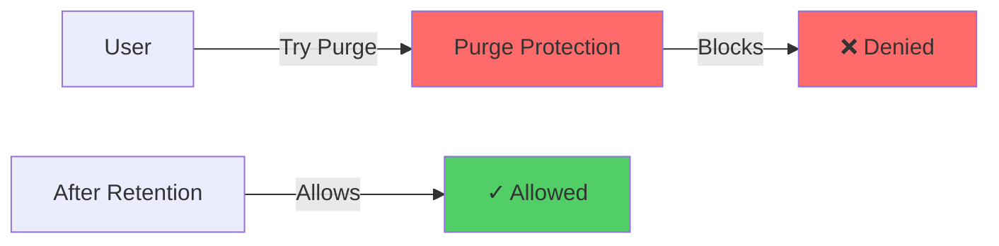

# Azure Key Vault

Protecting Sensitive Application Data

<div class="abs-bottom-10 left-10">
  <carbon-locked class="text-8xl text-red-400 opacity-80" />
</div>

---
layout: center
---

# Welcome

<v-click>

<div class="text-xl mt-8">
Explore Azure Key Vault<br/>One of Azure's most important security services
</div>

</v-click>

---
layout: section
---

# What is Key Vault?

---

# Specialized Storage Service

<v-click>

<div class="mt-4">
  <carbon-security class="text-6xl text-red-400" />
</div>

</v-click>

<v-click>

<div class="mt-8 text-xl text-center">
Designed for storing small, sensitive data
</div>

</v-click>

<v-click>

<div class="mt-12 grid grid-cols-3 gap-8">
  <div class="text-center">
    <carbon-password class="text-5xl text-blue-400" />
    <div class="text-sm mt-3">User Credentials</div>
  </div>
  <div class="text-center">
    <carbon-api class="text-5xl text-green-400" />
    <div class="text-sm mt-3">API Keys</div>
  </div>
  <div class="text-center">
    <carbon-certificate class="text-5xl text-purple-400" />
    <div class="text-sm mt-3">Certificates</div>
  </div>
</div>

</v-click>

<v-click>

<div class="mt-12 text-center text-lg text-red-400">
Data that should never be visible in plain text
</div>

</v-click>

---
layout: section
---

# Why Use Key Vault?

---

# The Problem

<v-click>

<div class="mt-8 text-center text-xl">
Where do you store application secrets?
</div>

</v-click>

<v-click>

<div class="mt-12 grid grid-cols-2 gap-8">
  <div class="text-center">
    <carbon-document class="text-6xl text-red-400" />
    <div class="text-sm mt-3 text-red-400">❌ Configuration files?</div>
  </div>
  <div class="text-center">
    <carbon-data-1 class="text-6xl text-red-400" />
    <div class="text-sm mt-3 text-red-400">❌ Environment variables?</div>
  </div>
</div>

</v-click>

<v-click>

<div class="mt-12 text-center text-2xl text-red-400">
Significant security risks!
</div>

</v-click>

---

# The Solution

<v-click>

<div class="mt-6 flex items-center gap-4">
  <carbon-locked class="text-4xl text-green-400" />
  <div>
    <div class="text-lg font-bold">Encryption at rest</div>
    <div class="text-sm opacity-70">All data encrypted in Key Vault</div>
  </div>
</div>

</v-click>

<v-click>

<div class="mt-6 flex items-center gap-4">
  <carbon-user-access class="text-4xl text-blue-400" />
  <div>
    <div class="text-lg font-bold">Access control</div>
    <div class="text-sm opacity-70">Fine-grained permissions</div>
  </div>
</div>

</v-click>

<v-click>

<div class="mt-6 flex items-center gap-4">
  <carbon-network-3 class="text-4xl text-purple-400" />
  <div>
    <div class="text-lg font-bold">Network isolation</div>
    <div class="text-sm opacity-70">Block access except when needed</div>
  </div>
</div>

</v-click>

<v-click>

<div class="mt-6 flex items-center gap-4">
  <carbon-document-view class="text-4xl text-orange-400" />
  <div>
    <div class="text-lg font-bold">Audit logging</div>
    <div class="text-sm opacity-70">Track every access</div>
  </div>
</div>

</v-click>

<v-click>

<div class="mt-6 flex items-center gap-4">
  <carbon-version class="text-4xl text-red-400" />
  <div>
    <div class="text-lg font-bold">Versioning</div>
    <div class="text-sm opacity-70">History for rotation and rollback</div>
  </div>
</div>

</v-click>

---
layout: section
---

# What Can You Store?

---

# Three Types of Data

<v-click>

<div class="mt-8 flex items-start gap-4">
  <div class="text-4xl text-blue-400 mt-1">1</div>
  <div>
    <carbon-password class="text-4xl inline-block" />
    <div class="ml-3 mt-2">
      <div class="text-xl font-bold">Secrets</div>
      <div class="text-sm mt-2 opacity-70">Passwords, connection strings, API keys</div>
      <div class="text-sm opacity-70">Maximum size: 25 KB</div>
    </div>
  </div>
</div>

</v-click>

<v-click>

<div class="mt-10 flex items-start gap-4">
  <div class="text-4xl text-green-400 mt-1">2</div>
  <div>
    <carbon-security class="text-4xl inline-block" />
    <div class="ml-3 mt-2">
      <div class="text-xl font-bold">Keys</div>
      <div class="text-sm mt-2 opacity-70">Cryptographic keys for encryption/decryption</div>
      <div class="text-sm opacity-70">Software or HSM-protected</div>
    </div>
  </div>
</div>

</v-click>

<v-click>

<div class="mt-10 flex items-start gap-4">
  <div class="text-4xl text-purple-400 mt-1">3</div>
  <div>
    <carbon-certificate class="text-4xl inline-block" />
    <div class="ml-3 mt-2">
      <div class="text-xl font-bold">Certificates</div>
      <div class="text-sm mt-2 opacity-70">X.509 certificates with lifecycle management</div>
      <div class="text-sm opacity-70">Keys + identity metadata</div>
    </div>
  </div>
</div>

</v-click>

---
layout: section
---

# Pricing Tiers

---

# Two Tiers

<v-click>

<div class="mt-8 flex items-start gap-4">
  <carbon-data-storage class="text-6xl text-blue-400 mt-1" />
  <div>
    <div class="text-2xl font-bold">Standard Tier</div>
    <div class="text-lg mt-4">Software-protected encryption</div>
    <div class="mt-4 flex items-center gap-3">
      <carbon-checkmark class="text-2xl text-green-400" />
      <span class="text-sm">Secrets and keys</span>
    </div>
    <div class="mt-2 flex items-center gap-3">
      <carbon-currency-dollar class="text-2xl text-green-400" />
      <span class="text-sm">Cost-effective</span>
    </div>
  </div>
</div>

</v-click>

<v-click>

<div class="mt-10 flex items-start gap-4">
  <carbon-chip class="text-6xl text-purple-400 mt-1" />
  <div>
    <div class="text-2xl font-bold">Premium Tier</div>
    <div class="text-lg mt-4">Hardware HSM-backed encryption</div>
    <div class="mt-4 flex items-center gap-3">
      <carbon-shield class="text-2xl text-red-400" />
      <span class="text-sm">Highest security standards</span>
    </div>
    <div class="mt-2 flex items-center gap-3">
      <carbon-enterprise class="text-2xl text-blue-400" />
      <span class="text-sm">Enterprise compliance</span>
    </div>
  </div>
</div>

</v-click>

---
layout: section
---

# Recovery and Protection

---

# Soft Delete

<v-click>

<div class="mt-4">
  <carbon-undo class="text-6xl text-green-400" />
</div>

</v-click>

<v-click>

<div class="mt-8 text-xl text-center">
Automatically enabled on new vaults
</div>

</v-click>

<v-click>

<div class="mt-12">



</div>

</v-click>

<v-click>

<div class="mt-8 text-center text-lg opacity-70">
Default 90-day retention before permanent deletion
</div>

</v-click>

---

# Purge Protection

<v-click>

<div class="mt-4">
  <carbon-shield class="text-6xl text-red-400" />
</div>

</v-click>

<v-click>

<div class="mt-8 text-xl text-center">
Prevents permanent deletion during retention
</div>

</v-click>

<v-click>

<div class="mt-12">



</div>

</v-click>

<v-click>

<div class="mt-8 text-center text-lg text-red-400">
Critical for production environments
</div>

</v-click>

---
layout: section
---

# Access Control

---

# Two Permission Models

<v-click>

<div class="mt-8 flex items-start gap-4">
  <div class="text-4xl text-blue-400 mt-1">1</div>
  <div>
    <carbon-settings class="text-4xl inline-block" />
    <div class="ml-3 mt-2">
      <div class="text-xl font-bold">Access Policies</div>
      <div class="text-sm mt-2 opacity-70">Traditional model</div>
      <div class="text-sm opacity-70">Specific permissions at vault level</div>
      <div class="text-sm opacity-70">"get secrets", "list secrets", "set secrets"</div>
    </div>
  </div>
</div>

</v-click>

<v-click>

<div class="mt-10 flex items-start gap-4">
  <div class="text-4xl text-green-400 mt-1">2</div>
  <div>
    <carbon-user-access class="text-4xl inline-block" />
    <div class="ml-3 mt-2">
      <div class="text-xl font-bold">Azure RBAC</div>
      <div class="text-sm mt-2 opacity-70">Modern approach (recommended)</div>
      <div class="text-sm opacity-70">Role-based access control</div>
      <div class="text-sm opacity-70">Consistent across all Azure resources</div>
    </div>
  </div>
</div>

</v-click>

---
layout: section
---

# Key Vault URI Structure

---

# URI Components

<v-click>

<div class="mt-8">

```
https://<keyvault-name>.vault.azure.net/secrets/database-password/<version>
```

</div>

</v-click>

<v-click>

<div class="mt-12 grid grid-cols-4 gap-4 text-center">
  <div>
    <div class="text-red-400 font-mono text-xs">&lt;keyvault-name&gt;</div>
    <div class="text-xs mt-2 opacity-70">Vault DNS</div>
  </div>
  <div>
    <div class="text-green-400 font-mono text-xs">/secrets/</div>
    <div class="text-xs mt-2 opacity-70">Object type</div>
  </div>
  <div>
    <div class="text-blue-400 font-mono text-xs">database-password</div>
    <div class="text-xs mt-2 opacity-70">Object name</div>
  </div>
  <div>
    <div class="text-purple-400 font-mono text-xs">&lt;version&gt;</div>
    <div class="text-xs mt-2 opacity-70">Version (optional)</div>
  </div>
</div>

</v-click>

---

# Version Behavior

<v-click>

<div class="mt-8">

```
# With version - specific version
https://myvault.vault.azure.net/secrets/db-pwd/abc123

# Without version - latest version
https://myvault.vault.azure.net/secrets/db-pwd
```

</div>

</v-click>

<v-click>

<div class="mt-12 text-center text-xl text-green-400">
Without version = always get latest
</div>

</v-click>

<v-click>

<div class="mt-6 text-center text-lg opacity-70">
Important for secret rotation - no code changes needed
</div>

</v-click>

---
layout: section
---

# Best Practices

---

# Key Best Practices

<v-click>

<div class="mt-4 flex items-start gap-3">
  <carbon-close class="text-3xl text-red-400 mt-1" />
  <div>
    <div class="font-bold">Never hardcode secrets</div>
    <div class="text-sm opacity-70">In code or configuration files</div>
  </div>
</div>

</v-click>

<v-click>

<div class="mt-4 flex items-start gap-3">
  <carbon-folder class="text-3xl text-blue-400 mt-1" />
  <div>
    <div class="font-bold">Separate Key Vaults per environment</div>
    <div class="text-sm opacity-70">Dev, test, production</div>
  </div>
</div>

</v-click>

<v-click>

<div class="mt-4 flex items-start gap-3">
  <carbon-shield class="text-3xl text-green-400 mt-1" />
  <div>
    <div class="font-bold">Enable soft delete and purge protection</div>
    <div class="text-sm opacity-70">For production vaults</div>
  </div>
</div>

</v-click>

<v-click>

<div class="mt-4 flex items-start gap-3">
  <carbon-user-identification class="text-3xl text-purple-400 mt-1" />
  <div>
    <div class="font-bold">Use Managed Identities</div>
    <div class="text-sm opacity-70">Eliminates credential storage</div>
  </div>
</div>

</v-click>

<v-click>

<div class="mt-4 flex items-start gap-3">
  <carbon-time class="text-3xl text-orange-400 mt-1" />
  <div>
    <div class="font-bold">Set expiration dates</div>
    <div class="text-sm opacity-70">Implement rotation policies</div>
  </div>
</div>

</v-click>

<v-click>

<div class="mt-4 flex items-start gap-3">
  <carbon-chart-line class="text-3xl text-red-400 mt-1" />
  <div>
    <div class="font-bold">Monitor and audit access</div>
    <div class="text-sm opacity-70">Azure Monitor and Log Analytics</div>
  </div>
</div>

</v-click>

---
layout: section
---

# What's Next

---

# Lab Objectives

<v-click>

<div class="mt-4 flex items-start gap-3">
  <carbon-add class="text-3xl text-blue-400 mt-1" />
  <span>Create Key Vault via Portal and CLI</span>
</div>

</v-click>

<v-click>

<div class="mt-4 flex items-start gap-3">
  <carbon-password class="text-3xl text-green-400 mt-1" />
  <span>Store and retrieve secrets</span>
</div>

</v-click>

<v-click>

<div class="mt-4 flex items-start gap-3">
  <carbon-version class="text-3xl text-purple-400 mt-1" />
  <span>Work with secret versioning</span>
</div>

</v-click>

<v-click>

<div class="mt-4 flex items-start gap-3">
  <carbon-certificate class="text-3xl text-orange-400 mt-1" />
  <span>Create and manage certificates</span>
</div>

</v-click>

<v-click>

<div class="mt-4 flex items-start gap-3">
  <carbon-user-access class="text-3xl text-red-400 mt-1" />
  <span>Implement proper access controls</span>
</div>

</v-click>

---
layout: center
class: text-center
---

<div>

<v-click>

<carbon-play-outline class="text-8xl text-green-400 inline-block" />

</v-click>

<v-click>

<div class="text-4xl mt-8 font-bold">
Let's Get Started!
</div>

</v-click>

<v-click>

<div class="text-xl mt-6 opacity-70">
Secure your application secrets with Key Vault
</div>

</v-click>

</div>
