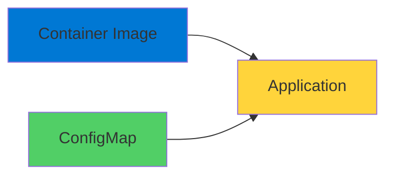
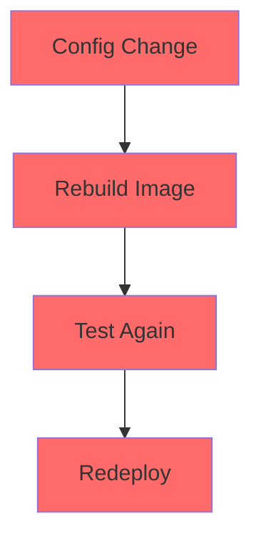
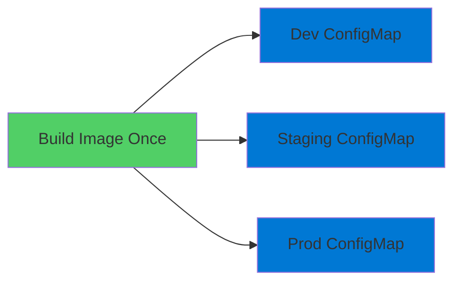
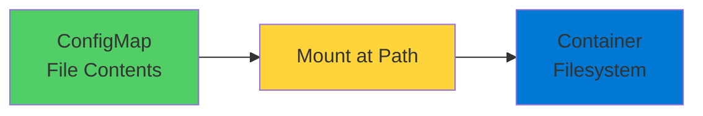

# Kubernetes ConfigMaps

Externalizing Application Configuration

  <carbon-settings class="text-8xl text-blue-400 opacity-80" />

---
layout: center
---

# Welcome

<v-click>

Explore Kubernetes ConfigMaps Separate configuration from container images

</v-click>

---
layout: section
---

# What Are ConfigMaps?

---

# Configuration Store

<v-click>

  <carbon-document class="text-6xl text-blue-400" />

</v-click>

<v-click>

Kubernetes object storing configuration data

</v-click>

<v-click>

As key-value pairs

</v-click>

<v-click>

</v-click>

<v-click>

Code completely separate from configuration

</v-click>

---

# Two Main Formats

<v-click>

  
1

  

    <carbon-parameter class="text-3xl inline-block" />
    Key-Value Pairs
    
Read as environment variables

  

</v-click>

<v-click>

  
2

  

    <carbon-document-blank class="text-3xl inline-block" />
    Full Text Files
    
JSON or YAML configuration files

    
Mounted into filesystem

  

</v-click>

---
layout: section
---

# Why ConfigMaps Matter

---

# The Traditional Problem

<v-click>

</v-click>

<v-click>

Slow, error-prone, against immutable infrastructure

</v-click>

---

# The ConfigMap Solution

<v-click>

</v-click>

<v-click>

Same image, different configurations

</v-click>

<v-click>

Twelve-Factor App methodology in action

</v-click>

---

# Separation of Concerns

<v-click>

  

    <carbon-code class="text-6xl text-blue-400" />
    
Developers

    
Focus on code

  

  

    <carbon-settings class="text-6xl text-green-400" />
    
Operations

    
Manage configuration

  

</v-click>

<v-click>

No hardcoded values in images

</v-click>

---
layout: section
---

# ConfigMaps in AKS

---

# Azure Integration

<v-click>

  <carbon-locked class="text-4xl text-blue-400" />
  Integrate with Azure Key Vault for secrets

</v-click>

<v-click>

  <carbon-settings-adjust class="text-4xl text-green-400" />
  Use with Azure App Configuration

</v-click>

<v-click>

  <carbon-deployment-pattern class="text-4xl text-purple-400" />
  Manage through Azure DevOps pipelines

</v-click>

<v-click>

  <carbon-id-management class="text-4xl text-orange-400" />
  Work with AKS managed identities

</v-click>

---
layout: section
---

# Two Methods of Using ConfigMaps

---

# Environment Variables

<v-click>

  <carbon-parameter class="text-6xl text-blue-400" />

</v-click>

<v-click>

Inject as environment variables

</v-click>

<v-click>

Perfect for simple settings:

</v-click>

<v-click>

  

    <carbon-flag class="text-5xl text-blue-400" />
    
Feature Flags

  

  

    <carbon-api class="text-5xl text-green-400" />
    
API Endpoints

  

  

    <carbon-version class="text-5xl text-purple-400" />
    
Version Numbers

  

</v-click>

<v-click>

Application reads like any environment variable

</v-click>

---

# Volume Mounts

<v-click>

  <carbon-document-blank class="text-6xl text-green-400" />

</v-click>

<v-click>

Mount as files in filesystem

</v-click>

<v-click>

</v-click>

<v-click>

Better for complex configuration files

</v-click>

<v-click>

JSON settings, XML config, etc.

</v-click>

---
layout: section
---

# AZ-204 Exam Connection

---

# Key Exam Topics

<v-click>

  <carbon-checkmark class="text-4xl text-green-400" />
  Implement containerized solutions

</v-click>

<v-click>

  <carbon-checkmark class="text-4xl text-green-400" />
  Configure application settings

</v-click>

<v-click>

  <carbon-checkmark class="text-4xl text-green-400" />
  Manage configuration across environments

</v-click>

<v-click>

Essential knowledge areas

</v-click>

---

# What You'll Be Tested On

<v-click>

  <carbon-decision-tree class="text-4xl text-blue-400" />
  ConfigMaps vs Secrets

</v-click>

<v-click>

  <carbon-data-base class="text-4xl text-green-400" />
  Mounting configuration as volumes

</v-click>

<v-click>

  <carbon-renew class="text-4xl text-purple-400" />
  Updating running applications

</v-click>

<v-click>

  <carbon-data-structured class="text-4xl text-orange-400" />
  Configuration hierarchy

</v-click>

---
layout: section
---

# What You'll Learn Today

---

# Lab Objectives

<v-click>

  <carbon-add class="text-4xl text-blue-400" />
  Create ConfigMaps using YAML manifests

</v-click>

<v-click>

  <carbon-parameter class="text-4xl text-green-400" />
  Inject as environment variables

</v-click>

<v-click>

  <carbon-data-base class="text-4xl text-purple-400" />
  Mount as files

</v-click>

<v-click>

  <carbon-chart-network class="text-4xl text-orange-400" />
  Understand configuration hierarchy

</v-click>

<v-click>

Best practices for externalizing configuration

</v-click>

---
layout: center
class: text-center
---

<v-click>

<carbon-play-outline class="text-8xl text-green-400 inline-block" />

</v-click>

<v-click>

Let's Get Started!

</v-click>

<v-click>

Master Kubernetes configuration management

</v-click>

