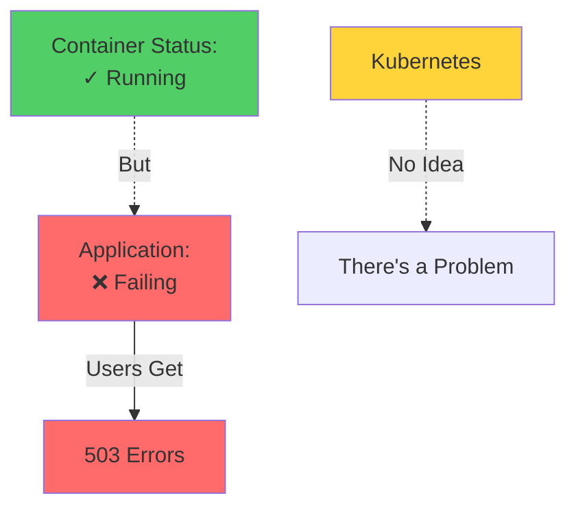
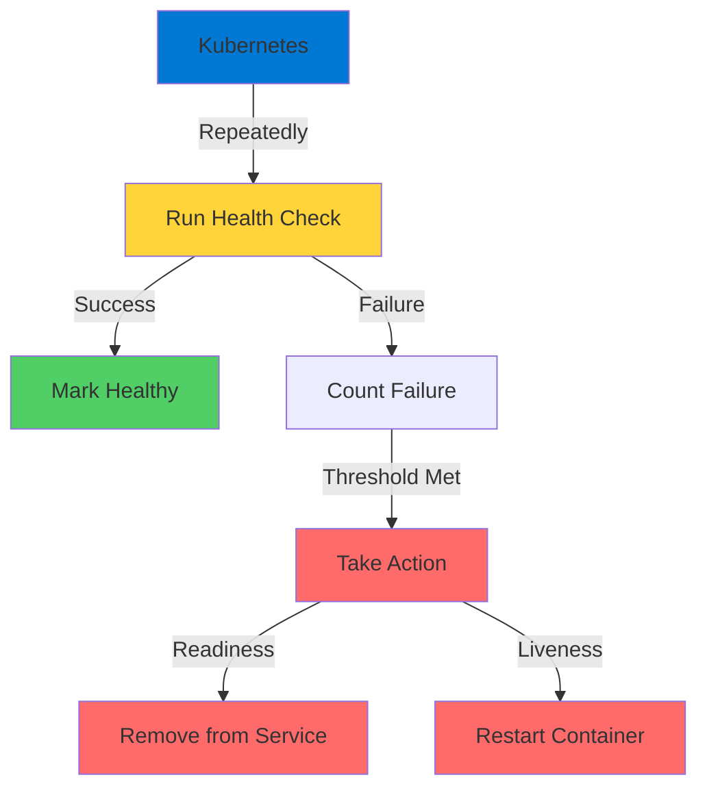
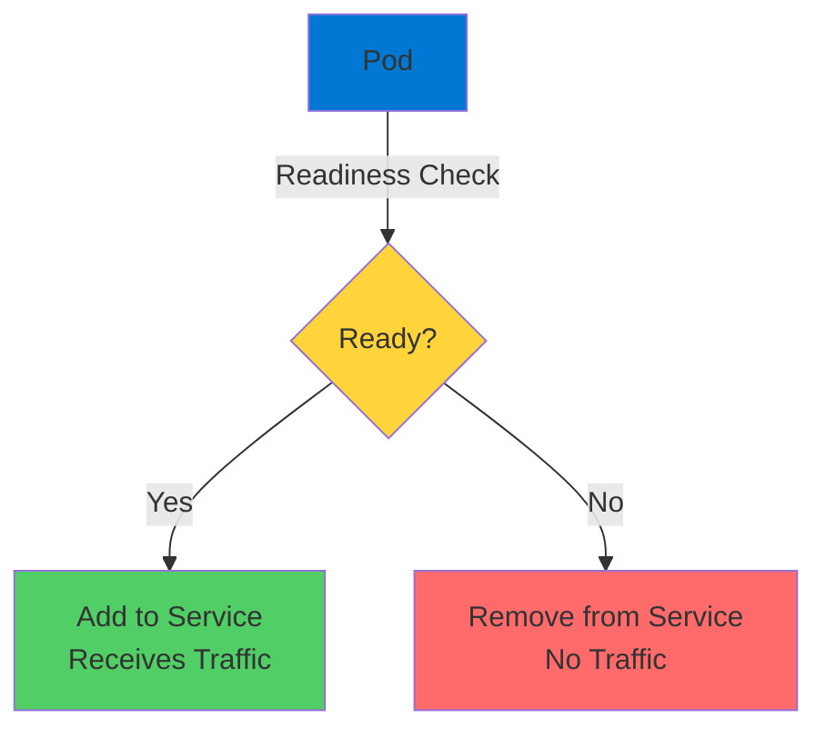
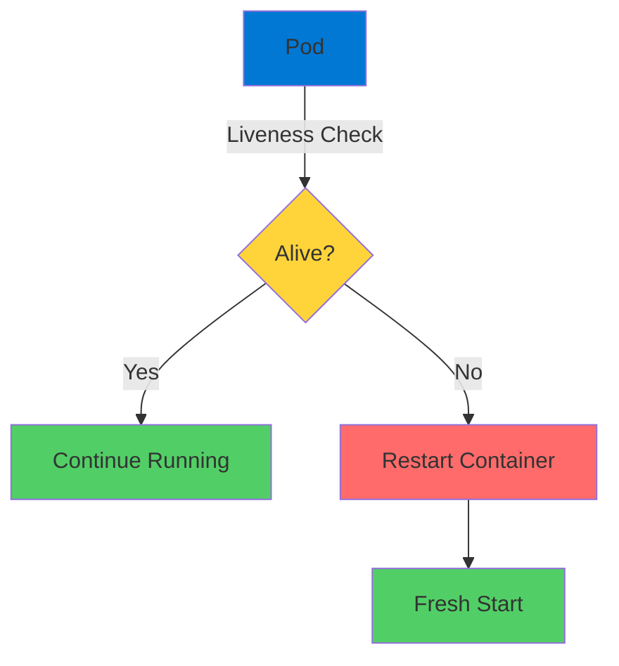

# Kubernetes Container Probes

Production-Ready Health Monitoring

<div class="abs-bottom-10 left-10">
  <carbon-health-cross class="text-8xl text-blue-400 opacity-80" />
</div>

---
layout: center
---

# Welcome

<!--
METADATA:
sentence: --- Slide 3: What Are Container Probes?
search_anchor: --- Slide 3: What Are
-->
<v-click>

<div class="text-xl mt-8">
Explore Kubernetes container probes<br/>Essential for production-ready applications
</div>

</v-click>

---
layout: section
---

# The Problem

---

# Running ≠ Healthy

<v-click>

<div class="mt-4">
  <carbon-warning class="text-6xl text-red-400" />
</div>

</v-click>

<!--
METADATA:
sentence: This is where container probes come to the rescue.
search_anchor: This is where container probes
-->
<v-click>

<div class="mt-8 text-xl text-center">
Container shows as running
</div>

</v-click>

<!--
METADATA:
sentence: Imagine this scenario: your web app is up, the container shows as running, but internally the application is returning five-oh-three errors.
search_anchor: Imagine this scenario: your web
-->
<v-click>

<div class="mt-12 text-center text-xl text-red-400">
But application is returning 503 errors
</div>

</v-click>

<v-click>

<div class="mt-12">



</div>

</v-click>

---

# Container Probes to the Rescue

<!--
METADATA:
sentence: Based on the results, Kubernetes takes action automatically.
search_anchor: Based on the results, Kubernetes
-->
<v-click>

<div class="mt-12 text-center text-2xl text-green-400">
Health checks Kubernetes runs automatically
</div>

</v-click>

<!--
METADATA:
sentence: Think of them as a doctor doing regular check-ups on your applications.
search_anchor: Think of them as a
-->
<v-click>

<div class="mt-12 flex justify-center gap-12">
  <div class="text-center">
    <carbon-doctor class="text-6xl text-blue-400" />
    <div class="text-sm mt-3">Regular Check-ups</div>
  </div>
  <div class="text-center">
    <carbon-health-cross class="text-6xl text-green-400" />
    <div class="text-sm mt-3">Determine Status</div>
  </div>
</div>

</v-click>

---
layout: section
---

# Three Types of Probes

---

# The Probe Types

<!--
METADATA:
sentence: This is where container probes come to the rescue.
search_anchor: This is where container probes
-->
<v-click>

<div class="mt-6 flex items-start gap-4">
  <div class="text-3xl text-blue-400 mt-1">1</div>
  <div>
    <carbon-checkmark-outline class="text-3xl inline-block" />
    <span class="ml-3 text-lg font-bold">Readiness Probes</span>
    <div class="text-sm mt-2 opacity-70">Is container ready to accept traffic?</div>
  </div>
</div>

</v-click>

<!--
METADATA:
sentence: Second, Liveness Probes - these determine if your container is still running properly, or if it needs to be restarted.
search_anchor: Second, Liveness Probes - these
-->
<v-click>

<div class="mt-8 flex items-start gap-4">
  <div class="text-3xl text-green-400 mt-1">2</div>
  <div>
    <carbon-health-cross class="text-3xl inline-block" />
    <span class="ml-3 text-lg font-bold">Liveness Probes</span>
    <div class="text-sm mt-2 opacity-70">Is container still running properly?</div>
    <div class="text-sm opacity-70">Should it be restarted?</div>
  </div>
</div>

</v-click>

<!--
METADATA:
sentence: And third, Startup Probes - these give slow-starting applications extra time to initialize before the other probes kick in.
search_anchor: third, Startup Probes - these
-->
<v-click>

<div class="mt-8 flex items-start gap-4">
  <div class="text-3xl text-purple-400 mt-1">3</div>
  <div>
    <carbon-time class="text-3xl inline-block" />
    <span class="ml-3 text-lg font-bold">Startup Probes</span>
    <div class="text-sm mt-2 opacity-70">Give slow-starting apps extra time</div>
    <div class="text-sm opacity-70">Before other probes begin</div>
  </div>
</div>

</v-click>

---
layout: section
---

# How Probes Work

---

# Probe Execution Cycle

<v-click>

<div class="mt-8">



</div>

</v-click>

---

# Configuration Options

<!--
METADATA:
sentence: You configure how often to run the check, how many failures to tolerate, and what timeouts to use.
search_anchor: You configure how often to
-->
<v-click>

<div class="mt-8 flex items-center gap-4">
  <carbon-time class="text-4xl text-blue-400" />
  <span class="text-lg">How often to run the check</span>
</div>

</v-click>

<!--
METADATA:
sentence: You configure how often to run the check, how many failures to tolerate, and what timeouts to use.
search_anchor: You configure how often to
-->
<v-click>

<div class="mt-6 flex items-center gap-4">
  <carbon-warning class="text-4xl text-orange-400" />
  <span class="text-lg">How many failures to tolerate</span>
</div>

</v-click>

<!--
METADATA:
sentence: --- Slide 3: What Are Container Probes?
search_anchor: --- Slide 3: What Are
-->
<v-click>

<div class="mt-6 flex items-center gap-4">
  <carbon-timer class="text-4xl text-green-400" />
  <span class="text-lg">Timeout settings</span>
</div>

</v-click>

<!--
METADATA:
sentence: Based on the results, Kubernetes takes action automatically.
search_anchor: Based on the results, Kubernetes
-->
<v-click>

<div class="mt-12 text-center text-xl text-green-400">
Kubernetes takes action automatically
</div>

</v-click>

<!--
METADATA:
sentence: This is self-healing infrastructure in action!
search_anchor: This is self-healing infrastructure in
-->
<v-click>

<div class="mt-4 text-center text-lg opacity-70">
Self-healing infrastructure in action
</div>

</v-click>

---
layout: section
---

# Probe Implementation Methods

---

# Three Ways to Check Health

<!--
METADATA:
sentence: HTTP probes are perfect for REST APIs and web applications - Kubernetes makes an HTTP request and expects a success status code.
search_anchor: HTTP probes are perfect for
-->
<v-click>

<div class="mt-6 flex items-start gap-4">
  <div class="text-3xl text-blue-400 mt-1">1</div>
  <div>
    <carbon-network-3 class="text-3xl inline-block" />
    <span class="ml-3 text-lg font-bold">HTTP Probes</span>
    <div class="text-sm mt-2 opacity-70">Make HTTP request</div>
    <div class="text-sm opacity-70">Expect success status code</div>
    <div class="text-sm mt-2 text-green-400">Perfect for REST APIs and web apps</div>
  </div>
</div>

</v-click>

<!--
METADATA:
sentence: TCP probes simply check if a port is open - great for databases and non-HTTP services.
search_anchor: TCP probes simply check if
-->
<v-click>

<div class="mt-8 flex items-start gap-4">
  <div class="text-3xl text-green-400 mt-1">2</div>
  <div>
    <carbon-data-connected class="text-3xl inline-block" />
    <span class="ml-3 text-lg font-bold">TCP Probes</span>
    <div class="text-sm mt-2 opacity-70">Check if port is open</div>
    <div class="text-sm mt-2 text-green-400">Great for databases and non-HTTP services</div>
  </div>
</div>

</v-click>

<!--
METADATA:
sentence: And exec probes run a command inside your container - the most flexible option when you need custom health logic.
search_anchor: exec probes run a command
-->
<v-click>

<div class="mt-8 flex items-start gap-4">
  <div class="text-3xl text-purple-400 mt-1">3</div>
  <div>
    <carbon-terminal class="text-3xl inline-block" />
    <span class="ml-3 text-lg font-bold">Exec Probes</span>
    <div class="text-sm mt-2 opacity-70">Run command inside container</div>
    <div class="text-sm mt-2 text-green-400">Most flexible for custom logic</div>
  </div>
</div>

</v-click>

---

# HTTP Probe Example

<v-click>

<div class="mt-8">

```mermaid
graph LR
    K8s[Kubernetes] -->|GET /health| App[Application]
    App -->|200 OK| Success[✓ Healthy]
    App -->|500 Error| Fail[❌ Unhealthy]
    style K8s fill:#0078d4
    style App fill:#ffd43b
    style Success fill:#51cf66
    style Fail fill=#ff6b6b
```

</div>

</v-click>

<!--
METADATA:
sentence: A failing readiness probe removes the pod from service endpoints.
search_anchor: failing readiness probe removes the
-->
<v-click>

<div class="mt-12 text-center text-xl">
Application provides health endpoint
</div>

</v-click>

<!--
METADATA:
sentence: Based on the results, Kubernetes takes action automatically.
search_anchor: Based on the results, Kubernetes
-->
<v-click>

<div class="mt-4 text-center text-lg opacity-70">
Kubernetes checks it regularly
</div>

</v-click>

---
layout: section
---

# Probe Actions

---

# Readiness Probe Actions

<v-click>

<div class="mt-8">



</div>

</v-click>

<!--
METADATA:
sentence: A failing readiness probe removes the pod from service endpoints.
search_anchor: failing readiness probe removes the
-->
<v-click>

<div class="mt-12 text-center text-xl text-green-400">
Failing probe removes from service endpoints
</div>

</v-click>

---

# Liveness Probe Actions

<v-click>

<div class="mt-8">



</div>

</v-click>

<!--
METADATA:
sentence: A failing liveness probe restarts the container.
search_anchor: failing liveness probe restarts the
-->
<v-click>

<div class="mt-12 text-center text-xl text-green-400">
Failing probe restarts container
</div>

</v-click>

---
layout: section
---

# AZ-204 Exam Relevance

---

# Key Exam Topics

<!--
METADATA:
sentence: This is self-healing infrastructure in action!
search_anchor: This is self-healing infrastructure in
-->
<v-click>

<div class="mt-8 flex items-center gap-4">
  <carbon-health-cross class="text-4xl text-blue-400" />
  <span class="text-lg">Application health monitoring in AKS</span>
</div>

</v-click>

<!--
METADATA:
sentence: Know when to use each probe type, how they affect container lifecycle management, and how they integrate with Azure's container monitoring solutions.
search_anchor: Know when to use each
-->
<v-click>

<div class="mt-6 flex items-center gap-4">
  <carbon-decision-tree class="text-4xl text-green-400" />
  <span class="text-lg">When to use each probe type</span>
</div>

</v-click>

<!--
METADATA:
sentence: This is where container probes come to the rescue.
search_anchor: This is where container probes
-->
<v-click>

<div class="mt-6 flex items-center gap-4">
  <carbon-flow class="text-4xl text-purple-400" />
  <span class="text-lg">Container lifecycle management</span>
</div>

</v-click>

<!--
METADATA:
sentence: Know when to use each probe type, how they affect container lifecycle management, and how they integrate with Azure's container monitoring solutions.
search_anchor: Know when to use each
-->
<v-click>

<div class="mt-6 flex items-center gap-4">
  <carbon-data-view-alt class="text-4xl text-orange-400" />
  <span class="text-lg">Integration with Azure monitoring</span>
</div>

</v-click>

<!--
METADATA:
sentence: This is a key part of developing cloud-native applications that are production-ready and resilient.
search_anchor: This is a key part
-->
<v-click>

<div class="mt-12 text-center text-xl text-green-400">
Production-ready cloud-native applications
</div>

</v-click>

---
layout: section
---

# What's Next

---

# Hands-On Lab

<!--
METADATA:
sentence: In the next section, we'll deploy real applications with different types of probes, see how Kubernetes responds to failures, and configure health checks that keep your apps running smoothly.
search_anchor: next section, we'll deploy real
-->
<v-click>

<div class="mt-8 flex items-center gap-4">
  <carbon-deployment-pattern class="text-4xl text-blue-400" />
  <span class="text-lg">Deploy applications with different probe types</span>
</div>

</v-click>

<!--
METADATA:
sentence: Based on the results, Kubernetes takes action automatically.
search_anchor: Based on the results, Kubernetes
-->
<v-click>

<div class="mt-6 flex items-center gap-4">
  <carbon-warning class="text-4xl text-orange-400" />
  <span class="text-lg">See how Kubernetes responds to failures</span>
</div>

</v-click>

<!--
METADATA:
sentence: Think of them as a doctor doing regular check-ups on your applications.
search_anchor: Think of them as a
-->
<v-click>

<div class="mt-6 flex items-center gap-4">
  <carbon-settings class="text-4xl text-green-400" />
  <span class="text-lg">Configure health checks for your apps</span>
</div>

</v-click>

<!--
METADATA:
sentence: In the next section, we'll deploy real applications with different types of probes, see how Kubernetes responds to failures, and configure health checks that keep your apps running smoothly.
search_anchor: next section, we'll deploy real
-->
<v-click>

<div class="mt-12 text-center text-xl text-green-400">
Keep applications running smoothly
</div>

</v-click>

---
layout: center
class: text-center
---

<div>

<v-click>

<carbon-play-outline class="text-8xl text-green-400 inline-block" />

</v-click>

<!--
METADATA:
sentence: This is self-healing infrastructure in action!
search_anchor: This is self-healing infrastructure in
-->
<v-click>

<div class="text-4xl mt-8 font-bold">
Let's Dive In!
</div>

</v-click>

<!--
METADATA:
sentence: In this video, we're going to explore one of the most important production-ready features in Kubernetes: container probes.
search_anchor: this video, we're going to
-->
<v-click>

<div class="text-xl mt-6 opacity-70">
Build production-ready health monitoring
</div>

</v-click>

</div>
