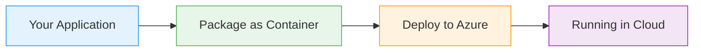

# Kubernetes Container Probes

  <iconify-icon icon="logos:docker-icon" style="font-size: 4rem;" />

---

---
layout: center
---

# Kubernetes Container Probes - Introduction Script

**Duration:** 2-3 minutes
**Tone:** Conversational, friendly, educational

---

---
layout: center
---

# Slide 1: Title Slide

**[SCREEN: Title slide with "Kubernetes Container Probes"]**

---

---
layout: center
---

# Slide 2: The Problem

**[SCREEN: Diagram showing a running container with a non-responsive application]**

---

---
layout: center
---

# Slide 3: What Are Container Probes?

**[SCREEN: Three icons representing the three probe types]**...

---

---
layout: center
---

# Slide 4: How Probes Work

**[SCREEN: Flow diagram showing probe execution cycle]**

---

---
layout: center
---

# Slide 5: Probe Types Explained

**[SCREEN: Side-by-side comparison of HTTP, TCP, and Exec probes]**

---

---
layout: center
---

# Slide 6: AZ-204 Exam Relevance

**[SCREEN: AZ-204 exam objectives with container health monitoring highlighted]**

---

---
layout: center
---

# Slide 7: What's Next

**[SCREEN: Preview of hands-on lab environment]**

