# Kubernetes Deployments

Essential Controllers for Managing Applications

<div class="abs-bottom-10 left-10">
  <carbon-deployment-pattern class="text-8xl text-blue-400 opacity-80" />
</div>

---
layout: center
---

# Welcome

<v-click>

<div class="text-xl mt-8">
Explore Kubernetes Deployments<br/>Critical for AKS and AZ-204
</div>

</v-click>

---
layout: section
---

# Why Not Create Pods Directly?

---

# The Problem with Direct Pods

<v-click>

<div class="mt-4">
  <carbon-warning class="text-6xl text-red-400" />
</div>

</v-click>

<v-click>

<div class="mt-8 text-xl text-center text-red-400">
Creating Pods directly is like building without foundation
</div>

</v-click>

<v-click>

<div class="mt-12 flex items-center gap-4">
  <carbon-close class="text-4xl text-red-400" />
  <span class="text-lg">Can't update to new versions</span>
</div>

</v-click>

<v-click>

<div class="mt-6 flex items-center gap-4">
  <carbon-close class="text-4xl text-red-400" />
  <span class="text-lg">Can't easily scale</span>
</div>

</v-click>

<v-click>

<div class="mt-6 flex items-center gap-4">
  <carbon-close class="text-4xl text-red-400" />
  <span class="text-lg">Pod crashes = gone forever</span>
</div>

</v-click>

---
layout: section
---

# Deployments as Controllers

---

# Smart Managers

<v-click>

<div class="mt-4">
  <carbon-network-4 class="text-6xl text-green-400" />
</div>

</v-click>

<v-click>

<div class="mt-8 text-xl text-center text-green-400">
Deployments are controllers
</div>

</v-click>

<v-click>

<div class="mt-12 text-center text-xl">
They create and manage Pods for you
</div>

</v-click>

<v-click>

<div class="mt-12">


</div>

</v-click>

---

# Declarative Approach

<v-click>

<div class="mt-12 text-center text-2xl text-green-400">
"Here's what I want"
</div>

</v-click>

<v-click>

<div class="mt-12">


</div>

</v-click>

<v-click>

<div class="mt-12 text-center text-xl">
Kubernetes figures out how to get there
</div>

</v-click>

---
layout: section
---

# Key Features

---

# Four Superpowers

<v-click>

<div class="mt-6 flex items-start gap-4">
  <div class="text-3xl text-blue-400 mt-1">1</div>
  <div>
    <carbon-document-tasks class="text-3xl inline-block" />
    <span class="ml-3 text-lg font-bold">Declarative Updates</span>
    <div class="text-sm mt-2 opacity-70">Describe desired state in YAML</div>
    <div class="text-sm opacity-70">Kubernetes figures out how</div>
  </div>
</div>

</v-click>

<v-click>

<div class="mt-6 flex items-start gap-4">
  <div class="text-3xl text-green-400 mt-1">2</div>
  <div>
    <carbon-renew class="text-3xl inline-block" />
    <span class="ml-3 text-lg font-bold">Rolling Updates</span>
    <div class="text-sm mt-2 opacity-70">Gradually replace old Pods with new</div>
    <div class="text-sm opacity-70">Application stays available</div>
  </div>
</div>

</v-click>

<v-click>

<div class="mt-6 flex items-start gap-4">
  <div class="text-3xl text-purple-400 mt-1">3</div>
  <div>
    <carbon-undo class="text-3xl inline-block" />
    <span class="ml-3 text-lg font-bold">Easy Rollbacks</span>
    <div class="text-sm mt-2 opacity-70">Something wrong?</div>
    <div class="text-sm opacity-70">Roll back with single command</div>
  </div>
</div>

</v-click>

<v-click>

<div class="mt-6 flex items-start gap-4">
  <div class="text-3xl text-orange-400 mt-1">4</div>
  <div>
    <carbon-scale class="text-3xl inline-block" />
    <span class="ml-3 text-lg font-bold">Simple Scaling</span>
    <div class="text-sm mt-2 opacity-70">Update replica count</div>
    <div class="text-sm opacity-70">In YAML or quick command</div>
  </div>
</div>

</v-click>

---
layout: section
---

# Deployment Structure

---

# Three Main Parts

<v-click>

<div class="mt-6 flex items-start gap-4">
  <div class="text-3xl text-blue-400 mt-1">1</div>
  <div>
    <carbon-tag class="text-3xl inline-block" />
    <span class="ml-3 text-lg font-bold">Selector</span>
    <div class="text-sm mt-2 opacity-70">Which Pods does this Deployment manage?</div>
    <div class="text-sm opacity-70">Uses labels to identify</div>
  </div>
</div>

</v-click>

<v-click>

<div class="mt-6 flex items-start gap-4">
  <div class="text-3xl text-green-400 mt-1">2</div>
  <div>
    <carbon-hashtag class="text-3xl inline-block" />
    <span class="ml-3 text-lg font-bold">Replica Count</span>
    <div class="text-sm mt-2 opacity-70">How many copies to run?</div>
  </div>
</div>

</v-click>

<v-click>

<div class="mt-6 flex items-start gap-4">
  <div class="text-3xl text-purple-400 mt-1">3</div>
  <div>
    <carbon-document-blank class="text-3xl inline-block" />
    <span class="ml-3 text-lg font-bold">Template</span>
    <div class="text-sm mt-2 opacity-70">Pod specification blueprint</div>
    <div class="text-sm opacity-70">No name field - auto-generated</div>
  </div>
</div>

</v-click>

---

# YAML Structure

<v-click>

<div class="mt-8">

```yaml
apiVersion: apps/v1
kind: Deployment
metadata:
  name: my-app
spec:
  replicas: 3
  selector:
    matchLabels:
      app: my-app
  template:
    metadata:
      labels:
        app: my-app
    spec:
      containers:
      - name: app
        image: myapp:v1
```

</div>

</v-click>

---
layout: section
---

# Rolling Updates in Action

---

# Zero Downtime Updates

```mermaid
graph TB
    Start[v1 Pods Running] --> Create[Create v2 Pod]
    Create --> Ready[Wait Until Ready]
    Ready --> Term[Terminate v1 Pod]
    Term --> More{More to Update?}
    More -->|Yes| Create
    More -->|No| Done[All Updated ✓]
    style Start fill:#0078d4
    style Create fill:#51cf66
    style Ready fill:#ffd43b
    style Term fill:#ff6b6b
    style Done fill:#51cf66
```

<v-click>

<div class="mt-8">



</div>

</v-click>

<v-click>

<div class="mt-8 text-center text-xl text-green-400">
Application stays available throughout
</div>

</v-click>

---

# Gradual Process

<v-click>

<div class="mt-8 text-center text-xl">
Doesn't kill all Pods and start over
</div>

</v-click>

<v-click>

<div class="mt-12 flex justify-center gap-12">
  <div class="text-center">
    <carbon-renew class="text-6xl text-green-400" />
    <div class="text-sm mt-3">Gradual Replacement</div>
  </div>
  <div class="text-center">
    <carbon-checkmark-outline class="text-6xl text-blue-400" />
    <div class="text-sm mt-3">No Downtime</div>
  </div>
  <div class="text-center">
    <carbon-user-multiple class="text-6xl text-purple-400" />
    <div class="text-sm mt-3">No User Disruption</div>
  </div>
</div>

</v-click>

<v-click>

<div class="mt-12 text-center text-xl">
Notice something wrong?
</div>

</v-click>

<v-click>

<div class="mt-4 text-center text-xl text-green-400">
Roll back just as smoothly
</div>

</v-click>

---
layout: section
---

# AZ-204 Exam Relevance

---

# Key Exam Areas

<v-click>

<div class="mt-6 flex items-center gap-4">
  <carbon-container-software class="text-4xl text-blue-400" />
  <span class="text-lg">Implement container solutions with AKS</span>
</div>

</v-click>

<v-click>

<div class="mt-6 flex items-center gap-4">
  <carbon-document class="text-4xl text-green-400" />
  <span class="text-lg">Understand Deployment manifests</span>
</div>

</v-click>

<v-click>

<div class="mt-6 flex items-center gap-4">
  <carbon-scale class="text-4xl text-purple-400" />
  <span class="text-lg">Scaling strategies</span>
</div>

</v-click>

<v-click>

<div class="mt-6 flex items-center gap-4">
  <carbon-renew class="text-4xl text-orange-400" />
  <span class="text-lg">Update patterns</span>
</div>

</v-click>

---

# Application Lifecycle

<v-click>

<div class="mt-8 flex items-center gap-4">
  <carbon-deployment-pattern class="text-4xl text-blue-400" />
  <span class="text-lg">Deploy updates</span>
</div>

</v-click>

<v-click>

<div class="mt-6 flex items-center gap-4">
  <carbon-undo class="text-4xl text-green-400" />
  <span class="text-lg">Roll back changes</span>
</div>

</v-click>

<v-click>

<div class="mt-6 flex items-center gap-4">
  <carbon-availability class="text-4xl text-purple-400" />
  <span class="text-lg">Maintain application availability</span>
</div>

</v-click>

---

# Imperative vs Declarative

<v-click>

<div class="mt-8 flex justify-center gap-16">
  <div class="text-center">
    <carbon-terminal class="text-6xl text-orange-400" />
    <div class="text-sm mt-3">Imperative Commands</div>
    <div class="text-xs mt-2 opacity-70">Quick testing</div>
  </div>
  <div class="text-center">
    <carbon-document-blank class="text-6xl text-green-400" />
    <div class="text-sm mt-3">Declarative YAML</div>
    <div class="text-xs mt-2 opacity-70">Production standard</div>
  </div>
</div>

</v-click>

<v-click>

<div class="mt-12 text-center text-xl text-green-400">
Know the difference
</div>

</v-click>

---
layout: section
---

# What's Next

---

# Hands-On Exercises

<v-click>

<div class="mt-8 flex items-center gap-4">
  <carbon-add class="text-4xl text-blue-400" />
  <span class="text-lg">Create Deployments</span>
</div>

</v-click>

<v-click>

<div class="mt-6 flex items-center gap-4">
  <carbon-scale class="text-4xl text-green-400" />
  <span class="text-lg">Scale up and down</span>
</div>

</v-click>

<v-click>

<div class="mt-6 flex items-center gap-4">
  <carbon-renew class="text-4xl text-purple-400" />
  <span class="text-lg">Perform rolling updates</span>
</div>

</v-click>

<v-click>

<div class="mt-6 flex items-center gap-4">
  <carbon-undo class="text-4xl text-orange-400" />
  <span class="text-lg">Practice rollbacks</span>
</div>

</v-click>

<v-click>

<div class="mt-6 flex items-center gap-4">
  <carbon-deployment-pattern class="text-4xl text-red-400" />
  <span class="text-lg">Blue-green deployment challenge</span>
</div>

</v-click>

---
layout: center
class: text-center
---

<div>

<v-click>

<carbon-play-outline class="text-8xl text-green-400 inline-block" />

</v-click>

<v-click>

<div class="text-4xl mt-8 font-bold">
Let's Get Started!
</div>

</v-click>

<v-click>

<div class="text-xl mt-6 opacity-70">
Master Kubernetes Deployments
</div>

</v-click>

</div>
